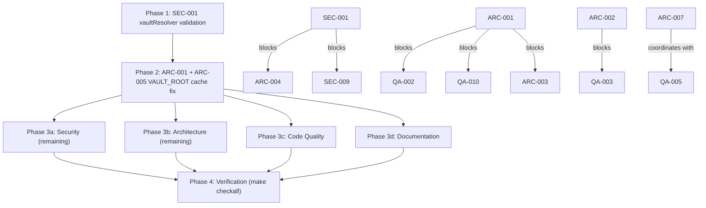

# Project Audit Report

> **Project**: Parsidion
> **Date**: 2026-06-12
> **Stack**: Python 3 (stdlib-first hook scripts + PEP 723 tools), TypeScript/Next.js (visualizer), FastMCP (parsidion-mcp), Bash, Makefile, uv
> **Audited by**: Claude Code Audit System

---

## Executive Summary

Parsidion is in good overall health — disciplined stdlib-only constraints, near-perfect docstring coverage, and intentional security thinking (path allowlists, env-var allowlists, `O_NOFOLLOW`, no `shell=True` anywhere) stand out. The most critical finding is that the visualizer's TypeScript `resolveVault()` lacks the forbidden-path validation its Python counterpart enforces, turning every unauthenticated visualizer API route into a potential read/write/delete interface to arbitrary filesystem locations including `~/.claude/`. The second systemic issue is the mutable `VAULT_ROOT` module-global monkey-patch pattern used by six scripts, which is unsafe under concurrency and interacts badly with `lru_cache`-based config/path resolution. Estimated effort to remediate the critical and high-priority issues is roughly 2–4 focused days; the large-file decompositions (`install.py`, `vault_doctor.py`) are larger ongoing efforts.

### Issue Count by Severity

| Severity | Architecture | Security | Code Quality | Documentation | Total |
|----------|:-----------:|:--------:|:------------:|:-------------:|:-----:|
| 🔴 Critical | 1 | 1 | 1 | 2 | **5** |
| 🟠 High     | 4 | 4 | 3 | 5 | **16** |
| 🟡 Medium   | 6 | 5 | 6 | 6 | **23** |
| 🔵 Low      | 5 | 4 | 5 | 4 | **18** |
| **Total**   | **16** | **14** | **15** | **17** | **62** |

---

## 🔴 Critical Issues (Resolve Immediately)

### [SEC-001] Missing Forbidden-Path Validation in TypeScript `resolveVault()`
- **Area**: Security (CWE-22 / OWASP A01)
- **Location**: `visualizer/lib/vaultResolver.ts:113-133`
- **Description**: The TypeScript `resolveVault()` — called by every visualizer API route and the WebSocket upgrade handler — accepts an arbitrary `vault` query parameter and resolves it with no forbidden-prefix checks. The Python equivalent (`vault_path.py:_validate_vault_path`) blocks `/System`, `/usr`, `/etc`, `~/.claude`, `~/Library`, etc. Any caller passing `vault=~/.claude` or `vault=/etc` redirects all vault reads, writes, and directory walks there. Combined with SEC-004 (no auth), any local process or browser tab reaching `localhost:3999` can exploit this.
- **Impact**: Arbitrary file enumeration, read, write, and delete outside the vault — including creating files in `~/.claude/`.
- **Remedy**: Mirror the Python `_VAULT_FORBIDDEN_PREFIXES` list in `vaultResolver.ts`: after `path.resolve()`, reject paths equal to or under `~/.claude`, `~/Library`, `/System`, `/usr`, `/bin`, `/sbin`, `/etc`. Apply the same check in the WebSocket upgrade path (SEC-009).

### [ARC-001] Mutable `VAULT_ROOT` Module-Global Monkey-Patch Pattern
- **Area**: Architecture
- **Location**: `skills/parsidion/scripts/vault_doctor.py:2375-2376`, `update_index.py:735-736`, `vault_export.py:515-516`, `vault_merge.py:684-685`, `vault_review.py:566-567`, `build_embeddings.py:411-412`
- **Description**: Six scripts switch the active vault by monkey-patching `vault_common.VAULT_ROOT` with try/finally restore. The global is shared with `lru_cache`-memoized `load_config()` and `_resolve_vault_cached()`, so restoring `VAULT_ROOT` does not flush stale cached config/paths. `vault_review.py` additionally bakes `_PENDING_PATH` from `VAULT_ROOT` at import time.
- **Impact**: Concurrent use (anyio task groups, thread pools) races on the global and silently operates on the wrong vault; stale caches survive vault switches — latent data-corruption risk in multi-vault scenarios.
- **Remedy**: Thread an explicit `vault: Path` parameter through call sites (`resolve_vault()` already accepts `explicit`). At minimum, call `load_config.cache_clear()` and `resolve_vault.cache_clear()` inside every try/finally that mutates `VAULT_ROOT`.

### [QA-001] `anyio.to_thread` Accessed via `vars(anyio)["to_thread"]`
- **Area**: Code Quality (also flagged by Architecture)
- **Location**: `skills/parsidion/scripts/summarize_sessions.py:62`
- **Description**: `to_thread = cast(Any, vars(anyio)["to_thread"])` bypasses normal attribute access using dict introspection. Any anyio version restructuring its namespace (lazy imports, `__getattr__` dispatch) raises `KeyError` at runtime with no static warning; the `cast(Any, ...)` also blinds pyright to downstream usage.
- **Impact**: Silent summarizer breakage on anyio upgrades.
- **Remedy**: Replace with `from anyio import to_thread` (public API). The missing-stub concern is handled by the existing `# type: ignore[import-untyped]` on the import.

### [DOC-001] `vault_common.__version__` Stale (0.6.0 vs 0.7.6)
- **Area**: Documentation
- **Location**: `skills/parsidion/scripts/vault_common.py:132`
- **Description**: `__version__ = "0.6.0"` while `pyproject.toml` declares `0.7.6` — 13 minor releases behind.
- **Impact**: Any tooling or diagnostic reading `vault_common.__version__` gets a confidently wrong answer.
- **Remedy**: Update to match `pyproject.toml`; consider a single source of truth (`importlib.metadata.version("parsidion")` with a fallback) so it can never drift again.

### [DOC-002] README Scripts Table Describes Pre-Split Monolithic `vault_common.py`
- **Area**: Documentation
- **Location**: `README.md:183` (Scripts table)
- **Description**: The table still describes `vault_common.py` as the implementation home for frontmatter parsing/search/paths/config. Since ARC-005 it is a re-export facade over six submodules (`vault_config`, `vault_path`, `vault_fs`, `vault_index`, `vault_hooks`, `vault_adaptive`) — none of which appear in the table.
- **Impact**: Contributors are directed to the wrong file for every shared-library change.
- **Remedy**: Reword the `vault_common.py` row as "re-export facade" and add rows for the six submodules (responsibilities already documented in `docs/ARCHITECTURE.md`).

---

## 🟠 High Priority Issues

### Security

### [SEC-002] `PUT /api/note` Allows Creating Arbitrary File Types
- **Location**: `visualizer/app/api/note/route.ts:110-139`
- **Description**: The note-creation handler writes any extension; the Python MCP `vault_write` correctly enforces `.md`-only, this endpoint does not.
- **Impact**: Combined with SEC-001, arbitrary file types (scripts, configs) can be written.
- **Remedy**: Reject non-`.md` `path` values with a 400 before writing.

### [SEC-003] Subprocess `stderr` Returned Verbatim in API Error Responses
- **Location**: `visualizer/app/api/graph/rebuild/route.ts:53`, `note/history/route.ts:73`, `note/diff/route.ts:78`
- **Description**: Raw `git`/Python stderr (absolute paths, usernames, tracebacks) is forwarded in HTTP JSON errors.
- **Remedy**: Log stderr server-side; return generic error strings to clients.

### [SEC-004] No Authentication on Any Visualizer Endpoint
- **Location**: `visualizer/app/api/` (all routes), `visualizer/server.ts`
- **Description**: All HTTP routes and the `/ws/vault` WebSocket are unauthenticated. `localhost` binding does not protect against multi-user systems or loopback CSRF from any browser tab.
- **Remedy**: Startup-generated shared token in `Authorization` header (env `VISUALIZER_TOKEN`); at minimum require `Content-Type: application/json` on mutation endpoints to raise the CSRF bar.

### [SEC-005] Unvalidated `vault` Parameter Passed to `build_graph.py` Subprocess
- **Location**: `visualizer/app/api/graph/rebuild/route.ts:39`
- **Description**: The resolved (unvalidated, per SEC-001) `vaultPath` is passed as `--vault`/`--output` to a spawned `uv run build_graph.py`. `spawn` argv form prevents shell injection, but the path itself is attacker-influenced.
- **Remedy**: Apply the SEC-001 forbidden-path fix before spawning; verify the path exists and is a directory.

### Architecture

### [ARC-002] `install.py` Is a 3,119-Line Monolith (≈80 Top-Level Functions)
- **Location**: `install.py`
- **Description**: Vault path resolution, hook registration for three runtimes, launchd/cron scheduling, git init, settings.json mutation, vaults.yaml, Claude Desktop config, and uninstall — all in one flat module. `install()` alone is ~300 lines with non-contiguous step numbering (no step 4; step 7 twice).
- **Remedy**: Decompose into `installer/hooks.py`, `installer/vault.py`, `installer/schedule.py`, `installer/settings.py`, `installer/cli.py` with `install.py` as a thin dispatcher.

### [ARC-003] `vault_doctor.py` Is a 2,714-Line Script; `main()` Is 508 Lines
- **Location**: `skills/parsidion/scripts/vault_doctor.py`
- **Description**: Eight fix modes entangled through shared globals and the `--fix-all` path. The module-level `_vault_path` global produces the repeated pattern `_vault_path if _vault_path else vault_common.VAULT_ROOT` at 12+ sites.
- **Remedy**: Extract each mode into `run_<mode>()` functions dispatched from a table in `main()`; eliminate `_vault_path` by passing the vault explicitly; extract shared setup (vault resolution, PID lock) into a context manager.

### [ARC-004] Vault Resolution Logic Duplicated Across Python and TypeScript
- **Location**: `skills/parsidion/scripts/vault_path.py:291`, `visualizer/lib/vaultResolver.ts`
- **Description**: The precedence chain (explicit → `.claude/vault` file → `CLAUDE_VAULT` env → XDG → default) is implemented twice with no synchronization mechanism (already tracked as QA-012 in code comments). The missing forbidden-prefix list on the TS side (SEC-001) is a direct consequence of this divergence.
- **Remedy**: Long-term: serve resolution through `parsidion-mcp`. Now: add an integration test calling both resolvers with identical inputs and asserting identical outputs.

### [ARC-005] Import-Time Path Constants Bypass Runtime Vault Switching
- **Location**: `skills/parsidion/scripts/update_index.py:55` (`PID_FILE`), `vault_review.py:28` (`_PENDING_PATH`)
- **Description**: Both constants are computed from `VAULT_ROOT` at import time; later monkey-patches (ARC-001) don't affect them. Parallel runs against different vaults share one PID file.
- **Remedy**: Convert to call-time functions resolving against `resolve_vault()`. Fix together with ARC-001.

### Code Quality

### [QA-002] Near-Duplicate Atomic-Write Implementations in `vault_doctor.py`
- **Location**: `vault_doctor.py:172` (`save_state`) and `:204` (`_write_pid`)
- **Remedy**: Extract a shared `_write_state_atomic(state, state_file)` helper.

### [QA-003] Redundant Inline `import os as _os_import` Inside `install()`
- **Location**: `install.py:2615`
- **Remedy**: Delete the inline import; use the module-level `os` directly.

### [QA-004] `GraphCanvas.tsx` Is 1,165 Lines with 7 `any` Suppressions
- **Location**: `visualizer/components/GraphCanvas.tsx`
- **Description**: Graph construction, force layout, reducers, hover logic, path finding, and a custom WebGL label renderer in one file; `nodeReducer`/`edgeReducer` callbacks typed `any` (lines 566, 617).
- **Remedy**: Extract `useForceLayout.ts`, `useGraphReducers.ts`, `lib/sigma-renderers.ts`; define `SigmaNodeData`/`SigmaEdgeData` interfaces.

### Documentation

### [DOC-003] `docs/MCP.md` Hard-Codes Legacy `~/ClaudeVault/` Path
- **Location**: `docs/MCP.md:58, 328-329`
- **Remedy**: Update diagram and bullets to `~/ParsidionVault/` with legacy note.

### [DOC-004] `docs/ARCHITECTURE.md` Diagram Uses 36 Per-Node `style` Lines Instead of `classDef`
- **Location**: `docs/ARCHITECTURE.md:166-201`
- **Description**: Violates the project's own `DOCUMENTATION_STYLE_GUIDE.md`.
- **Remedy**: Replace with named `classDef` groups + `class` assignments.

### [DOC-005] `docs/ARCHITECTURE.md` Framing Stale — "Claude Code customization toolkit"
- **Location**: `docs/ARCHITECTURE.md:1`
- **Remedy**: Match README's agent-agnostic framing (Claude Code primary adapter; Codex, Gemini, pi supported).

### [DOC-006] `EMBEDDINGS_EVAL.md` / `EMBEDDINGS.md` Use Legacy `~/ClaudeVault/` Throughout
- **Location**: `docs/EMBEDDINGS_EVAL.md` (8 sites), `docs/EMBEDDINGS.md:48`
- **Remedy**: Replace with `~/ParsidionVault/`; one legacy parenthetical on first occurrence.

### [DOC-007] 24 Unlabeled Fenced Code Blocks in `docs/ARCHITECTURE.md`
- **Location**: `docs/ARCHITECTURE.md` (lines 202, 299, 913, 940, 971, 1078, 1127, 1155, 1182, 1188, +14 more)
- **Remedy**: Add `bash`/`yaml`/`python`/`text`/`json` language tags.

---

## 🟡 Medium Priority Issues

### Architecture

- **[ARC-006] Hardcoded model identifiers in `ai_backend.py`** — `ai_backend.py:23-28`: `claude-haiku-4-5-20251001` and `gpt-5.5` defaults will silently break on provider deprecation. Document in config template; consider a `PARSIDION_DEFAULT_MODEL` env override.
- **[ARC-007] `vault_search.py` / `vault_stats.py` dual script-vs-library identity** — PEP 723 headers + entry points + module-level `rich` imports mean library importers outside `[tools]` get `ImportError`. Split display/CLI layer from data-gathering layer.
- **[ARC-008] `install.py` parses `vault_path.py` source with regex** — `install.py:166-204`: regex extraction of `VAULT_DIRS` silently falls back to a stale hardcoded list on any formatting change. Import via `importlib` instead, or assert-check fallback vs. parsed in tests.
- **[ARC-009] `resolve_vault()` cache-clear pattern entangled with test patching** — `vault_path.py:326, 356-364`: production cache logic inspects `sys.modules["vault_common"].VAULT_ROOT` to support test monkey-patching. Switch tests to set `CLAUDE_VAULT` env + `cache_clear()`.
- **[ARC-010] `parsidion-mcp` excluded from root quality gate** — no Makefile in `parsidion-mcp/`; root `make checkall` never runs its tests. Add `parsidion-mcp/Makefile` and wire into root `checkall`.
- **[ARC-011] `embed_eval_common.py` reads `VAULT_ROOT` at module level** — line 39: `DEFAULT_QUERIES_FILE` baked at import. Convert to a `get_default_queries_file(vault=None)` function.

### Security

- **[SEC-006] Missing security headers in Next.js app** — `visualizer/next.config.ts` is empty: no `X-Frame-Options`, `X-Content-Type-Options`, CSP, or Referrer-Policy. Add a headers block.
- **[SEC-007] Prompt injection: `vault_doctor.py` sends note stems to AI without `<content>` isolation** — `vault_doctor.py:470-488`: unlike `session_stop_hook.py`'s correct `<content>` framing. Apply the same pattern.
- **[SEC-008] Vault-resident logs world-readable** — `vault_hooks.py:55`: `hook_events.log` / `pending_summaries.jsonl` inherit `0o755` vault perms. Create with `0o600`.
- **[SEC-009] WebSocket `vault` parameter unvalidated** — `visualizer/server.ts:126-133`: client-supplied path becomes a chokidar watch root (resource exhaustion + SEC-001 inheritance). Apply forbidden-path check; close socket on failure.
- **[SEC-010] Transcript path from hook JSON not extension-checked** — `session_stop_hook.py` / `subagent_stop_hook.py`: `is_allowed_transcript_path()` allowlists roots, but any file under `~/.claude/` (e.g. `settings.json`) could be read and summarized into vault notes. Require `.jsonl` suffix.

### Code Quality

- **[QA-005] Zero test coverage for `vault_stats.py` (1,325 lines) and `vault_search.py` (879 lines)** — add `tests/test_vault_stats.py` and `tests/test_vault_search.py` covering core modes and the SQLite-absent fallback.
- **[QA-006] Zero test coverage for `vault_merge.py` (782 lines) and `vault_export.py` (551 lines)** — merge's backlink-rewriting can silently corrupt wikilinks vault-wide; test with mocked AI responses.
- **[QA-007] `session_start_hook.py` (915 lines) has only 7 tests** — AI cooldown, single-flight lock, adaptive ranking, and delta assembly are untested.
- **[QA-008] `parse_frontmatter()` silently discards nested YAML mappings** — `vault_index.py:66`: emit a warning when a nested-mapping pattern is skipped so doctor checks don't mislead.
- **[QA-009] Summarizer swallows broad exceptions and purges the queue entry** — `summarize_sessions.py:692, 784, 968`: unexpected exceptions are counted as skips and the session is permanently lost. Log tracebacks; only purge for known-stale/skipped cases.
- **[QA-010] `check_note()` computes `related`/`related_str` twice** — `vault_doctor.py:847, 861`: compute once before both checks.

### Documentation

- **[DOC-008] 5 unlabeled fenced code blocks in README** — lines ~69, 97, 141, 147, 165.
- **[DOC-009] Emoji callouts (`📝`) in README + `⚠️` in SECURITY.md** — violates style guide; use plain `> **Note:**` / `> **Warning:**`.
- **[DOC-010] CHANGELOG missing Keep-a-Changelog version comparison footer links.**
- **[DOC-011] `vprint` in `install.py` lacks a docstring** — the only undocumented function in the file.
- **[DOC-012] `_score` in `session_start_hook.py` lacks a docstring.**
- **[DOC-013] `docs/superpowers/` plans/specs reference legacy paths and old `parsidion-cc` name** — add a historical-record callout at the top of each, or move to `docs/archive/`.

---

## 🔵 Low Priority / Improvements

### Architecture

- **[ARC-012]** `vault_stats.py` (14 modes, 1,325 lines) — extract per-mode modules; entry point unchanged.
- **[ARC-013]** `_DEFAULT_CODEX_MODELS` uses `gpt-5.5` for both `small` and `large` tiers — document the no-op tiering.
- **[ARC-014]** `summarize_sessions.py` has no `--vault` flag unlike sibling CLIs — add and pass to `resolve_vault(explicit=...)`.
- **[ARC-015]** Visualizer uses a custom Express server (`server.ts`) instead of standard `next dev` — evaluate SSE-based API route for the file watcher.
- **[ARC-016]** No CI step runs `parsidion-mcp` tests — add a matrix job/step.

### Security

- **[SEC-011]** `visualizer/.env.local` discloses a real vault path; gitignored correctly — optionally `chmod 600`.
- **[SEC-012]** `guardPath` copy-pasted across 3 route files — extract into `lib/vaultResolver.ts`.
- **[SEC-013]** Windows file locking is a no-op (`fcntl` absent) — `vault_fs.py:63-77`: implement `msvcrt.locking()` or document the limitation.
- **[SEC-014]** Rebuild route accumulates subprocess stderr unbounded — cap at ~64 KB.

### Code Quality

- **[QA-011]** `install()` step comments skip step 4 and repeat step 7 — renumber.
- **[QA-012]** `_SAFE_ENV_KEYS` (private-named) exported via `__all__` in `vault_hooks.py` — rename or add a public accessor.
- **[QA-013]** `ReadingPane.tsx:313, 501` untyped markdown component callbacks — use `ComponentPropsWithoutRef<'a'>`.
- **[QA-014]** `vault_common.py` facade re-exports private implementation symbols (`_CONFIG_SCHEMA`, `_parse_scalar`, etc.) — export only public names.
- **[QA-015]** `session_stop_wrapper.sh` `trap EXIT` can delete `$TMPFILE` before the background subshell reads it — remove the trap; rely on the subshell's own `rm -f`.

### Documentation

- **[DOC-014]** `docs/ARCHITECTURE.md:12` TOC anchor `#claude-vault-skill` is stale.
- **[DOC-015]** ARCHITECTURE.md Overview bullets omit multi-runtime adapters — add one bullet.
- **[DOC-016]** `docs/ideas.md:57` references `~/ClaudeVault/Templates/*.md`.
- **[DOC-017]** CHANGELOG `[0.1.0]` uses old `parsidion-cc` name without a rename note.

---

## Detailed Findings

### Architecture & Design

**Summary**: Critical: 1 | High: 4 | Medium: 6 | Low: 5 — Overall health: **Good**.

Key concern: the mutable `VAULT_ROOT` monkey-patch pattern (6 files, try/finally restores) is unsafe under concurrency and interacts badly with `lru_cache`-based config and path resolution — a latent data-corruption risk in multi-vault scenarios. Other systemic findings: `install.py` is the second-highest-degree god node (43 edges per the graph report); vault resolution precedence is duplicated in Python and TypeScript with no enforcement of parity; several modules bake vault-derived paths at import time, defeating runtime vault switching. The `vault_common` facade split (ARC-005 historical work), the `resolve_vault()` precedence design, the consistently enforced stdlib-only constraint, and the clean Strategy pattern in `ai_backend.py` are genuine strengths.

### Security Assessment

**Summary**: Critical: 1 | High: 4 | Medium: 4 | Low: 4 — Overall posture: **Fair**.

Highest-risk area: the visualizer. `resolveVault()` (TS) lacks the forbidden-path validation present in Python, and no endpoint requires authentication, so every route is a potential read/write/delete interface to arbitrary filesystem locations. Information disclosure via verbatim subprocess stderr compounds this. The Python side is markedly stronger: correct `Path.resolve()` + `is_relative_to()` confinement in MCP tools, `.md`-only writes, zero `shell=True`, SHA-regex validation before `git diff`, explicit env-var allowlisting, `umask 077` temp files, mode-`0o700` log dirs, and inline CVE-pinned dependencies in `parsidion-mcp/pyproject.toml`.

### Code Quality

**Summary**: Critical: 1 | High: 5 | Medium: 6 | Low: 5 — Overall health: **Good**.

Primary concern: `install.py` (3,119 lines) and `vault_doctor.py`'s 508-line `main()` absorb disproportionate maintenance cost, and the most user-visible CLI tools (`vault_stats`, `vault_search`, `vault_merge`, `vault_export`, `vault_links`) have zero dedicated tests (estimated overall coverage 30–50%). Technical debt is otherwise well-managed: zero TODO/FIXME comments, and all 27 `# noqa: BLE001` suppressions carry explanatory comments justifying fail-open hook behavior. `parse_frontmatter()` is the best-tested module (83 tests). Largest files: `install.py` 3,119; `vault_doctor.py` 2,714; `summarize_sessions.py` 1,458; `vault_stats.py` 1,325; `GraphCanvas.tsx` 1,165; `session_start_hook.py` 915.

### Documentation Review

**Summary**: Critical: 2 | High: 5 | Medium: 5 | Low: 4 — Overall health: **Good**.

Most impactful gap: `vault_common.__version__ = "0.6.0"` vs. `pyproject.toml` `0.7.6`, plus the README still describing `vault_common.py` as a monolith — together these actively mislead contributors about the project's most important shared library. A cluster of v0.7.0-rename stragglers (`~/ClaudeVault/` in MCP.md, EMBEDDINGS docs, ideas.md) and style-guide violations in the project's own architecture doc (per-node `style` lines, 24 unlabeled code fences) round out the findings. Docstring coverage is exceptional: 99%+ — only `vprint` and `_score` are undocumented out of ~200 functions. README, CONTRIBUTING.md, and the documentation style guide are all production-grade.

---

## Remediation Roadmap

### Immediate Actions (Before Next Deployment)
1. **SEC-001** — Add forbidden-path validation to `visualizer/lib/vaultResolver.ts` (and the WebSocket path, SEC-009).
2. **SEC-002** — Enforce `.md`-only writes on `PUT /api/note`.
3. **SEC-003** — Stop returning subprocess stderr in API responses.
4. **ARC-001 / ARC-005** — Fix `VAULT_ROOT` cache staleness (`cache_clear()` in every monkey-patch block; convert import-time path constants to functions).
5. **QA-001** — Replace `vars(anyio)["to_thread"]` with the public import.
6. **DOC-001 / DOC-002** — Sync `__version__` and the README Scripts table.

### Short-term (Next 1–2 Sprints)
1. **SEC-004** — Add token auth (or at minimum CSRF hardening) to the visualizer API.
2. **SEC-005 – SEC-010** — Remaining security mediums (headers, prompt-injection framing, log perms, transcript extension check).
3. **QA-005 / QA-006 / QA-007** — Test coverage for `vault_stats`, `vault_search`, `vault_merge`, `vault_export`, and `session_start_hook` critical paths.
4. **QA-009** — Stop purging queue entries on unexpected summarizer exceptions; log tracebacks.
5. **ARC-010 / ARC-016** — Wire `parsidion-mcp` tests into `make checkall` and CI.
6. **DOC-003 – DOC-007** — Legacy-path sweep and ARCHITECTURE.md style fixes.

### Long-term (Backlog)
1. **ARC-002** — Decompose `install.py` into an `installer/` package.
2. **ARC-003** — Refactor `vault_doctor.py` into mode functions + dispatch table; thread `vault` explicitly (full ARC-001 resolution).
3. **ARC-004** — Consolidate vault resolution behind `parsidion-mcp`; until then, add a Python↔TypeScript parity test.
4. **QA-004** — Split `GraphCanvas.tsx` into hooks + renderer modules with typed sigma interfaces.
5. **ARC-007 / ARC-012** — Split CLI display layers from data layers in `vault_stats`/`vault_search`.

---

## Positive Highlights

1. **The `vault_common` facade split is architecturally sound** — six cohesive submodules (`vault_config`, `vault_path`, `vault_fs`, `vault_index`, `vault_hooks`, `vault_adaptive`) behind a clean re-export facade with preserved backward compatibility.
2. **Python-side security is genuinely strong** — `Path.resolve()` + `is_relative_to()` confinement in MCP tools, `_VAULT_FORBIDDEN_PREFIXES`, `_SAFE_ENV_KEYS` allowlisting, zero `shell=True` anywhere, `O_NOFOLLOW` on the debug log, `umask 077` temp files, and SHA-regex validation before `git diff`.
3. **Near-perfect docstring coverage** — 99%+ across ~200 functions in Google style; only two private helpers undocumented.
4. **Disciplined dependency hygiene** — the stdlib-only constraint for hooks is enforced and documented in every file header; `parsidion-mcp` pins dependencies with inline CVE references.
5. **Zero TODO/FIXME debt, and every lint suppression is justified** — all 27 `BLE001` suppressions carry comments explaining why hooks must fail open.
6. **`ai_backend.py` Strategy pattern** cleanly abstracts Claude CLI / Codex CLI / none backends behind one `run_ai_prompt()` entry point with sensible runtime auto-detection.
7. **Production-grade README and CONTRIBUTING.md** — installation flag tables, annotated config reference, heredoc-based manual hook testing instructions, and a comprehensive documentation style guide.
8. **Prompt-injection awareness** — `session_stop_hook.py` wraps untrusted transcript content in `<content>` tags with explicit untrusted-data framing, and the summarizer validates AI-generated frontmatter before writing.

---

## Audit Confidence

| Area | Files Reviewed | Confidence |
|------|---------------|-----------|
| Architecture | ~25 | High |
| Security | ~30 | High |
| Code Quality | ~25 | High |
| Documentation | ~20 | High |

*All four agents completed full structured reviews with file-level citations.*

---

## Remediation Plan

> This section is generated by the audit and consumed directly by `/fix-audit`.
> It pre-computes phase assignments and file conflicts so the fix orchestrator
> can proceed without re-analyzing the codebase.

### Phase Assignments

#### Phase 1 — Critical Security (Sequential, Blocking)
| ID | Title | File(s) | Severity |
|----|-------|---------|----------|
| SEC-001 | Forbidden-path validation in TS `resolveVault()` (incl. WebSocket path) | `visualizer/lib/vaultResolver.ts`, `visualizer/server.ts` | Critical |

#### Phase 2 — Critical Architecture (Sequential, Blocking)
| ID | Title | File(s) | Severity | Blocks |
|----|-------|---------|----------|--------|
| ARC-001 | Fix `VAULT_ROOT` monkey-patch cache staleness (`cache_clear()` in all 6 try/finally blocks) | `vault_doctor.py`, `update_index.py`, `vault_export.py`, `vault_merge.py`, `vault_review.py`, `build_embeddings.py` (all under `skills/parsidion/scripts/`) | Critical | QA-002, QA-010, ARC-003 |
| ARC-005 | Convert import-time path constants to call-time functions | `skills/parsidion/scripts/update_index.py`, `skills/parsidion/scripts/vault_review.py` | High (promoted: same files as ARC-001) | — |

#### Phase 3 — Parallel Execution

**3a — Security (remaining)**
| ID | Title | File(s) | Severity |
|----|-------|---------|----------|
| SEC-002 | `.md`-only enforcement on `PUT /api/note` | `visualizer/app/api/note/route.ts` | High |
| SEC-003 | Stop returning subprocess stderr in API errors | `visualizer/app/api/graph/rebuild/route.ts`, `visualizer/app/api/note/history/route.ts`, `visualizer/app/api/note/diff/route.ts` | High |
| SEC-004 | Token auth / CSRF hardening on visualizer API | `visualizer/server.ts`, `visualizer/app/api/*` | High |
| SEC-005 | Validate vault path before `build_graph.py` spawn | `visualizer/app/api/graph/rebuild/route.ts` | High |
| SEC-006 | Security headers | `visualizer/next.config.ts` | Medium |
| SEC-007 | `<content>` isolation for AI prompts in vault_doctor | `skills/parsidion/scripts/vault_doctor.py` | Medium |
| SEC-008 | `0o600` perms on vault-resident logs | `skills/parsidion/scripts/vault_hooks.py`, `skills/parsidion/scripts/vault_fs.py` | Medium |
| SEC-009 | WebSocket vault validation | `visualizer/server.ts` | Medium |
| SEC-010 | `.jsonl` extension check on transcript paths | `skills/parsidion/scripts/session_stop_hook.py`, `skills/parsidion/scripts/subagent_stop_hook.py` | Medium |
| SEC-011 | `chmod 600` `.env.local` (optional) | `visualizer/.env.local` | Low |
| SEC-012 | Extract shared `guardPath` | `visualizer/lib/vaultResolver.ts`, 3 route files | Low |
| SEC-013 | Windows locking fallback or doc note | `skills/parsidion/scripts/vault_fs.py` | Low |
| SEC-014 | Cap subprocess stderr accumulation | `visualizer/app/api/graph/rebuild/route.ts` | Low |

**3b — Architecture (remaining)**
| ID | Title | File(s) | Severity |
|----|-------|---------|----------|
| ARC-002 | Decompose `install.py` into `installer/` package | `install.py` | High |
| ARC-003 | Refactor `vault_doctor.py` modes + remove `_vault_path` global | `skills/parsidion/scripts/vault_doctor.py` | High |
| ARC-004 | Python↔TS vault resolution parity test | `skills/parsidion/scripts/vault_path.py`, `visualizer/lib/vaultResolver.ts`, `tests/` | High |
| ARC-006 | Document/override hardcoded model defaults | `skills/parsidion/scripts/ai_backend.py` | Medium |
| ARC-007 | Split CLI display vs data layers | `skills/parsidion/scripts/vault_search.py`, `skills/parsidion/scripts/vault_stats.py` | Medium |
| ARC-008 | Replace regex source-parsing with importlib | `install.py` | Medium |
| ARC-009 | Decouple cache from test monkey-patching | `skills/parsidion/scripts/vault_path.py`, `tests/` | Medium |
| ARC-010 | `parsidion-mcp` Makefile + root checkall wiring | `parsidion-mcp/`, `Makefile` | Medium |
| ARC-011 | Call-time `DEFAULT_QUERIES_FILE` | `skills/parsidion/scripts/embed_eval_common.py` | Medium |
| ARC-012 | Mode-based split of `vault_stats.py` | `skills/parsidion/scripts/vault_stats.py` | Low |
| ARC-013 | Document Codex tier no-op | `skills/parsidion/scripts/ai_backend.py` | Low |
| ARC-014 | Add `--vault` flag to summarizer | `skills/parsidion/scripts/summarize_sessions.py` | Low |
| ARC-015 | Evaluate replacing custom Express server | `visualizer/server.ts` | Low |
| ARC-016 | CI step for `parsidion-mcp` tests | `.github/workflows/` | Low |

**3c — Code Quality (all)**
| ID | Title | File(s) | Severity |
|----|-------|---------|----------|
| QA-001 | Replace `vars(anyio)["to_thread"]` with public import | `skills/parsidion/scripts/summarize_sessions.py` | Critical |
| QA-002 | Extract shared atomic-write helper | `skills/parsidion/scripts/vault_doctor.py` | High |
| QA-003 | Remove inline `import os as _os_import` | `install.py` | High |
| QA-004 | Split `GraphCanvas.tsx` + typed sigma interfaces | `visualizer/components/GraphCanvas.tsx` | High |
| QA-005 | Tests for `vault_stats` / `vault_search` | `tests/` | Medium |
| QA-006 | Tests for `vault_merge` / `vault_export` | `tests/` | Medium |
| QA-007 | Expand `session_start_hook` tests | `tests/test_session_start_hook.py` | Medium |
| QA-008 | Warn on skipped nested YAML mappings | `skills/parsidion/scripts/vault_index.py` | Medium |
| QA-009 | Log tracebacks; don't purge queue on unexpected exceptions | `skills/parsidion/scripts/summarize_sessions.py` | Medium |
| QA-010 | Dedupe `related` computation in `check_note()` | `skills/parsidion/scripts/vault_doctor.py` | Medium |
| QA-011 | Renumber `install()` step comments | `install.py` | Low |
| QA-012 | Public name for `_SAFE_ENV_KEYS` export | `skills/parsidion/scripts/vault_hooks.py` | Low |
| QA-013 | Typed markdown callbacks | `visualizer/components/ReadingPane.tsx` | Low |
| QA-014 | Stop re-exporting private symbols from facade | `skills/parsidion/scripts/vault_common.py` | Low |
| QA-015 | Remove racy `trap EXIT` in stop wrapper | `skills/parsidion/scripts/session_stop_wrapper.sh` | Low |

**3d — Documentation (all)**
| ID | Title | File(s) | Severity |
|----|-------|---------|----------|
| DOC-001 | Sync `__version__` with pyproject | `skills/parsidion/scripts/vault_common.py` | Critical |
| DOC-002 | README Scripts table: facade + 6 submodules | `README.md` | Critical |
| DOC-003 | MCP.md legacy vault path | `docs/MCP.md` | High |
| DOC-004 | classDef refactor of architecture diagram | `docs/ARCHITECTURE.md` | High |
| DOC-005 | Agent-agnostic framing | `docs/ARCHITECTURE.md` | High |
| DOC-006 | EMBEDDINGS docs legacy paths | `docs/EMBEDDINGS_EVAL.md`, `docs/EMBEDDINGS.md` | High |
| DOC-007 | Language tags on 24 code blocks | `docs/ARCHITECTURE.md` | High |
| DOC-008 | Language tags on 5 README blocks | `README.md` | Medium |
| DOC-009 | Remove emoji callouts | `README.md`, `SECURITY.md` | Medium |
| DOC-010 | CHANGELOG comparison links | `CHANGELOG.md` | Medium |
| DOC-011 | `vprint` docstring | `install.py` | Medium |
| DOC-012 | `_score` docstring | `skills/parsidion/scripts/session_start_hook.py` | Medium |
| DOC-013 | Historical callouts on superpowers plans | `docs/superpowers/` | Medium |
| DOC-014 | Fix stale TOC anchor | `docs/ARCHITECTURE.md` | Low |
| DOC-015 | Multi-runtime bullet in Overview | `docs/ARCHITECTURE.md` | Low |
| DOC-016 | ideas.md legacy path | `docs/ideas.md` | Low |
| DOC-017 | `parsidion-cc` rename note in CHANGELOG | `CHANGELOG.md` | Low |

### File Conflict Map

| File | Domains | Issues | Risk |
|------|---------|--------|------|
| `skills/parsidion/scripts/vault_doctor.py` | Architecture + Security + Code Quality | ARC-001, ARC-003, SEC-007, QA-002, QA-010 | ⚠️ Read before edit — ARC-001/ARC-003 restructure code SEC-007/QA-002/QA-010 target |
| `install.py` | Architecture + Code Quality + Documentation | ARC-002, ARC-008, QA-003, QA-011, DOC-011 | ⚠️ Read before edit — ARC-002 decomposition moves functions other fixes target |
| `skills/parsidion/scripts/summarize_sessions.py` | Architecture + Code Quality | ARC-014, QA-001, QA-009 | ⚠️ Read before edit |
| `visualizer/lib/vaultResolver.ts` | Security + Architecture | SEC-001, SEC-012, ARC-004 | ⚠️ SEC-001 first; later fixes import its validation helper |
| `visualizer/server.ts` | Security + Architecture | SEC-004, SEC-009, ARC-015 | ⚠️ Read before edit |
| `visualizer/app/api/graph/rebuild/route.ts` | Security | SEC-003, SEC-005, SEC-014 | ⚠️ Same-file edits within 3a — apply together |
| `skills/parsidion/scripts/update_index.py` | Architecture | ARC-001, ARC-005 | ⚠️ Fix together in Phase 2 |
| `skills/parsidion/scripts/vault_review.py` | Architecture | ARC-001, ARC-005 | ⚠️ Fix together in Phase 2 |
| `skills/parsidion/scripts/vault_hooks.py` | Security + Code Quality | SEC-008, QA-012 | ⚠️ Read before edit |
| `skills/parsidion/scripts/vault_common.py` | Documentation + Code Quality | DOC-001, QA-014 | ⚠️ Read before edit |
| `skills/parsidion/scripts/session_start_hook.py` | Documentation + Code Quality | DOC-012, QA-007 | Low risk (docstring vs tests) |
| `README.md` | Documentation | DOC-002, DOC-008, DOC-009 | Same-domain — single agent should handle |
| `docs/ARCHITECTURE.md` | Documentation | DOC-004, DOC-005, DOC-007, DOC-014, DOC-015 | Same-domain — single agent should handle |
| `skills/parsidion/scripts/vault_path.py` | Architecture | ARC-004, ARC-009 | Same-domain |
| `skills/parsidion/scripts/ai_backend.py` | Architecture | ARC-006, ARC-013 | Same-domain |
| `skills/parsidion/scripts/vault_stats.py` | Architecture + Code Quality | ARC-007, ARC-012, QA-005 | ⚠️ QA-005 tests should target post-ARC-007 structure if both done |
| `skills/parsidion/scripts/vault_search.py` | Architecture + Code Quality | ARC-007, QA-005 | ⚠️ Same as above |

### Blocking Relationships

- SEC-001 → ARC-004: SEC-001 adds the validation helper to `vaultResolver.ts` that the parity test (and any consolidation) must preserve; restructuring first risks dropping the fix.
- SEC-001 → SEC-009: both use the same forbidden-prefix helper; apply together so the WebSocket entry point isn't left unguarded.
- SEC-002 → (future note-API features): the `.md` guard must land before any new file-type/path patterns on the creation endpoint.
- ARC-001 → QA-002, QA-010: ARC-001 (and the fuller ARC-003 refactor) restructure `vault_doctor.py` code these QA fixes touch; QA fixes must read current file state.
- ARC-001 → ARC-003: the cache-staleness fix (Phase 2) is the minimal correction; the full `_vault_path` elimination in ARC-003 builds on it.
- ARC-002 → QA-003, QA-011, DOC-011, ARC-008: if the `install.py` decomposition proceeds, the small in-file fixes should land first (they're trivial) or be re-targeted to the new modules.
- ARC-007 → QA-005: if the `vault_stats`/`vault_search` layer split happens first, new tests should target the split structure; otherwise write tests against current structure (still valuable as a refactor safety net — prefer tests first).
- DOC-002 ↔ vault_common changes: update the README table in the same commit as any further facade changes.

### Dependency Diagram

