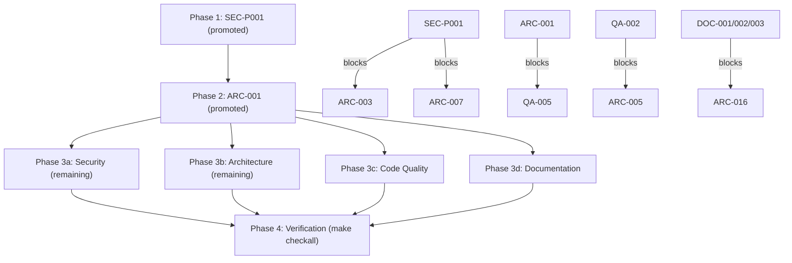

# Project Audit Report

> **Project**: parsidion
> **Date**: 2026-08-01
> **Stack**: Python (stdlib-only hooks/CLIs + `uv` extras), TypeScript/Bun (Next.js visualizer), Python MCP server
> **Audited by**: Claude Code Audit System (Opus 5 subagents)
> **Repo**: `/Users/probello/Repos/parsidion` @ `e0faf8c` (par-mem indexed, current)

---

## Executive Summary

Parsidion is in **good shape**. Across all four domains the auditors repeatedly returned to the same verdict: disciplined, well-tested, with several exemplary patterns (a stdlib-only gate test with a self-proving poison harness, a Strategy+Registry agent-adapter that collapsed ~470 lines of copy-paste, a cross-language parity contract, layered config). The most serious defect is **documentation that lies**: the README advertises a `summarize_sessions.py --approved-only` flag that does not exist (users hit an argparse error) and a "Latest release: 0.14.0" line while the shipped code is 0.15.0. The single most important **security** item is that the Python vault resolver still accepts attacker-influenced `.claude/vault` paths against a denylist while its TypeScript twin was already hardened to an allowlist — a malicious repo opened in Claude Code could redirect vault writes. The largest **maintainability** debt is that two God-module re-export facades (`vault_common.py`, `install.py`) quietly undo the otherwise-strong `core/` decomposition by re-concentrating the coupling the split was meant to dissolve. Remediation is mostly mechanical and the test suite (1,281 + 30 + 60 tests, fully green) gives every refactor a strong safety net.

### Issue Count by Severity

| Severity | Architecture | Security | Code Quality | Documentation | Total |
|----------|:-----------:|:--------:|:------------:|:-------------:|:-----:|
| 🔴 Critical | 0 | 0 | 0 | 2 | **2** |
| 🟠 High     | 4 | 0 | 3 | 3 | **10** |
| 🟡 Medium   | 5 | 1 | 4 | 4 | **14** |
| 🔵 Low      | 8 | 4 | 3 | 3 | **18** |
| **Total**   | **17** | **5** | **10** | **12** | **44** |

---

## 🔴 Critical Issues (Resolve Immediately)

### [DOC-001] README "Latest release" is one minor version behind the shipped code
- **Area**: Documentation
- **Location**: `README.md:1084`
- **Description**: The "Changelog" section says "Latest release: **0.14.0**", but `pyproject.toml` declares `version = "0.15.0"`, `CHANGELOG.md` has a published `## [0.15.0] - 2026-07-31` entry, and the `v0.15.0` tag exists. The README's own banner at line 11 advertises "New in 0.15.0", so the file is internally inconsistent.
- **Impact**: A reader who scans to the bottom is told the project is one minor release older than it is, with none of the 0.15.0 work (ENH-001…008) discoverable from that line.
- **Remedy**: Update the line to "0.15.0" and replace the parenthetical summary with the 0.15.0 CHANGELOG entry (or a pointer to CHANGELOG.md). Going forward, regenerate this string from `pyproject.toml`/git tags rather than hand-editing.

### [DOC-002] `summarize_sessions.py --approved-only` is documented but does not exist
- **Area**: Documentation (and a half-built feature)
- **Location**: `README.md:884`; the flag is absent from `summarize_sessions.py:850-910`
- **Description**: The README shows `summarize_sessions.py --approved-only  # only process sessions approved by vault-review`. The summarizer's argparse defines exactly eight flags (`--sessions`, `--dry-run`, `--model`, `--persist`, `--run-doctor`, `--rebuild-graph`, `--graph-include-daily`, `--vault`). `grep 'approved'` in the summarizer returns nothing. The companion `vault_review.py` does tag entries with `"status": "approved"` (lines 559, 580), but nothing consumes that field — the workflow is half-built.
- **Impact**: A user who runs the documented command gets `error: unrecognized arguments: --approved-only` and the summarizer refuses to run, with no documented fallback.
- **Remedy**: The `fix-documentation` agent only touches docs, so the immediate fix is to correct the README (remove the line, or mark the workflow as not-yet-implemented). Implementing the flag itself is a small code change (`args.approved_only` filter in the entry loop reading `status == "approved"`) tracked separately as enhancement **ENH-A** below — note that `vault-review` already records approvals that nothing reads.

---

## 🟠 High Priority Issues

### [ARC-001] God-module re-export facades undermine the `core/` decomposition
- **Area**: Architecture
- **Location**: `skills/parsidion/scripts/vault_common.py:1-248` (re-exports ~100 symbols, `__all__` ~80); `install.py:43-176` (first ~130 lines re-export ~60 symbols across 8 `installer/` submodules)
- **Description**: ARC-005 split implementations into focused `core/` submodules, but `vault_common.py` remains the load-bearing import surface — **80 files** do `import vault_common` and the graph confirms it is the #1 bridge symbol (betweenness 0.047, 54 in / 93 out degree). Every new symbol added to `core/X.py` requires a matching update to both `vault_common.py` and the flat `X.py` shim — triple-bookkeeping. `install.py` mirrors this for the installer.
- **Impact**: The decomposition's readability win is lost because the import surface collapses everything back to one name. Refactors are risky — removing a symbol from `core/` requires auditing 80 consumers.
- **Remedy**: Stop re-exporting *new* symbols from `vault_common`; add a `# deprecated: import from core.X` comment to each re-export; migrate callers incrementally (the par-mem graph's 80 import sites are the work-list). Long-term, fold `vault_common` into a thin compatibility shim for external callers (parsidion-mcp). **Blocks QA-005.**

### [ARC-002] Test monkeypatching convenience shapes production module structure
- **Area**: Architecture
- **Location**: `install.py:43-101` (comment "IMPORTANT: _ask and _FORBIDDEN_PREFIXES are imported into THIS module's namespace"), `install.py:172-193`
- **Description**: `install.py` deliberately imports `_ask`, `_FORBIDDEN_PREFIXES`, and other private names into its own namespace purely so `monkeypatch.setattr(install, "_ask", …)` patches the binding that `install.py` functions use. Production code is organized around what tests patch.
- **Impact**: Clear-Box testing anti-pattern. It blocks moving `validate_vault_path`/`prompt_vault_path` into `installer/` (where they belong) because doing so would break the patches.
- **Remedy**: Refactor tests to patch at the source module (`monkeypatch.setattr("installer.ui._ask", …)`) or inject via a fixture; then the namespace imports become unnecessary and the functions can move to `installer/`.

### [ARC-003] Module-level mutable global paired with `lru_cache` as a side-channel
- **Area**: Architecture
- **Location**: `skills/parsidion/scripts/core/vault_path.py:384-428` (`_resolve_vault_cached`), `:410-428` (the `VAULT_ROOT` mutation branch)
- **Description**: `resolve_vault()` is `@lru_cache`-cached, but branch 4 reads the module-level mutable `vault_common.VAULT_ROOT` and returns it when it differs from default. Callers must manually call `resolve_vault.cache_clear()` (re-exposed via a `# type: ignore` lambda) after `update_index.py` mutates `VAULT_ROOT = vault_path` for an explicit `--vault-path` CLI arg.
- **Impact**: Classic "global mutable state + function cache" staleness anti-pattern. The cache and the global disagree silently unless every mutation site clears the cache. The `# type: ignore` on the shim is a symptom. The author's note "Tests should NOT rely on this branch" is evidence the pattern is fragile.
- **Remedy**: Pass the vault explicitly through the call graph. For `update_index.py`'s `--vault-path` flow, thread the path as a function argument (the resolver already accepts `explicit`). Deprecate the `VAULT_ROOT` mutation branch with a warning; remove once `update_index.py` migrates. **Depends on SEC-P001 landing first** (same file, hardened resolver).

### [ARC-004] Duplicated sources of truth for hook-script maps (acknowledged debt)
- **Area**: Architecture
- **Location**: `skills/parsidion/scripts/agent_adapter.py:231-250` (`_CLAUDE_HOOK_SCRIPTS`, `_CODEX_HOOK_SCRIPTS`, `_GEMINI_HOOK_SCRIPTS`) AND `installer/paths.py:44-65` (the same three dicts)
- **Description**: The hook-event → script-filename maps are defined twice. The comment at `agent_adapter.py:228-230` explicitly acknowledges it: *"The duplicates in installer/paths.py are removed once its consumers migrate to reading these off the adapter descriptors."*
- **Impact**: Drift between the two maps silently breaks hook registration for one runtime. A new hook event added to one map but not the other produces no error — just missing hooks.
- **Remedy**: Make `agent_adapter` the sole source. Either have `installer/paths.py` import the dicts from `agent_adapter`, move them to a neutral location both import, or invert the dependency. Delete the other copy, add a test asserting only one exists.

### [QA-001] Duplicated `_backup_note` with reversed parameter order
- **Area**: Code Quality
- **Location**: `skills/parsidion/scripts/doctor/_state.py:249` `_backup_note(vault, note_path)` and `skills/parsidion/scripts/summarizer/notes.py:397` `_backup_note(note_path, vault)`
- **Description**: Two near-identical `_backup_note` implementations exist with **opposite** parameter orders. The summarizer docstring says it "mirrors `vault_doctor._backup_note`" while using the reversed signature. Contracts diverge: doctor's is "never raises" (best-effort, per-run dedup set); summarizer's raises `OSError` and lacks the dedup. Both write to `<vault>/.trash/backup/<date>/<rel>`.
- **Impact**: The reversed parameter order is a live footgun — a consolidation or copy-paste can silently pass `vault` where `note_path` is expected (Path types match, no static check catches it).
- **Remedy**: Promote one canonical implementation to `core/vault_fs.py` (next to `atomic_write_text`). Pick one parameter order and one explicit error contract; doctor and summarizer each wrap with their own try/except for swallow-vs-raise. Add a regression test asserting parameter order.

### [QA-002] `vault_stats.py:main` has cyclomatic complexity 40 (Critical band)
- **Area**: Code Quality
- **Location**: `skills/parsidion/scripts/vault_stats.py:1014` (`main`)
- **Description**: `main` is a ~230-line function doing three jobs: a 15-mode argparse definition, a "no_mode" flag recombination, and two parallel if/elif dispatch chains (one for `conn is None`, one for the populated-DB path). The `no_mode` boolean ORs 13 flags twice.
- **Impact**: Adding a mode means editing 3+ places (argparse, `no_mode`, both dispatch chains). Highest complexity in the repo.
- **Remedy**: Extract `_build_parser()` and convert the dispatch into a table `{"summary": (run_summary, needs_db=True), …}` then loop once. Collapses both chains and removes the duplicated `no_mode` enumeration. **Foundational to ARC-005** (the package split subsumes this).

### [QA-003] `summarize_sessions.py` is the repo's worst churn×complexity hotspot
- **Area**: Code Quality
- **Location**: `skills/parsidion/scripts/summarize_sessions.py` — `summarize_one` (complexity 37, churn 20, score 740) and `main` (complexity 34, churn 20, score 680)
- **Description**: By far the highest hotspot (next worst is `install.py` at 528). The module is progressively split into `summarizer/*` (11 modules), but the two entrypoints still concentrate branching: `main` does argparse + config + dispatch; `summarize_one` threads write-gate, merge/skip/write, dead-letter classification, dedup, backlinks, and progress through one body.
- **Impact**: Most-touched, most-fragile file. Each new failure-classification code adds a branch; high churn means any in-flight refactor conflicts with daily work.
- **Remedy**: Finish the `summarizer/*` split — move `summarize_one`'s decision dispatch into a small state machine (the `FailureReason` enum is already there) and lift the argparse/config block out of `main`. Existing test coverage (`test_summarizer_queue_fixes.py`) is strong.

### [DOC-003] Root README and `parsidion-mcp/README.md` undercount MCP tools (7 vs 8)
- **Area**: Documentation
- **Location**: `README.md:497-507` ("Seven tools"); `parsidion-mcp/README.md:42-50` ("Seven tools are exposed")
- **Description**: `server.py:13-20` registers **eight** tools (`vault_search`, `vault_read`, `vault_write`, `vault_context`, `rebuild_index`, `vault_doctor`, `vault_health`, `code_search`). `docs/MCP.md` correctly lists all eight. Both READMEs say "Seven" and omit `vault_health` entirely.
- **Impact**: A user's MCP client lists eight tools but the README promises seven; the composite 0–100 health score (ENH-007) is not discoverable from the entry-point docs.
- **Remedy**: Change "Seven tools" → "Eight tools" in both READMEs and add a `vault_health` row. `docs/MCP.md` is the source of truth to copy from.

### [DOC-004] `docs/MCP.md` has an internal tool-count inconsistency
- **Area**: Documentation
- **Location**: `docs/MCP.md:46`
- **Description**: The Overview says "the other six tools work fully today; `code_search` activates automatically once par-mem ships." With eight tools total and `code_search` being one, "the other six" should be "the other seven." The same file's TOC (14-22) and diagram (88-97) correctly enumerate eight.
- **Impact**: Minor arithmetic confusion; suggests the doc was edited when the count was seven and not updated when `vault_health` was added.
- **Remedy**: Change "the other six tools" → "the other seven tools".

### [DOC-005] `hackernews-release.md` is committed with substantially stale content
- **Area**: Documentation
- **Location**: `hackernews-release.md` (whole file, 53 lines; tracked by git)
- **Description**: This Show HN draft describes the project pre-0.12: vault path hard-coded as `~/ClaudeVault/` (lines 7, 48); "Five stdlib-only Python hooks" predating Codex/Gemini/pi adapters and the runtime-adapter registry; "up to 5 parallel Claude sessions via agent SDK" but the summarizer is now backend-neutral (`claude -p` or `codex exec`). Not linked from any doc index — an orphan.
- **Impact**: Anyone browsing top-level files finds a published-sounding announcement whose facts contradict the current README/CLAUDE.md/ARCHITECTURE.md.
- **Remedy**: `git rm hackernews-release.md` (historical context preserved in git history) or `gitignore` it. Deleting is cleanest.

---

## 🟡 Medium Priority Issues

### Architecture
- **[ARC-005] CLI God-files violate the decomposition model the project proved** — `vault_stats.py` (1244 LOC, 18 subcommands), `vault_search.py` (1228 LOC, 4 modes), `vault_merge.py` (1179 LOC), `update_index.py` (1081 LOC). The project already decomposed `vault_doctor.py` → `doctor/` (16 modules) and `summarize_sessions.py` → `summarizer/` (11 modules) — those are the model the flat CLIs did not get. Extract each `run_*`/mode into `cli/stats/<mode>.py`, `cli/search/<mode>.py`, leaving a thin dispatcher. (Depends on QA-002 for `vault_stats`.)
- **[ARC-006] `session_start_hook.py` is a 1253-LOC God-file** — 25 top-level functions spanning candidate building, semantic search, AI selection (+ lock/cooldown/stamp — 6 functions), graph retrieval (Tier 1/2 + rerank), usefulness ranking, pending/dead-letter notices, delta building, context assembly. Extract a `session_start/` subpackage: `ai_selector.py`, `graph_retrieval.py`, `seed_selection.py`, leaving the orchestrator (~300 LOC).
- **[ARC-007] Cross-language vault-resolution duplication (RESOLVED via ENH-009)** — `core/vault_path.py` `resolve_vault` was duplicated by `visualizer/lib/vaultResolver.ts` `resolveVault`, and the TS twin supported fewer channels (no `cwd/.claude/vault`, no `CLAUDE_VAULT`) — a user who set `CLAUDE_VAULT` saw a different vault in the visualizer than in hooks. Resolved 2026-08-01: the TS resolver now delegates to the new `resolve_vault_server()` (the deliberately narrower server contract) via the `vault_resolve.py` CLI, so the allowlist is single-sourced in Python. The shared parity fixture still pins the observable contract; MCP stays optional and is not on the visualizer's path.
- **[ARC-008] Visualizer stack is disproportionately heavy for the feature surface** — Next.js 16 + React 19 + TS 6 + sigma.js + graphology + Tailwind 4 to render a single-page graph viewer of `graph.json`. `app/page.tsx`'s `Home` (554 LOC, 34 hooks, top-10 bridge symbol). `overrides` block pins 5 transitive deps — a signal of recurring churn. (1) Consider Vite+React SPA if no SSR/SEO is needed; (2) extract `Home`'s state into a store or `<GraphPanel>`/`<SidebarPanel>`/`<ReadingPanePanel>` containers; (3) pin exact versions (drop `^`) for `sigma`/`graphology`/`next`/`react`.
- **[ARC-009] Broad-exception volume hinders auditability** — 65 `except Exception` total, of which 19 are `except Exception: pass` (`# noqa: BLE001`). Many are justifiable (hooks must not fail closed; `_emit_hook_event` is best-effort), but the volume hides the few problematic cases. Where a swallow is best-effort, add a one-line `print(f"...: {exc}", file=sys.stderr)` so diagnostics are reachable; reserve bare `pass` for cases where logging itself could fail. (Spread across ~30 files in `skills/parsidion/scripts/`.)

### Security
- **[SEC-P001] Python vault resolver is denylist-based while the TS twin is allowlist-based** — CWE-22/OWASP A01. `core/vault_path.py:306-337` (`_resolve_vault_reference`) and `:229-259` (`_VAULT_FORBIDDEN_PREFIXES`). The Python resolver honors `.claude/vault` and `CLAUDE_VAULT`, accepting any referenced path not on a small denylist (`~/.claude`, `~/Library`, `/System`, `/usr`, `/bin`, `/sbin`, `/etc`). The TS twin was hardened to an allowlist (named vaults from `vaults.yaml` + default only). **Exploit**: a malicious repo with `.claude/vault` → `~/.ssh` or `/tmp/evil` triggers `SessionEnd` → `resolve_vault(cwd=cwd)` → `ensure_vault_dirs()` creating `Daily/`, `Projects/`, `pending_summaries.jsonl`, etc. inside the attacker-chosen location. Damage bounded to directory creation + derived-content writes (no RCE), but a real supply-chain vector via any repo opened in Claude Code. **Remedy**: port the TS allowlist to Python; accept only (a) named vaults from `vaults.yaml`, (b) the default vault, (c) `CLAUDE_VAULT`/`.claude/vault` only when the resolved path is itself inside `vaults.yaml` or matches the default. Update `tests/test_vault_resolver_parity.py` + the parity fixture. **Promoted to Phase 1.**

### Code Quality
- **[QA-004] A cluster of "Critical"-band CLI entrypoints with inherent dispatch complexity** — 11 functions ≥20 cyclomatic complexity: `doctor/worker.py:_repair_one` (38), `doctor/check.py:check_note` (35), `session_stop_hook.py:main` (34), `doctor/tags.py:_normalize_underscores_in_frontmatter` (31), `installer/vault.py:_render_vaults_yaml_for_record` (31), `vault_tui.py:_run_tui` (30), `html-to-md.py:_html_to_markdown` (28), `doctor/orchestrator.py:run_scan_and_repair` (28), `install.py:install_skill` (27), `pre_compact_hook.py:extract_file_paths` (26). Most are inherent (security-guard chains, explicit repair pipelines). Treat as a watch-list: for `session_stop_hook.main` lift the guard sequence into `_should_skip(input) -> reason | None`; for `_repair_one` wrap status bookkeeping in a `_classify_repair_outcome` helper.
- **[QA-005] Heavy `# noqa: F401 — re-export` import pattern in facade modules** — `vault_doctor.py` (16 re-exports), `summarize_sessions.py` (9), `vault_common.py`, and the 9 flat shims (`vault_config/path/fs/hooks/index/links/metrics/adaptive/health.py`). Deliberate, documented, applied consistently — not sloppy. Costs: visual noise, hand-maintained surface, the surprise of seeing `re`/`sys` re-exported from a vault module, and leaked private helpers (`_CONFIG_SCHEMA`). Tightening: switch each shim to `from core.X import *  # noqa: F401,F403` + explicit `__all__`; drop stdlib modules from the re-export surface. **Depends on ARC-001.**
- **[QA-006] Non-null assertions on `Map.get()` results in the visualizer** — 12 `!` assertions across `GraphCanvas.tsx:231-232,367`, `useForceLayout.ts:64-65`, `graphDelta.ts:100-101`, `useVaultFiles.ts:33`, plus `stem!` in 5 API routes (`note/route.ts:39,103,223`, `note/diff/route.ts:42`, `note/history/route.ts:37`). The `stem!` cases are the riskier ones — `stem` comes from a query param and is dereferenced before any validation that it's non-empty, so `findNote(vaultRoot, stem!)` can be called with `undefined`. Remedy: replace `stem!` with an explicit `if (!stem) return new Response('missing stem', {status: 400})`; for `Map.get()!` prefer an explicit `if (!x) return;` guard.
- **[QA-007] Unstructured `console.error/warn` across server-side code** — 25+ call sites in `visualizer/app/api/**/route.ts`, `vaultStatsServer.ts`, `searchServer.ts`, etc. No structured logger, no log-level discipline, no request IDs. Acceptable for a localhost dev-only visualizer; adopt a tiny structured logger (pino or a 20-line wrapper) only if it ever grows a multi-user deployment.

### Documentation
- **[DOC-006] README `config.yaml` block omits several documented sections** — `README.md:558-656` omits `vault.username` (per-user daily-note naming; without it files fall back to `$USER`), `embeddings.service_enabled`/`service_idle_exit` (ENH-003), and the `adapters.load_external` security flag — all present in `skills/parsidion/templates/config.yaml`. Add a `vault:` block, the ENH-003 pair, an `adapters: { load_external: false }` entry, or point at the template as canonical.
- **[DOC-007] `SECURITY.md` scope table omits most split stdlib-only modules** — `SECURITY.md:36-43` lists only `vault_common.py` and `update_index.py`. After ARC-004/005 the real surface is the `scripts/core/` subpackage + flat shims + CLI tools + `ai_backend.py`/`parmem_backend.py`/`agent_adapter.py`/`vault_embed_serve.py`. A reporter may wrongly conclude split modules are out of scope; a contributor may not realize the stdlib-only constraint applies to the CLI tools. Expand the table or add "Shared library (`vault_*.py` shims + `core/`)" and "Vault CLI tools (…)" rows.
- **[DOC-008] README Components table omits seven scripts CLAUDE.md describes** — `vault_tui.py`, `vault_metrics.py`, `ai_backend.py`, `parmem_backend.py`, `build_graph.py`, `vault_embed_serve.py`, `agent_adapter.py`. Several are load-bearing (`build_graph.py` backs `make graph`/the visualizer; `agent_adapter.py` is the ENH-006 registry; `vault_embed_serve.py` is ENH-003). Add rows (descriptions exist in CLAUDE.md).
- **[DOC-009] Quick Start section has no verification step (style-guide violation)** — `README.md:53-69` ends with "That's it." The project's own `DOCUMENTATION_STYLE_GUIDE` says procedural docs should end with verification. A first-time user has no documented way to confirm install success. Add a Step 4 "Verify": `ls ~/.claude/skills/parsidion/SKILL.md && ls ~/ParsidionVault`, plus "run `vault-stats --summary`; expect non-zero counts after your first session ends."

---

## 🔵 Low Priority / Improvements

### Architecture
- **[ARC-010]** `_register_builtin_adapters()` runs at import time (`agent_adapter.py:323`) — module side-effect; consider lazy registration.
- **[ARC-011]** `vault_tui.py` was not migrated to `core/` (266 LOC at scripts root) — inconsistent ARC-004 application.
- **[ARC-012]** Re-export of imported module symbols is brittle (`vault_config.py` shim re-exports `Any`, `Path`, `math`, `re`, `sys`, `functools`) — restrict shim re-exports to defined symbols.
- **[ARC-013]** `requires-python = ">=3.13"` is restrictive (excludes 3.10/3.11/3.12) without clear benefit; the stdlib-only constraint doesn't need 3.13. Consider `>=3.11`.
- **[ARC-014]** Pre-commit runs pyright on every commit; for 401 files that is slow. Move type-check to pre-push.
- **[ARC-015]** `_first_summary` magic numbers (`agent_adapter.py:348-353`) — `len > 50` and `[:500]` have no rationale; name as constants.
- **[ARC-016]** `README.md` is 67KB, `CHANGELOG.md` is 93KB — consider splitting README into `docs/` sections and archiving old CHANGELOG entries per major version.
- **[ARC-017]** `MEMORY_REPORT.md` (34KB) at repo root — *superseded by DOC-012*: the file is correctly gitignored (`.gitignore:13`), so it has no published impact. Optional: move to `docs/archive/` with a historical header. (Single merged finding with DOC-012.)

### Security
- **[SEC-P002]** `spawnSummarizer` in the visualizer forwards the full parent env (`visualizer/lib/vaultStatsServer.ts:276-287`) — `{...process.env}` with only `CLAUDECODE` deleted, unlike every Python site which allowlists `_SAFE_ENV_KEYS`. Benign on a single-user `127.0.0.1` workstation; define a TS `envWithoutClaudecode()` mirroring `_SAFE_ENV_KEYS`.
- **[SEC-P003]** parsidion-mcp `vault_write` has a TOCTOU window (`parsidion-mcp/src/parsidion_mcp/tools/notes.py:14-37,72-102`) — `resolve()` + `is_relative_to` then `write_text`; a symlink swap between check and use could write outside the vault. Reuse `vault_common.is_path_inside_vault` and write through a freshly opened fd.
- **[SEC-P004]** `vault_embed_serve.py` AF_UNIX socket has no auth (`:147-170`) — any same-user process can consume embedding computations. Only returns vectors (no vault disclosure); single-user threat model treats same-user as trusted. No action required unless shared-machine use is added.
- **[SEC-P005]** `vault_new.py:246-248` passes `$EDITOR` through `shlex.split` — argv list (no `shell=True`), user-set, so no injection path today; flagged only because it would become a bug if `editor` were ever config-sourced.

### Code Quality
- **[QA-008]** `GraphCanvas.tsx` is 699 lines / 24 hooks — the only real visualizer God component; logic already partly extracted into `useForceLayout`/`useSigmaInstance`/`useGraphControls`/`useGraphReducers`. Optional: lift context-menu + edge-pruning into a `useGraphCanvasInteractions` hook.
- **[QA-009]** `find_dead_code` flags ~37 functions; most are false positives (MCP tools registered via `mcp.tool()`, JSX components, the pi default export, Next config methods, SSE controller `start`/`cancel`). Genuinely dead candidates live in `tools/eval/` (developer-only harness). Tracked as enhancement **ENH-013**.
- **[QA-010]** (Positive observation) PEP 723 inline deps in `summarize_sessions.py:2-12` are correctly bounded (`anyio>=4.0.0,<5.0` etc.) with a correct `uv run --script` shebang — exemplary.

### Documentation
- **[DOC-010]** `AGENTS.md` is one line (`read @CLAUDE.md`) — a Codex redirect shim, technically a style-guide violation. Either exempt adapter shims in the style guide or expand to a brief H1+summary.
- **[DOC-011]** `docs/MCPL.md` and `docs/AGENTCHROME.md` describe external tools without version pinning — add a "Verified against vX.Y.Z (date)" line.
- **[DOC-012]** `MEMORY_REPORT.md` is a stale March 2026 artifact (old name `parsidion-cc`, `~/ClaudeVault/`, "Claude agent SDK") — but correctly gitignored (`.gitignore:13`), so no published impact. Optional: move to `docs/archive/` with a historical header. (Merged with ARC-017.)

---

## Detailed Findings

### Architecture & Design
See the 🟠/🟡/🔵 sections above. **Overall: Good** — above average for a personal project, with exemplary patterns (stdlib gate, Strategy+Registry adapter, parity fixtures, layered config, lean MCP). The main concern is that two God-module re-export facades (`vault_common`, `install.py`) undermine the otherwise-strong `core/` decomposition, and a few duplicated sources of truth (hook-script maps, vault resolver, `VAULT_ROOT` global) are acknowledged in code but not yet consolidated.

### Security Assessment
**0 Critical, 0 High, 1 Medium, 4 Low — Strong posture.** Both concerns flagged in prior vault research are **resolved** in current code: every visualizer API route export is wrapped in `withApi` (`apiAuth.ts:204`, constant-time bearer + same-origin + Content-Type guard) with an enumeration test (`app/api/apiRoutes.test.ts`) preventing unguarded routes; the vault-mismatch bug is fixed (`note/route.ts:67,152` accepts vault from query OR body). No `shell=True`/`eval`/`exec` anywhere; subprocess hardening centralized in `core/subproc_util.py:run_with_pgkill`; transcript paths validated against an allowed-root set; constant-time token check; symlink-aware path containment; atomic writes + cross-platform locking; file perms `0o600`; external adapter loading opt-in + mode-checked; constraint-deps pin known-vulnerable transitives. The one open item (SEC-P001) is the Python resolver's denylist.

### Code Quality
**0 Critical, 3 High, 4 Medium, 3 Low — Good.** Gate fully green: `make checkall` exits 0 (ruff format-check 190 files, ruff check clean, pyright 0 errors, pytest 1281 passed/1 skipped, test-graph 30 passed, visualizer tsc/lint/test/build, MCP 60 passed @ 92% coverage). 76 + 8 + 18 test files; ~1,175 Python test functions. Only 1 TODO in the whole codebase; 0 bare `except`; 0 hard lint disables. Debt is concentrated in a few hotspots (`summarize_sessions`, `vault_stats:main`, the duplicated `_backup_note`). The stdlib-only poison harness and the disciplined `# noqa: BLE001 — <reason>` exception handling are exemplary.

### Documentation Review
**2 Critical, 3 High, 4 Medium, 3 Low — Good.** Unusually thorough (43KB CLAUDE.md, 104KB ARCHITECTURE.md, ten focused topic docs, Keep-a-Changelog 1.1.0 CHANGELOG). Cross-doc link integrity is clean (`find_broken_doc_links` surfaced only legitimate template placeholders). Docstrings model the "comments state constraints, not narration" convention. Defects are concentrated in two staleness classes (version drift between README and shipped code; one documented-but-unimplemented flag) rather than structural gaps.

---

## Remediation Roadmap

### Immediate Actions (Before Next Release)
1. **DOC-001** — fix the README "Latest release" version string (0.14.0 → 0.15.0).
2. **DOC-002** — correct the README's `--approved-only` documentation (Critical: users hit an argparse error today).
3. **SEC-P001** — port the allowlist vault resolver from TS to Python (security; promoted to Phase 1).

### Short-term (Next 1–2 Sprints)
1. **QA-001** — consolidate the duplicated `_backup_note` (small, surgical footgun removal).
2. **ARC-004** — consolidate the duplicated hook-script maps.
3. **DOC-003/004** — fix the MCP tool counts (7 → 8).
4. **DOC-005** — delete the stale `hackernews-release.md`.
5. **QA-002** — `vault_stats:main` dispatch table (foundational to ARC-005).

### Long-term (Backlog)
1. **ARC-001 / QA-005** — narrow the `vault_common` re-export surface and migrate callers (incremental, graph-driven work-list).
2. **ARC-005** — decompose the CLI God-files (`vault_stats`, `vault_search`, `vault_merge`, `update_index`) into `cli/<tool>/<mode>.py` packages.
3. **ARC-006** — decompose `session_start_hook.py` into a `session_start/` subpackage.
4. **ARC-007** — ✅ RESOLVED via ENH-009 (Python-canonical resolution; visualizer delegates to `resolve_vault_server` via `vault_resolve.py`).
5. **ARC-003** — remove the `VAULT_ROOT` global + `lru_cache` side-channel.
6. **ARC-008** — right-size the visualizer stack (Vite SPA vs Next) and decompose `Home`.

---

## Positive Highlights

1. **The stdlib-only gate test** (`tests/test_stdlib_only.py`) — fresh interpreter per module, `sys.modules` poisoning of 12 forbidden packages, transitive-import detection, and a self-test (`test_poison_actually_blocks_an_installed_module`) proving the harness has teeth. The right way to make an architectural constraint executable.
2. **The agent-adapter Strategy + Registry** (`agent_adapter.py`) — collapses ~470 lines of copy-pasted codex/gemini hook shims into one descriptor + two generic entrypoints; lazy external-adapter loading with three security guards.
3. **The `doctor/` and `summarizer/` subpackages** — the project's own proof that the decomposition pattern works (16 and 11 focused modules; the `doctor/orchestrator.py` pipeline reduced a complexity-58 function to a flat pipeline).
4. **The cross-language parity contract** (`tests/fixtures/parity/vault-resolution.json` + `graph.schema.json`, dual Python/TS tests, `make parity-fixtures-check` CI gate) — a mature way to keep two implementations honest.
5. **The parsidion-mcp sub-project** — model of lean separation (25-LOC server, 8 tools, one module per concern, editable `[search]` dep, own Makefile/pyproject/gate).
6. **Layered config with defensive caching** (`core/vault_config.py:load_config`) — `config.yaml` + `config.local.yaml` deep-merged, `lru_cache`, returns a deep copy, distinguishes "absent" from "explicit null".
7. **Disciplined exception handling** — zero bare `except`; every one of ~50 broad catches carries `# noqa: BLE001 — <real reason>`.
8. **Streaming + ETag-cached graph serving** (`app/api/graph/route.ts`, ARC-015) — the 15MB `graph.json` is streamed with a strong mtime+size ETag and `Cache-Control: no-cache`, avoiding the prior full-buffer problem.

---

## Audit Confidence

| Area | Files Reviewed | Confidence |
|------|---------------|-----------|
| Architecture | vault_common.py, install.py, core/vault_path.py, agent_adapter.py, installer/paths.py, CLI files, visualizer/, parsidion-mcp/ | High |
| Security | core/vault_path.py, visualizer auth + routes, MCP tools, hooks, subprocess/lock sites, dependency manifests | High |
| Code Quality | summarize_sessions.py, vault_stats.py, doctor/, summarizer/, visualizer components, gate run | High |
| Documentation | README, CLAUDE.md, docs/, SECURITY.md, AGENTS.md, CHANGELOG, skill/agent defs | High |

*All four domains ran on Opus 5 against a current par-mem index. No domain required the low-confidence fallback.*

---

## Remediation Plan

> This section is generated by the audit and consumed directly by `/fix-audit`.
> It pre-computes phase assignments and file conflicts so the fix orchestrator
> can proceed without re-analyzing the codebase. The per-issue execution detail
> lives in `AUDIT-REMEDIATION-PLAN.md`.

### Phase Assignments

#### Phase 1 — Critical Security (Sequential, Blocking)
<!-- SEC-P001 is promoted here (Medium severity) because it shares core/vault_path.py with ARC-003/ARC-007
     (Phase 3b) and its discovery note requires it to land before any architecture work on that file.
     Severity may be lower than Critical for promoted rows. -->
| ID | Title | File(s) | Severity |
|----|-------|---------|----------|
| SEC-P001 | Port allowlist vault resolver from TS to Python | `skills/parsidion/scripts/core/vault_path.py` | Medium |

#### Phase 2 — Critical/Blocking Architecture (Sequential, Blocking)
<!-- ARC-001 is promoted here (High) because it blocks QA-005 and shares the vault_common.py + flat-shim files
     with QA-005 (Phase 3c). Narrowing the import surface first prevents a parallel-edit conflict. -->
| ID | Title | File(s) | Severity | Blocks |
|----|-------|---------|----------|--------|
| ARC-001 | Narrow the vault_common re-export facade + begin caller migration | `skills/parsidion/scripts/vault_common.py`, flat shims | High | QA-005 |

#### Phase 3 — Parallel Execution
<!-- All remaining work, safe to run concurrently by domain — except the flagged conflict files below,
     which carry blocking edges that sequence the edits within/across domains. -->

**3a — Security (remaining)**
| ID | Title | File(s) | Severity |
|----|-------|---------|----------|
| SEC-P002 | TS `envWithoutClaudecode()` for `spawnSummarizer` | `visualizer/lib/vaultStatsServer.ts` | Low |
| SEC-P003 | Close TOCTOU window in MCP `vault_write` | `parsidion-mcp/src/parsidion_mcp/tools/notes.py` | Low |
| SEC-P004 | (No action) Embedding-service socket auth note | `skills/parsidion/scripts/vault_embed_serve.py` | Low |
| SEC-P005 | (No action) `$EDITOR` shlex note | `skills/parsidion/scripts/vault_new.py` | Low |

**3b — Architecture (remaining)**
| ID | Title | File(s) | Severity |
|----|-------|---------|----------|
| ARC-002 | Decouple install.py tests from private-name patches | `install.py` | High |
| ARC-003 | Remove VAULT_ROOT global + lru_cache side-channel | `skills/parsidion/scripts/core/vault_path.py`, `update_index.py` | High |
| ARC-004 | Consolidate duplicated hook-script maps | `agent_adapter.py`, `installer/paths.py` | High |
| ARC-005 | Decompose CLI God-files into cli/<tool>/ packages | `vault_stats.py`, `vault_search.py`, `vault_merge.py`, `update_index.py` | Medium |
| ARC-006 | Decompose session_start_hook.py into session_start/ | `skills/parsidion/scripts/session_start_hook.py` | Medium |
| ARC-007 | Reconcile cross-language vault resolution parity | `core/vault_path.py`, `visualizer/lib/vaultResolver.ts` | Medium |
| ARC-008 | Right-size visualizer stack + decompose Home | `visualizer/package.json`, `visualizer/app/page.tsx` | Medium |
| ARC-009 | Sweep broad-exception auditability | `skills/parsidion/scripts/` (~30 files) | Medium |
| ARC-010 | Lazy adapter registration | `agent_adapter.py` | Low |
| ARC-011 | Migrate vault_tui.py to core/ (or document deviation) | `skills/parsidion/scripts/vault_tui.py` | Low |
| ARC-012 | Restrict shim re-exports to defined symbols | `vault_config.py` (flat shim) | Low |
| ARC-013 | Lower requires-python floor | `pyproject.toml` | Low |
| ARC-014 | Move pyright to pre-push stage | `.pre-commit-config.yaml` | Low |
| ARC-015 | Name _first_summary magic numbers | `agent_adapter.py` | Low |
| ARC-016 | Split README/CHANGELOG | `README.md`, `CHANGELOG.md` | Low |
| ARC-017 | (Merged with DOC-012) Archive MEMORY_REPORT.md | `MEMORY_REPORT.md` | Low |

**3c — Code Quality (all)**
| ID | Title | File(s) | Severity |
|----|-------|---------|----------|
| QA-001 | Consolidate duplicated _backup_note | `doctor/_state.py`, `summarizer/notes.py`, `core/vault_fs.py` | High |
| QA-002 | vault_stats:main dispatch table | `vault_stats.py` | High |
| QA-003 | Finish summarize_sessions split (state machine + lifted main) | `summarize_sessions.py`, `summarizer/` | High |
| QA-004 | De-cluster Critical-band entrypoints (watch-list) | `doctor/worker.py`, `session_stop_hook.py`, et al. | Medium |
| QA-005 | Tighten shim re-export pattern | `vault_doctor.py`, `summarize_sessions.py`, flat shims | Medium |
| QA-006 | Replace `!` assertions with explicit guards | `visualizer/components/GraphCanvas.tsx`, API routes | Medium |
| QA-007 | (Defer) Structured logger for visualizer | `visualizer/**` | Low-Medium |
| QA-008 | (Optional) Extract GraphCanvas interactions hook | `visualizer/components/GraphCanvas.tsx` | Low |
| QA-009 | (Tracked as ENH-013) eval dead-code sweep | `tools/eval/**` | Low |
| QA-010 | (Positive; no action) PEP 723 deps | `summarize_sessions.py` | Low |

**3d — Documentation (all)**
| ID | Title | File(s) | Severity |
|----|-------|---------|----------|
| DOC-001 | Fix README "Latest release" version (0.14.0→0.15.0) | `README.md` | Critical |
| DOC-002 | Correct README --approved-only docs | `README.md` | Critical |
| DOC-003 | Fix MCP tool counts (7→8) in both READMEs | `README.md`, `parsidion-mcp/README.md` | High |
| DOC-004 | Fix docs/MCP.md "other six→seven" | `docs/MCP.md` | High |
| DOC-005 | Delete stale hackernews-release.md | `hackernews-release.md` | High |
| DOC-006 | Add missing config.yaml sections to README | `README.md` | Medium |
| DOC-007 | Expand SECURITY.md scope table | `SECURITY.md` | Medium |
| DOC-008 | Add 7 missing scripts to README Components table | `README.md` | Medium |
| DOC-009 | Add Quick Start verification step | `README.md` | Medium |
| DOC-010 | Exempt/expand AGENTS.md shim | `AGENTS.md`, `docs/DOCUMENTATION_STYLE_GUIDE.md` | Low |
| DOC-011 | Version-pin external tool docs | `docs/MCPL.md`, `docs/AGENTCHROME.md` | Low |
| DOC-012 | (Merged with ARC-017) Archive MEMORY_REPORT.md | `MEMORY_REPORT.md` | Low |

### File Conflict Map
<!-- Files touched by issues in multiple domains. Fix agents must read current file state before editing. -->

| File | Domains | Issues | Risk |
|------|---------|--------|------|
| `skills/parsidion/scripts/core/vault_path.py` | Security + Architecture | SEC-P001, ARC-003, ARC-007 | ⚠️ SEC-P001 promoted to Phase 1 → ARC-003/007 re-read after |
| `skills/parsidion/scripts/vault_common.py` (+ flat shims) | Architecture + Code Quality | ARC-001, QA-005 | ⚠️ ARC-001 promoted to Phase 2 → QA-005 re-read after |
| `skills/parsidion/scripts/vault_stats.py` | Architecture + Code Quality | ARC-005, QA-002 | ⚠️ QA-002 (dispatch table) is foundational to ARC-005 (package split); sequence QA-002 → ARC-005 |
| `README.md` | Architecture + Documentation | ARC-016, DOC-001/002/003/006/008/009 | ⚠️ DOC edits are surgical content fixes; sequence before ARC-016's structural split |
| `MEMORY_REPORT.md` | Architecture + Documentation | ARC-017, DOC-012 | Dedup — single merged finding (gitignored; optional archive) |

### Blocking Relationships
<!-- Explicit dependency declarations from audit agents. -->
- **SEC-P001 → ARC-003** — SEC-P001 hardens the resolver to an allowlist; ARC-003 removes the `VAULT_ROOT` global the resolver reads. Land on the hardened resolver.
- **SEC-P001 → ARC-007** — same file; the parity fixture must reflect the new allowlist before ARC-007's parity work.
- **ARC-001 → QA-005** — narrow the import surface before collapsing the shims to `import *`.
- **QA-002 → ARC-005** — the dispatch-table refactor of `vault_stats.main` is the foundation ARC-005's package split subsumes.
- **DOC-001/002/003 → ARC-016** — README content fixes first; ARC-016's structural split second.

*Intra-domain same-file edits (e.g., ARC-001 & ARC-002 on `install.py`; QA-003 & QA-005 on `summarize_sessions.py`) are sequenced by the single per-domain fix agent.*

### Dependency Diagram

```mermaid
graph TD
    P1["Phase 1: SEC-P001 (promoted)"]
    P2["Phase 2: ARC-001 (promoted)"]
    P3a["Phase 3a: Security (remaining)"]
    P3b["Phase 3b: Architecture (remaining)"]
    P3c["Phase 3c: Code Quality"]
    P3d["Phase 3d: Documentation"]
    P4["Phase 4: Verification (make checkall)"]

    P1 --> P2
    P2 --> P3a & P3b & P3c & P3d
    P3a & P3b & P3c & P3d --> P4

    SECP001["SEC-P001"] -->|blocks| ARC003["ARC-003"]
    SECP001 -->|blocks| ARC007["ARC-007"]
    ARC001["ARC-001"] -->|blocks| QA005["QA-005"]
    QA002["QA-002"] -->|blocks| ARC005["ARC-005"]
    DOCS["DOC-001/002/003"] -->|blocks| ARC016["ARC-016"]
```
