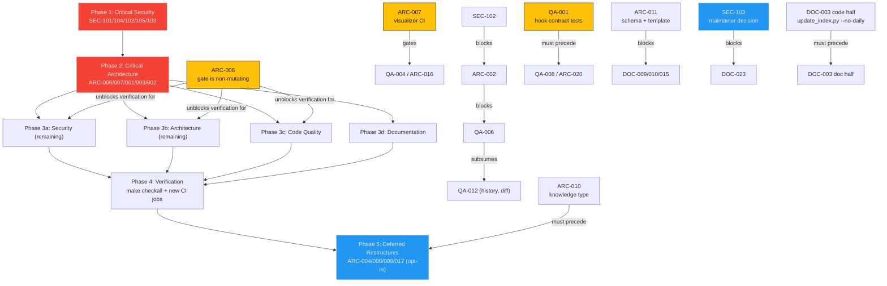

# Project Audit Report

> **Project**: parsidion
> **Date**: 2026-07-28
> **Commit**: `8e5d549` (clean working tree)
> **Stack**: Python 3.13/3.14 (110 files), TypeScript/Next.js 16 (66 files), Markdown (41 files), bun, uv
> **Audited by**: Claude Code Audit System — four Opus 5 domain agents + par-mem knowledge graph
> **Index**: par-mem `repo_id: parsidion`, 242 files / 3,828 symbols / 3,206 CALLS + 611 IMPORTS + 338 DOC_LINK edges

---

## Executive Summary

Parsidion is a well-engineered project that passes its own quality gate cleanly and shows clear evidence of prior security and architecture work — a true environment allowlist, symlink-resolution-before-containment on both the Python and TypeScript sides, parameterized read-only SQL, disciplined `flock` usage, mode-preserving atomic writes, 100% docstring and type-hint coverage on the public API, and zero TODO/FIXME markers anywhere in the source. Almost every finding below is a **gap in an otherwise-correct control** rather than a missing one.

The most critical finding is a **remote code execution path**: the vault's git `post-merge` hook template omits `--no-project` on one of its two `uv run` lines (`installer/vault.py:182`), so `uv` discovers and builds any `pyproject.toml` sitting in the vault worktree before running the target script. For anyone who follows `docs/VAULT_SYNC.md` and adds a git remote, a committer to that remote gains arbitrary code execution on every machine that pulls. The security agent reproduced both legs of this in a contained scratch directory. The adjacent `.gitignore` does not exclude `pyproject.toml`, and the every-other-call-site comparison confirms it is an oversight, not a design choice — `update_index.py:882` invokes *the same script* correctly.

Two other issues warrant immediate maintainer attention. The shipped config template (`skills/parsidion/templates/config.yaml:105-109`) sets `ANTHROPIC_BASE_URL: https://api.z.ai/api/anthropic` with GLM model IDs **as the committed default**, so every user who follows `CLAUDE.md`'s instruction to copy the template routes all nightly summarization — full cleaned transcripts containing source code — to a third-party endpoint. And `README.md:733-737` documents `echo ".obsidian/" > .gitignore` (truncating), which destroys the installer's ten-entry `.gitignore` whose own code comment says `config.yaml` "may hold ANTHROPIC_API_KEY / ANTHROPIC_AUTH_TOKEN — never sync to a remote," immediately before instructing `git add -A && git commit`.

Estimated effort to clear all 14 Critical findings: **2–4 focused days**. Most are one-line or one-block fixes; the genuine work is the four large restructures (deferred to Phase 5) and building the missing test harness for the visualizer routes and the lifecycle hooks.

**Greatest strength**: the Python test suite. 840 passing tests with only 3 of 49 scripts untested, including *architectural guard* tests (`test_vault_dirs_sync.py`, `test_vault_resolver_parity.py`) that assert cross-file invariants rather than unit behavior. That instinct is right and rare — even where one of those guards has silently rotted (ARC-005).

### User-Directed Focus

No focus areas were supplied with this invocation; all four domains received equal weight.

### Issue Count by Severity

| Severity | Architecture | Security | Code Quality | Documentation | Total |
|----------|:-----------:|:--------:|:------------:|:-------------:|:-----:|
| 🔴 Critical | 3 | 2 | 3 | 6 | **14** |
| 🟠 High     | 19 | 3 | 7 | 11 | **40** |
| 🟡 Medium   | 19 | 10 | 6 | 11 | **46** |
| 🔵 Low      | 7 | 19 | 5 | 12 | **43** |
| **Total**   | **48** | **34** | **21** | **40** | **143** |

### Gate Ground Truth

`make checkall` was executed at `8e5d549` and **exits 0**:

```
ruff format --check .   → 103 files already formatted
ruff check .            → All checks passed!
pyright .               → 0 errors, 0 warnings, 0 informations
pytest tests/           → 840 passed, 2 skipped (coverage TOTAL 51%)
make test-graph         → 6 passed
visualizer-check        → tsc clean, eslint clean, 60 pass / 0 fail
checkall-mcp            → ruff clean, pyright 0 errors, 43 passed
```

**Every finding in this report is something the gate does not measure.** Note the gate itself is defective — see ARC-006: `checkall-mcp` delegates to a target that runs `ruff format .` and `ruff check --fix .`, so running the project's own gate **rewrites source files**. The architecture agent could not run it during a read-only audit for exactly this reason.

---

## 🔴 Critical Issues (Resolve Immediately)

### [SEC-101] Vault git `post-merge` hook grants RCE to a hostile vault remote
- **Area**: Security · CWE-94 / CWE-829 / OWASP A08
- **Location**: `installer/vault.py:182`
- **Description**: The installed hook template omits `--no-project` on exactly one of its two `uv run` lines:
  ```bash
  uv run --no-project {scripts_dir}/update_index.py           # line 180 — correct
  uv run {scripts_dir}/build_embeddings.py --incremental      # line 182 — MISSING --no-project
  ```
  `.git/hooks` is not synced by git, so a remote cannot control the hook body — that leg is safe. The exploit is indirect: git runs `post-merge` with cwd set to the vault worktree, and `uv run` without `--no-project` discovers a `pyproject.toml` in cwd and executes its PEP 517 build backend **before** the target script resolves. Reproduced on uv 0.10.2 with a backend that writes a marker at import time — `--no-project` → marker absent; without it → `MARKER: CODE EXECUTED VIA BUILD BACKEND`. Identical inputs; the flag is the only variable. `set -e` does not help, because the payload runs at backend-import time before any error surfaces.
- **Impact**: An attacker with commit access to a shared vault remote (a teammate, or anyone obtaining a write-scoped token) commits a `pyproject.toml` plus a backend module. The victim runs `git pull` in their vault — the exact workflow `docs/VAULT_SYNC.md` prescribes — and the hook builds the attacker's "project" as the victim user. This converts "can commit a markdown note" into "arbitrary code execution on every machine that pulls," with no interaction beyond the documented sync step. The vault `.gitignore` covers neither `pyproject.toml`, `uv.toml`, nor `setup.py`. This is an outlier, not a design choice: every other `uv run` in the codebase passes `--no-project`, including `update_index.py:882`, which invokes *the same* `build_embeddings.py` correctly.
- **Current-machine status (verified by the orchestrator, correcting the agent's "live exposure" framing)**: `~/ParsidionVault/.git/hooks/post-merge` exists at mode `0755` and does contain the vulnerable line — but it is **not currently exploitable on this machine**, for two independent reasons. (1) No git remote is configured on the vault (`git remote -v` is empty), so `post-merge` never fires. (2) The hook still references the **legacy** `~/.claude/skills/parsidion-cc/scripts/` paths, and that directory no longer exists; `uv run --no-project <dead path>` exits 2 (verified), so `set -e` aborts the hook at line 1 before reaching line 2. The template defect is nonetheless Critical because a **fresh** install writes correct, resolvable paths — line 1 succeeds and line 2 runs vulnerable.
- **Secondary defect (this is why the stale hook persists)**: the live hook carries the marker `# parsidion-cc post-merge hook` while `_POST_MERGE_MARKER` is `"# parsidion post-merge hook"` (`installer/vault.py:173`). The containment test at `:217` therefore fails, and the installer falls through to `:219` warning *"already exists (not ours) … Skipping to avoid overwriting your custom hook."* **No future `make install` will ever repair this hook** — and as a functional consequence, post-merge index rebuild on this machine has been silently dead since the `parsidion-cc` → `parsidion` rename.
- **Remedy**: Add `--no-project` to line 182. Teach the marker check to recognize the legacy `parsidion-cc` string so stale hooks regenerate. Manually replace `~/ParsidionVault/.git/hooks/post-merge` on this machine, since the installer will not. Add `pyproject.toml`, `uv.toml`, `setup.py`, `.venv/` to the vault `.gitignore` as defence in depth.

### [SEC-102] Visualizer exposes full vault read/write to the local network with no authentication
- **Area**: Security · CWE-306 / OWASP A01 + A07
- **Location**: `visualizer/lib/apiAuth.ts:57-80`; `visualizer/package.json:6-8`; all 12 route files
- **Description**: Three defects compose into one exposure.
  1. **The bearer token is never checked on reads.** `requireAuth()` is the only function testing `VISUALIZER_TOKEN`, and it is called from mutation handlers only; all nine GET handlers call `requireSameOrigin()` alone. The file's own docstring is factually wrong: *"When VISUALIZER_TOKEN is set at server start, every API request must carry the header `Authorization: Bearer <token>`"* (`apiAuth.ts:13-14`).
  2. **The same-origin guard ignores non-browser clients.** It rejects only the literal string `cross-site`; `curl` omits `Sec-Fetch-Site` entirely, so `site` is `null` and the request passes. The function's own doc comment concedes this.
  3. **The server binds all interfaces.** Scripts are `next dev --port 3999` / `next start --port 3999` with no `-H`. Next.js documents `--hostname` as defaulting to `0.0.0.0`. Next.js 16's `blockCrossSiteDEV` does not help — it returns early unless the path matches `/_next` or `/__nextjs`, never `/api/*`.
- **Impact**: A developer running `make visualizer` on conference or corporate wifi exposes the entire vault. Any host on that network enumerates notes via `/api/files`, reads each via `/api/note?path=…`, and **writes** via `curl -X PUT`. Because vault notes are injected into every future agent session as `additionalContext`, an attacker-written note becomes persistent influence over an agent holding shell and file-write. `POST /api/summarize` and `POST /api/graph/rebuild` additionally spawn subprocesses on demand.
- **Remedy**: Call `requireAuth(req)` in every GET handler; bind loopback (`-H 127.0.0.1`) in both npm scripts; document `VISUALIZER_TOKEN`, which currently appears in no user-facing doc (see DOC-027). No test anywhere covers either guard — add one.

### [ARC-001] Any non-editable install of `parsidion` is dead on arrival
- **Area**: Architecture
- **Location**: `pyproject.toml:41-54`
- **Description**: `[tool.setuptools] py-modules` enumerates 12 modules, but `vault_common.py` (declared) imports six that are **not** declared — `vault_config`, `vault_path`, `vault_fs`, `vault_index`, `vault_hooks`, `vault_adaptive` (`vault_common.py:29,43,65,81,103,128`) — plus `ai_backend`, imported by `vault_merge`/`vault_conflicts`. Verified empirically by staging only the declared modules and importing: `ModuleNotFoundError: No module named 'vault_config'`. The stale `build/lib/` corroborates it: 9 modules, none of the six. The bug is masked today because both consumers use editable installs (`__editable__.parsidion-0.13.0.pth` is a bare path line to the scripts dir).
- **Impact**: `pip install parsidion` or a non-editable `uv tool install .` produces an importable-looking package that fails on first import. `parsidion-mcp/pyproject.toml:6` declares `parsidion[search]` as a hard dependency, so publishing the MCP server against a published `parsidion` ships a broken server. Every `[project.scripts]` console entry point (`vault-search`, `vault-stats`, …) fails identically.
- **Remedy**: Add the seven missing modules to `py-modules` as the immediate fix. Add a CI job that builds a wheel, installs it into a clean venv, and runs `python -c "import vault_common"`. Longer term, ARC-004 replaces the hand-maintained list with a real package.

### [ARC-002] Visualizer note writes silently target the wrong vault; overwrites are possible
- **Area**: Architecture
- **Location**: `visualizer/lib/useVisualizerState.ts:278,324` vs `visualizer/app/api/note/route.ts:76,146`
- **Description**: The client puts the selected vault in the **JSON body** (`if (selectedVault) body.vault = selectedVault`), while the POST and PUT handlers read it only from the **query string** (`req.nextUrl.searchParams.get('vault')`). `body.vault` is destructured nowhere and is silently discarded; `resolveVault(null)` then falls through to `getDefaultVault()`. GET and DELETE use query params correctly — so reads and deletes hit the selected vault while writes hit the default one.
- **Impact**: With a non-default vault selected, PUT creates the note in the default vault (and the subsequent rebuild targets the selected vault, so it never appears); POST either 404s or — when a same-relative-path note exists in the default vault — **overwrites the wrong file**. The mtime conflict check at `route.ts:122-132` compares the wrong file's mtime and cannot prevent it. This is silent data loss.
- **Remedy**: Accept `vault` from the body on POST/PUT (safe — `resolveVault` is an allowlist), and add a per-method contract test. ARC-016 (no route tests at all) is why this survived.

### [ARC-003] `disconnect codex|gemini` tears down shared global infrastructure
- **Area**: Architecture
- **Location**: `installer/skill.py:614-630`; routed from `install.py:810-836`
- **Description**: `disconnect <agent>` maps to `uninstall(hooks_only=False, runtime=agent)`. Inside `uninstall()`, three teardown actions sit at function-body indentation, **outside every** `if uninstall_*_runtime:` guard: `remove_vault_post_merge_hook(...)` (614-615), `unschedule_summarizer(...)` (617), and `vaults_config.unlink()` behind `if yes or _confirm(...)` (623-628).
- **Impact**: `uv run install.py disconnect codex --yes` — documented as removing the Codex integration only — also removes the nightly summarizer launchd plist/cron job, the vault's `post-merge` git hook (breaking multi-machine sync per `docs/VAULT_SYNC.md`), and `~/.config/parsidion/vaults.yaml`, with **no prompt at all** under `--yes`. The still-connected Claude install depends on all three.
- **Remedy**: Gate 614-617 behind an explicit `is_full_teardown = runtime in {"claude", "all"}`; require an explicit `--purge-config` before `--yes` may delete `vaults.yaml`.

### [QA-001] Registered lifecycle hooks have zero test coverage and fail silently by design
- **Area**: Code Quality
- **Location**: `skills/parsidion/scripts/subagent_stop_hook.py` (109 stmts, **0%**, lines 25-260); `skills/parsidion/scripts/post_compact_hook.py` (75 stmts, **0%**, lines 9-140)
- **Description**: Both are registered in `~/.claude/settings.json` and execute on every subagent stop / post-compaction. Neither has a single line exercised by the 840-test suite. Both deliberately swallow exceptions (`subagent_stop_hook.py:78` and `:251`, `except Exception:  # noqa: BLE001`), so a regression produces no error anywhere.
- **Impact**: The failure mode of this product is **silent memory loss** — sessions stop being queued, compaction context stops being restored, and the user gets a vault that looks fine but is missing entries. There is no test and no signal that would catch it.
- **Remedy**: Add stdin/stdout contract tests for both, mirroring `tests/test_hook_integration.py`. Minimum: valid payload → correct `pending_summaries.jsonl` line; malformed payload → `{}` on stdout and a `hook_events.log` entry; excluded agent type → no queue write.

### [QA-002] `install()` is the highest-complexity function in the repo and mutates global user state without a transaction
- **Area**: Code Quality (structurally identical to ARC-017)
- **Location**: `install.py:277` → ~591 — **314 lines, cyclomatic complexity 68**, nesting to level 4
- **Description**: One function performs skill sync, agent install, hook registration into `~/.claude/settings.json`, launchd/cron scheduling, vault creation, and vault `git init`. `installer/skill.py:464 uninstall` (CC 51) is its equally-complex inverse, maintained separately. The 12 execution steps are bare sequential calls with no `try`/`except`/rollback anywhere; only step 1 can abort. Every later step swallows errors into `_warn(...)` and returns `None`, and `install()` inspects no result and unconditionally returns 0.
- **Impact**: A mid-install failure leaves `~/.claude/settings.json` and the vault partially mutated with no rollback, and the installer still prints "Installation complete!" and exits 0 — so `make install` and CI cannot detect a broken install. Because install and uninstall are two independent ~300-line branch forests, keeping uninstall a true inverse is manual and unverifiable; anything install creates that uninstall forgets becomes permanent litter in the user's home directory.
- **Remedy**: Decompose into ordered, individually-testable steps (`sync_skill`, `sync_agent`, `register_hooks`, `schedule_summarizer`, `provision_vault`), each exposing `undo()`. Drive both `install()` and `uninstall()` from the same step list so they cannot drift. Snapshot `settings.json` before mutation and restore on any step failure. Have each step return a bool or raise; return non-zero if any failed. **Deferred to Phase 5** as a large restructure.

### [QA-003] `vault_doctor.py` is a 3,127-line God module whose destructive entry point is 48% covered
- **Area**: Code Quality (same subject as ARC-008)
- **Location**: `skills/parsidion/scripts/vault_doctor.py`; `run_scan_and_repair:2546` — **309 lines, CC 58, nesting to level 6**; coverage shows lines **2587-2853 and 2858-3109 entirely unexercised**
- **Description**: 44 top-level functions spanning at least nine unrelated jobs: frontmatter repair, tag deduplication, heading promotion, subfolder migration, daily-note renaming, session dedup, broken-link scanning, prefix stripping, and graph rebuild. `run_scan_and_repair` is the `--fix-all` orchestrator the nightly cron invokes, and the bulk of its body is never executed by a test. Also over threshold in the same file: `_repair_one:1595` (CC 38), `check_note:894` (CC 35), `_normalize_underscores_in_frontmatter:2016` (CC 31), `_replace_tag_in_note:1853` (CC 26).
- **Impact**: This is the one tool that rewrites, moves, and renames the user's notes in bulk, unattended, on a schedule. A CC-58 function at six levels of nesting with two-thirds of its lines untested is where a vault-corrupting bug will live. Compounding: `docs/ARCHITECTURE.md:481` omits that `--fix-all` also sets `args.strip_prefixes = True` (`vault_doctor.py:3071-3076`) — an **undocumented bulk file rename** in the nightly cron path.
- **Remedy**: Split by fix-mode into `vault_doctor/` submodules behind a common `Fixer` protocol; reduce `run_scan_and_repair` to a loop over a `(flag, scan_fn, fix_fn)` registry. Add a test per destructive mode asserting dry-run makes no filesystem change and `--execute` produces exact expected note content. **Deferred to Phase 5.**

### [DOC-001] README's vault git setup leaks API credentials and destroys installer protection
- **Area**: Documentation
- **Location**: `README.md:733-737`
- **Description**: The documented setup is `echo ".obsidian/" > .gitignore` followed by `git add -A && git commit`. That single-entry `.gitignore` does not exclude `config.yaml`, which `README.md:606-611` itself shows holding `ANTHROPIC_API_KEY` and `ANTHROPIC_AUTH_TOKEN`. The installer writes a **ten-entry** `.gitignore` (`installer/vault.py:113-126`) with an explicit code comment: *"config.yaml / config.local.yaml may hold ANTHROPIC_API_KEY / ANTHROPIC_AUTH_TOKEN (anthropic_env section) — never sync to a remote."* Because the README uses `>` (truncate), following it **overwrites the installer's correct file with one line**, actively removing protection. `docs/VAULT_SYNC.md:75-76` then instructs `git remote add origin` + `git push`, completing the path to a remote. *Independently verified by the orchestrator against both files.*
- **Impact**: Any user following README's git section commits live API keys, then pushes them. `docs/VAULT_SYNC.md:120-124` states the exact opposite security rule, so the two documents contradict each other on a credential-handling instruction.
- **Remedy**: Replace the block with a pointer to the installer's automatic git init, or reproduce all ten `.gitignore` entries using `>>`. Add a `> **Security:**` callout matching `docs/VAULT_SYNC.md:120-124`.

### [DOC-002] `vault-export --pdf` is a phantom feature documented in four places
- **Area**: Documentation
- **Location**: `CLAUDE.md:113`, `CLAUDE.md:322`, `README.md:219`, `README.md:861`
- **Description**: `CLAUDE.md:113` reads `vault-export --pdf ~/vault.pdf     # PDF via pandoc`. `vault_export.py` defines exactly seven arguments — `--vault/-V`, `--html`, `--zip`, `--list`, `--project`, `--folder`, `--tag` — and contains **zero** occurrences of the strings `pdf` or `pandoc` (verified by AST extraction and `grep -c`). The command fails with `unrecognized arguments`. `docs/ARCHITECTURE.md:827-829` correctly omits PDF, so the root docs are the stale ones.
- **Impact**: Every user or agent attempting the documented export hits a hard failure. Conversely `--list`, `--project`, `--folder`, `--tag` are real but undocumented.
- **Remedy**: Delete the `--pdf` claim from all four sites; document the four real undocumented flags.

### [DOC-003] `make graph` Daily-note behavior is documented backwards, and the config toggle is a no-op
- **Area**: Documentation (**requires a code fix first**)
- **Location**: `CLAUDE.md:291`, `README.md:475`, `skills/parsidion/scripts/update_index.py:757-763`
- **Description**: `build_graph.py:44` sets `parser.set_defaults(include_daily=True)`; `--no-daily` is the only exclusion path. `Makefile:53-54` passes no flags, so `make graph` **includes** Daily notes and `make graph-with-daily` is identical. `CLAUDE.md:291` claims "excludes Daily notes"; `README.md:475` claims `# exclude Daily notes (recommended)`. `docs/VISUALIZER.md:551` has it right, so the docs contradict each other. Compounding this, `update_index.py:757-759` appends `--include-daily` when requested but **never passes `--no-daily`**, while `:761-763` prints a literally false `"without Daily notes"` message.
- **Impact**: Users believe they control graph contents; both documented modes produce identical output. Fixing the docs alone would enshrine a code bug.
- **Remedy**: **Code fix first** — make `update_index.py` pass `--no-daily`. Then correct the two doc sites to describe intended (not current) behavior.

### [DOC-004] `docs/README.md` index links a file excluded from the repository
- **Area**: Documentation
- **Location**: `docs/README.md:32`; `docs/ARCHITECTURE.md:1261`
- **Description**: The index row `| [ideas.md](ideas.md) | ... |` points at `docs/ideas.md`, which `.gitignore:20` (bare `ideas.md`, matching at any depth) excludes. `git check-ignore -v docs/ideas.md` → `.gitignore:20:ideas.md	docs/ideas.md`; `git ls-files docs/` does not list it.
- **Impact**: Every reader who clones the repo gets a dead link from the documentation index — the file exists only on the author's machine.
- **Remedy**: Either un-ignore and commit it, or remove the index row and the `docs/ARCHITECTURE.md:1261` tree entry.

### [DOC-005] `bun` is required to run the project's own quality gate but is absent from every prerequisites list
- **Area**: Documentation
- **Location**: `CONTRIBUTING.md:14-18`; `README.md:41-48`
- **Description**: `Makefile:33` defines `checkall: fmt-check lint typecheck test test-graph visualizer-check checkall-mcp`, and `Makefile:30` is `visualizer-check: cd visualizer && bunx tsc --noEmit && bun run lint && bun test`. `CONTRIBUTING.md` never mentions `bun`, `visualizer`, `node`, or `npm` (grep exits 1), yet its setup step 5 (`:45`) instructs `make checkall`. README's prerequisites list Python, uv, Obsidian, jq, mcpl, agentchrome, par-mem — no bun.
- **Impact**: A contributor completing the documented setup and running the documented verification command fails immediately with no forewarning. This blocks first-time onboarding.
- **Remedy**: Add `bun` (required for the visualizer and `make checkall`) to both lists; note `make checkall` also needs `parsidion-mcp` deps synced.

### [DOC-006] `docs/VISUALIZER.md` documents an API contract the code does not implement
- **Area**: Documentation
- **Location**: `docs/VISUALIZER.md:674-676`
- **Description**: The doc specifies request body `{ stem, content, lastModified? }` and "409 if note was modified externally". The route destructures `const { stem, path: relPath, content, baseMtimeMs } = body` and gates on `if (baseMtimeMs !== undefined)` (`visualizer/app/api/note/route.ts:78`); the conflict response is `NextResponse.json({ conflict: true, serverContent, mtimeMs })` with **no status argument**, so Next.js returns **200**, not 409 (`route.ts:132`).
- **Impact**: A client written from the docs sends the wrong field name — optimistic locking silently never engages — and branches on `res.status === 409`, which never fires. Concurrent edits overwrite each other silently.
- **Remedy**: Correct the field name to `baseMtimeMs` and the status to 200, or change the code to honor the documented contract. See also ARC-040 (conflict is encoded three different ways across two files).

---

## 🟠 High Priority Issues

### Security

- **[SEC-103] Shipped config template routes all AI traffic and credentials to a third-party endpoint by default** — `skills/parsidion/templates/config.yaml:102-109`. The template `CLAUDE.md:191` tells users to copy verbatim ships `ANTHROPIC_BASE_URL: https://api.z.ai/api/anthropic` with `GLM-5-TURBO`/`GLM-5.1` as **defaults**. Committed in `c216e6a`, not a local artifact. The value demonstrably reaches subprocesses: `ANTHROPIC_BASE_URL` is in `_CONFIGURABLE_ENV_KEYS` (`vault_hooks.py:188-201`) and is merged into the environment of every `claude -p` call. Every nightly summarization — full cleaned transcripts containing source code and file contents, running unattended — goes to `api.z.ai` with whatever credential is configured, with no indication to the user. The adjacent `defaults:` block still names genuine Claude models, contradicting it, which suggests a personal setting leaked into the template. *Independently verified by the orchestrator.* **This needs a maintainer decision, not an automated fix** — per standing policy, security/credential configuration is never auto-replaced. CWE-1188.
- **[SEC-104] Vault `.gitignore` misses `.bak` and `conflicts/`; sensitive files are already committed** — `installer/vault.py:113-126` lists exact filenames with no globs, so backups created by migration code (`migrate_memory.py:505` and timestamped `.bak-YYYYMMDD-HHMMSS` variants) match nothing. `git ls-files` in the live vault returns four tracked files the rules were written to exclude: `pending_summaries.jsonl.bak`, `pending_summaries.jsonl.bak-20260712-092800`, `dead_letters.jsonl.bak-20260712-092800`, `conflicts/report.json` — containing session IDs, absolute transcript paths, and project names. Because they are already in commit history, adding a remote leaks them retroactively. No remote is configured today, which is why fixing it now is cheap. Also, line 133's `e not in content` substring test means a commented-out `# config.yaml` counts as present and suppresses the real entry. CWE-538.
- **[SEC-105] Malformed `settings.json` is silently discarded, then overwritten — destroying `permissions.deny`** — `installer/hooks.py:565-567`, write at `:621-629`. `except (json.JSONDecodeError, OSError): settings = {}` means one stray comma in `~/.claude/settings.json` replaces the file with parsidion's hooks alone. `permissions.allow`, **`permissions.deny`**, `env`, `statusLine`, MCP servers, and every non-parsidion hook are destroyed behind a single yellow warning, on every `make install`. There is no backup anywhere in the installer, and the write is non-atomic. The correct pattern exists two functions away — the Codex and Gemini readers bail out on parse failure (`hooks.py:172-188`, `:201-219`), as do `remove_installed_hooks`, `remove_legacy_hooks`, and `enable_ai_mode`. `merge_hooks` is the sole exception. Rated High for silently removing security controls with no recovery path, despite the benign trigger. CWE-345.

### Architecture

- **[ARC-004] `skills/parsidion/scripts/` is a 49-file flat directory with no package boundary** — six unrelated concerns in one directory (7 core library modules, 10 hook scripts + a shell wrapper, 8 user-facing CLIs, 2 backends, 5 `embed_eval_*` scripts, 2 one-off migrations, 4 build/index tools, and `html-to-md.py` whose hyphen makes it unimportable). No `__init__.py`, so every import depends on the scripts dir being on `sys.path`; five modules insert it themselves and `parsidion-mcp/.../search.py:8` documents relying on that side effect. This is the root cause of ARC-001 and of the `sys.path` mutation. Critically, **the project's hardest constraint has no structural enforcement** — stdlib-only hook code sits beside `vault_stats.py` (30 `rich` imports), `vault_search.py` (`fastembed`, `sqlite_vec`), and `vault_conflicts.py`. Nothing but review prevents a hook from importing an extra; no test asserts it. **Remedy**: split into `parsidion/core/` (stdlib-only), `parsidion/hooks/`, `parsidion/cli/`, and `tools/` outside the installed tree; add a test importing every `core/` and `hooks/` module with `sys.modules` poisoned against `rich`/`fastembed`/`sqlite_vec`. **Deferred to Phase 5** — it is the only finding that moves files.
- **[ARC-005] The installer's `VAULT_DIRS` single-source-of-truth is silently dead** — `installer/paths.py:95-131`. `_extract_vault_dirs()` regex-scans **`vault_common.py`** for `^VAULT_DIRS: list[str] = [...]`. After the ARC-005 module split, `vault_common.py` only re-exports the name (line 83); the canonical definition moved to `vault_path.py:72`. Verified: the regex returns no match, so the function silently falls through to the hardcoded fallback at 103-115, and `installer.VAULT_DIRS` *is* that fallback at runtime. `tests/test_vault_dirs_sync.py` passes only because the fallback still happens to match — it validates the *values*, not the *mechanism* — and its failure message ("install.py should extract VAULT_DIRS from vault_common.py source") is now false, pointing future maintainers at the wrong file.
- **[ARC-006] `make checkall`, the documented quality gate, rewrites source files** — `Makefile:33,37`. Root `checkall` uses non-mutating `fmt-check` and `lint`, but its last dependency `checkall-mcp` delegates to `$(MAKE) -C parsidion-mcp checkall`, whose `checkall: fmt lint typecheck test` runs `ruff format .` and `ruff check --fix .` — both rewriting. The project's own verification command mutates the working tree, so it cannot be run to *check* anything. **The architecture agent could not run the gate during this audit for exactly this reason** — the finding blocked its own verification.
- **[ARC-007] CI covers neither the visualizer nor the pi extension** — `.github/workflows/ci.yml` runs root and `parsidion-mcp` fmt-check/lint/typecheck/pytest, but never `visualizer-check` or `test-graph`, both of which are in `make checkall`. 66 TypeScript files / ~12.5k LOC — including all 12 API routes and `vaultResolver.ts`'s path-traversal guards — merge with zero automated verification. Separately `extensions/pi/parsidion/` (914 LOC, including `parsidion-status.test.ts`) is referenced by no Makefile target, CI job, or pre-commit hook. `visualizer-check` also omits `next build`, so RSC boundary violations (ARC-041) pass `tsc --noEmit` and fail only at deploy.
- **[ARC-008] `vault_doctor.py` is a 3,127-LOC God module** — see QA-003; same subject, architecture framing. **Phase 5.**
- **[ARC-009] `summarize_sessions.py` is a 2,242-LOC module with twelve responsibilities** — queue IO, transcript cleaning for three formats, hierarchical chunking, prompt construction, backend invocation, note schema + validation, five AI-output salvage passes, note writing with collision merge, semantic dedup, progress reporting, singleton locking, index rebuild, git commit, and the CLI. `summarize_one` is 265 lines; `main` is 268. Control flow uses six sentinel return values (`_STALE`/`_SKIPPED`/`_DEAD`/`_DEFERRED`/`None`/`Path`) that callers re-classify in two places — **and those two places disagree**: `_run_one` (1586-1593) counts `_DEAD` as "skipped", `main` (2156-2171) counts it as "stale", so reported statistics are wrong depending on which counter is read. **Phase 5.**
- **[ARC-010] The summarizer can never write a `knowledge` note** — `summarize_sessions.py:208-217` (`_TYPE_FOLDERS`), `:607-618` (`_VALID_NOTE_TYPES`), `:502` (prompt) all omit `knowledge`, while it is first-class everywhere else (`vault_doctor.py:73-85` `VALID_TYPES`, `vault_new.py:26`, `vault_path.py:81`, `templates/knowledge.md`, and root `CLAUDE.md`). Two failure modes: the prompt never offers it, so no session-derived note reaches `Knowledge/`; and if the model emits it anyway — plausible, since the dedup block shows it similar existing notes — validation rejects it, `write_note` refuses, and the session burns three AI calls before dead-lettering. A whole note category is silently discarded. **One-line fix; do it before the ARC-009 restructure.**
- **[ARC-011] The shipped config template produces six false validation warnings** — `vault_config.py:350-455` (`_CONFIG_SCHEMA`) vs `templates/config.yaml`. Reproduced by copying the repo's own template into a clean vault and calling `validate_config()` — 6 warnings, all for keys the code genuinely honors: `session_stop_hook.transcript_tail_lines`, `session_stop_hook.pi_transcript_tail_lines`, `summarizer.transcript_tail_bytes`, `summarizer.rebuild_graph`, `summarizer.graph_include_daily`, `event_log.path`. In the opposite direction `summarizer.ai_timeout` is read at `:1039` and `:1362` but appears in neither schema, template, nor `CLAUDE.md`. And the schema declares three sections — `ai`, `ai_models`, `codex_cli` — that drive backend selection but are **absent from the template users are told to copy**. Since `validate_config()` runs at `session_start_hook.py:1131`, every user following the documented setup sees six spurious warnings at every session start, training them to ignore the validator entirely.
- **[ARC-012] One unguarded write aborts the entire parallel summarization run** — `summarize_sessions.py:1432`, `:960`, `:1602-1604`. `run_all` fans out via `anyio.create_task_group()`, which cancels all siblings when any child raises. `summarize_one` guards the AI call and the backlink step but leaves two write paths unguarded. One malformed session kills all in-flight sessions, and `main` never reaches its cleanup at 2177 — **the queue is not cleaned, the index is not rebuilt, the git commit never happens** — while notes from completed tasks remain on disk. The next run re-processes those sessions and, because their slugs now exist, appends `## Session update` blocks, compounding duplicate content on every crash.
- **[ARC-013] `_prune_dead_letters` reads outside the lock it writes under** — `summarize_sessions.py:1675-1733`. The read at 1695-1698 is unlocked; `LOCK_EX` is taken 25 lines later at 1720-1722, immediately before `seek(0)`/`truncate()`. Any `_append_dead_letter` (which *does* lock) landing in that window is destroyed. Reachable in normal operation: prune runs on every invocation (`main:2097`) and `session_stop_hook.py:204-216` spawns a summarizer on every session end. Lost dead-letter records are not just lost visibility — `_dead_lettered_ids` is the guard that stops a re-queued session from re-billing an AI call. The truncate is also non-atomic, unlike `remove_processed` (1812-1816) which correctly uses tmp+`replace`. *(Also filed as SEC-129.)*
- **[ARC-014] `VISUALIZER_TOKEN` protects zero read endpoints** — architecture framing of SEC-102; see that entry. Compounding: `/api/stats` imports **neither** guard — the only such route, itself evidence that guards are applied by hand rather than structurally. **Remedy**: enforce both through a shared `withApi()` wrapper so a new route cannot forget them.
- **[ARC-015] `graph.json` is read synchronously and in full on every request** — `visualizer/app/api/graph/route.ts:30`. `fs.readFileSync` on a **47.5 MB** file (measured: 5,563 nodes, 376,060 edges), materialized as a JS string, on the Node event loop, per request. No `ETag`, `Last-Modified`, or `Cache-Control`. Refetched wholesale on mount, every vault switch, every `graph:rebuilt` SSE event, and after every note creation. `lib/graphDelta.ts` exists precisely to avoid this and is used correctly client-side, but the server never got a delta endpoint. **Remedy**: stream the file, add an mtime-derived `ETag` with `If-None-Match` → 304, add `GET /api/graph/delta?since=<generated>`.
- **[ARC-016] No tests for any API route, component, or the vault path guards** — all 60 visualizer tests target pure `lib/` helpers. Untested: all 12 route files, all 20 components, `useVisualizerState.ts` (571 LOC), and — most importantly — `lib/vaultResolver.ts`, which owns `guardPath()`, `validateVaultPath()`, and the `resolveVault()` allowlist, carrying SEC-001/SEC-012 annotations and constituting the app's entire path-traversal defense. ARC-002 is precisely the class of bug a single route test would have caught. *(Same subject as QA-004.)*
- **[ARC-017] `install()` and `uninstall()` re-inline one runtime matrix ~20 times** — see QA-002. `if install_claude_runtime and not args.skip_hooks:` appears at 490 and again at 507; the same predicates are re-evaluated a third time in the plan block (407-438) purely to decide what to print. This is the structure that let ARC-003's unguarded teardown hide in plain sight. **Phase 5.**
- **[ARC-018] No atomic write, backup, or lock on `~/.claude/settings.json`** — all 13 config write sites across `installer/` are bare `path.write_text(...)`; searching for `os.replace|NamedTemporaryFile|flock|backup|\.bak` returns zero hits. A single install performs **two** independent read-modify-write cycles on the same `settings.json` (`merge_hooks`, then `enable_ai_mode` re-reads and rewrites it). A crash or Ctrl-C mid-write truncates the user's settings, destroying all unrelated Claude Code configuration with no recovery path. The project already uses `fcntl.flock` for `pending_summaries.jsonl`, so the pattern is known but unapplied to the far more valuable file.
- **[ARC-019] A custom `--vault` path is never persisted, so the runtime resolver cannot find it** — `resolve_vault()` reads four channels; the install flow writes the chosen path into **none** of them. `create_vaults_config()` only emits a template whose vault entries are all commented out, and runs solely behind the opt-in `--create-vaults-config`. So `uv run install.py --yes --vault ~/WorkVault` — the exact invocation documented at `install.py:656-657` — populates `~/WorkVault` while every installed hook continues reading `~/ParsidionVault`. Related dead code: `_resolve_vault_root_for_uninstall()` parses a `vault_root:` key from `config.yaml` that nothing ever writes.
- **[ARC-020] Per-agent hook wrappers are 93-99% copy-paste; a fourth agent is pure duplication** — `codex_session_start_hook.py` (77 LOC) vs `gemini_session_start_hook.py` (78 LOC) differ only in docstrings and one literal; `codex_stop_hook.py` (107) vs `gemini_session_end_hook.py` (107) differ only in two function references, with the whole 60-line `main()` duplicated verbatim. The SessionStart wrappers correctly delegate to `session_start_hook.build_session_context`; the stop wrappers delegate to nothing and reimplement the entire queueing pipeline. A concrete consequence: the Codex/Gemini wrappers call `write_hook_event` and `git_commit_vault` **zero** times each (vs 2× each in `session_stop_hook.py`), so `vault-stats --hooks` is blind to every Codex/Gemini session and a Codex-only user's vault silently accumulates uncommitted daily-note changes. A **third** mechanism already exists: the pi extension is installed by a standalone bash script, is unknown to `install.py connect`, and invokes scripts via bare `python3` rather than `uv run --no-project`. *(Same subject as QA-008.)*
- **[ARC-021] `parsidion-mcp` straddles two copies of the code and has no vault scoping** — `ops.py:11` sets `SCRIPTS_DIR = vault_common.SCRIPTS_DIR`, hardwired to `~/.claude/skills/parsidion/scripts`, and subprocesses `update_index.py` / `vault_doctor.py` from there — while the same process *imports* `vault_common`/`vault_search` from the repo via the editable install. Two copies of the same codebase serve one request. Separately, **no MCP tool accepts a vault parameter**, so multi-vault support — real in the Python layer and in the visualizer — is silently absent at the MCP layer. `vault_context` also re-implements a simplified `session_start_hook` selection with no graph expansion, adaptive ranking, or semantic search.
- **[ARC-022] Partial install leaves inconsistent state and always reports success** — see QA-002. Additional asymmetry: uninstall never removes the `<!-- BEGIN parsidion -->` blocks injected into `~/.codex/AGENTS.md` / `~/.gemini/GEMINI.md` (no removal function exists), never reverts `[features] hooks = true` in `~/.codex/config.toml`, never runs `uv tool uninstall`, and never removes the `Templates` symlink. A "disconnected" Codex still loads the full parsidion instruction block every session.

### Code Quality

- **[QA-004] The visualizer has no tests for any component or any API route** — see ARC-016.
- **[QA-005] 13 subprocess call sites have no timeout; one blocks the index rebuild indefinitely** — only 7 of ~36 sites pass `timeout=`. Worst: `update_index.py:764` runs `build_graph.py` synchronously with no bound, and `update_index.py` is invoked from the summarizer and from post-write hook paths, so a hung child stalls the summarizer mid-run and leaves the index stale with no error. Others: `vault_merge.py:851`, `vault_doctor.py:2166`, `summarize_sessions.py:1860`, `installer/vault.py:162-164`, `installer/schedule.py:130,134,191,200,288,299,314`, `installer/skill.py:179`. **`ai_backend.py:158-191` already implements the correct pattern including process-group escalation — reuse it.**
- **[QA-006] `findNote` is triplicated across API routes and the copies have diverged** — `note/route.ts:11`, `note/history/route.ts:8`, `note/diff/route.ts:8`. A prior fix (comment `QA-006` at `note/route.ts:7-9`) converted only the first copy to async `fs.promises`; the other two still call synchronous `fs.readdirSync` and recurse over the entire vault tree per request. Textbook shotgun surgery — the next fix must be applied three times, and two of three were already missed. **Remedy**: extract the async version into `lib/` next to `guardPath` and have all three routes import it. *(Also ARC-035, which notes `app/api/files/route.ts:15-41` is a fourth variant.)*
- **[QA-007] Twelve tests assert nothing; 48 more assert only triviality** — `tests/test_vault_stats.py:160,164,186,191`; `test_vault_common.py:498,506,514`; `test_atomic_write_fixes.py:79`; `test_embed_eval.py:265,269`; `test_merge_preview.py:303`; `test_session_start_hook.py:426`. The worst offender is misleadingly named: `test_reads_pending_entries` writes two pending entries, calls `run_pending(vault)`, and verifies nothing about what was read — its own comment says *"just confirm no exception"*. All four `test_vault_stats.py` cases would pass against `def run_pending(v): pass`, while `vault_stats.py` sits at **12%** coverage. **Remedy**: capture stdout via `capsys` and assert rendered content; rename pure smoke tests to `test_*_does_not_raise`; for the flock tests assert observable lock state.
- **[QA-008] Five agent-extension hooks are ~90% copy-paste, all at 0% coverage** — 469 lines across five files whose only real variation is three symbols. See ARC-020. **Remedy**: collapse to one parameterized module driven by a runtime descriptor; the five files become three-line shims, and one parameterized test covers all runtimes.
- **[QA-009] `build_embeddings.py` and `embed_eval_run.py` import third-party libs unguarded, contradicting the documented graceful-degradation contract** — `build_embeddings.py:27-28`, `embed_eval_run.py:26-34` import `sqlite_vec`/`fastembed`/`rich` at module top level. `CLAUDE.md` states these "degrade gracefully when absent"; three of the four optional-dependency consumers genuinely do (`vault_search.py:64-71`, `vault_merge.py:710-717`, `vault_conflicts.py:169-173`). These two raise a raw `ImportError` traceback at import time. Because `update_index.py:880-899` spawns `build_embeddings.py` detached into a log file, **without the `search` extra every index rebuild silently writes a traceback to `~/.claude/logs/parsidion-embed.log` while the user sees "Embeddings: full rebuild launched in background"** — a success message for something that never ran. `CLAUDE.md` is currently false for these two files.
- **[QA-010] Backlink rewrite writes note bodies non-atomically** — `vault_merge.py:603` `path.write_text(new_content, encoding="utf-8")`. The repo has a shared `vault_fs.atomic_write_text` used at 11 sites in `vault_doctor.py` alone. An interrupt during `vault-merge` truncates a note that was merely a *link target*, not the note being merged — silent collateral data loss in a file the user did not ask to modify.

### Documentation

- **[DOC-007] `CLAUDE.md` names a function that does not exist** — `CLAUDE.md:207` cites `vault_common._safe_env()`. No such symbol exists; at runtime `hasattr(vault_common, "_safe_env")` is `False`. The real readers are `vault_hooks.py:221 _configured_env_defaults()` and `:252 env_without_claudecode()`. `CLAUDE.md` is read by every AI session in this repo, so this sends every agent to a dead symbol.
- **[DOC-008] `CLAUDE.md` documents a vault-override environment variable that is never read** — `CLAUDE.md:369` claims override via `VAULT_PATH`. That string appears **nowhere** in `skills/`, `installer/`, `install.py`, or `parsidion-mcp/src`. The real variable is `CLAUDE_VAULT` (`vault_path.py:351`), and the documented precedence is explicit flag → `cwd/.claude/vault` → `CLAUDE_VAULT` → default. `README.md:725` and `docs/EMBEDDINGS.md:160` both get this right; `CLAUDE.md` is the sole outlier and also omits the `.claude/vault` step.
- **[DOC-009] The backend-selection config sections are entirely undocumented, and the "all options" template claim is false** — `_CONFIG_SCHEMA` declares **17** sections; `CLAUDE.md:196-211` lists 14, omitting `ai` (`backend`), `ai_models` (`claude`, `codex`), and `codex_cli` (6 keys). These are not minor: `ai_backend.py:84` reads `ai.backend` to choose Claude vs Codex and `:121` reads `ai_models.<backend>` for model tiers — the entire multi-backend feature. The shipped template omits all three, so `CLAUDE.md:187`'s claim that it holds "all options and their defaults" is false.
- **[DOC-010] Three documented config keys are inert** — verified by AST extraction of every `get_config` call. `event_log.path` (`CLAUDE.md:209`, shipped at `templates/config.yaml:122`, absent from `_CONFIG_SCHEMA['event_log']`), `adaptive_context.decay_days` (`CLAUDE.md:210`), and `defaults.sonnet_model` (`CLAUDE.md:203`) are never read. Users set them and observe no behavior change, with no error. Everything else in the table verified correct.
- **[DOC-011] `SECURITY.md` omits the Gemini adapter from a security policy's scope** — `SECURITY.md` mentions Gemini **zero times**; its Overview and Scope table list only Claude and Codex. But the Gemini adapter is fully implemented (`installer/skill.py:288 install_gemini_md()`, `remove_gemini_hooks`, `_wants_gemini_runtime`, and two executable lifecycle hooks). An entire code-execution surface sits outside the declared scope, and "Out of Scope" does not exclude it either. Both Gemini hooks were verified stdlib-only, so the existing guarantee holds — **documentation-only fix**. *(SEC-132 adds that the scope table also omits the visualizer, the only network-facing component.)*
- **[DOC-012] `CONTRIBUTING.md` misstates the PEP 723 exception list** — claims "the four PEP 723 scripts (`summarize_sessions.py`, `build_embeddings.py`, `vault_search.py`, `vault_new.py`)". `vault_new.py` has **no** PEP 723 block. There are **eleven** files carrying `# /// script`, not four. `CLAUDE.md:269` separately lists `vault_new.py` as stdlib-only, directly contradicting `CONTRIBUTING.md`. This is the governing document for the project's central architectural constraint, and it is the stalest root doc (last touched 2026-04-27, predating the ARC-005 split).
- **[DOC-013] `visualizer/README.md` documents a deleted WebSocket server** — line 3 claims "live file updates over WebSocket"; line 59 lists "`server.ts` — custom Next.js dev server with WebSocket vault file watching"; line 68 says `bun run build  # Build Next.js and the custom server`. The SSE migration removed all of this: `server.ts` does not exist, `ws` is absent from `package.json`, `lib/useVaultFiles.ts:92` uses `new EventSource(...)`. `docs/VISUALIZER.md` and `visualizer/CLAUDE.md` were both updated; this file was missed.
- **[DOC-014] `docs/ARCHITECTURE.md` states three of four `vault_links` signatures incorrectly** — `:775-778`. Documented `find_related_by_tags(note_path, vault_root, limit)` vs actual `find_related_by_tags(new_note_path, new_tags, max_links=5, vault_notes=None, vault=None)`; documented `add_backlinks_to_existing(new_note_path, vault_root)` vs actual `(new_note_path, related_notes, vault_notes=None, vault=None)`. Two documented signatures **omit a required positional parameter**. `vault_links` is the shared backlink API used by both the summarizer and `parsidion-mcp`; anyone coding from this doc writes a `TypeError`. The docstrings in the source are complete and correct — only the prose drifted.
- **[DOC-015] The shipped config template points users at the legacy vault path** — `templates/config.yaml:3` reads `# Place at ~/ClaudeVault/config.yaml` and `:122` references `~/ClaudeVault/hook_events.log`. The default vault is `~/ParsidionVault/`, and `CLAUDE.md:191` correctly instructs `cp ... ~/ParsidionVault/config.yaml`. A new user following the template's own instruction places `config.yaml` in a directory that does not exist on a fresh install, and the config is silently never loaded. *Verified by the orchestrator.*
- **[DOC-016] `parsidion-mcp/` ships with no README** — `git ls-files` shows only `Makefile`, `pyproject.toml`, `src/`, `tests/`, `uv.lock`. It is a genuinely standalone artifact with its own `[project]` name, version, entry point, and quality gate, yet nothing inside the directory points to `docs/MCP.md` two levels up.
- **[DOC-017] `docs/ARCHITECTURE.md` claims the installer copies `config.yaml`; it never does** — `:1014`, `:1396`. No copy exists in `install.py` or `installer/`. The installer only writes individual keys into an existing file (`install.py:532`, `:535`, `installer/skill.py:349`). A reader expects a populated commented `config.yaml` after install, does not find one, and cannot tell whether the install failed.

---

## 🟡 Medium Priority Issues

### Architecture
- **[ARC-023]** Import cycles broken only by lazy imports — `vault_hooks.py:19` ↔ `vault_fs.py:585`; `vault_search.py:42` ↔ `parmem_backend.py:399`; `vault_search.py:731` ↔ `vault_tui.py:50`. Structural cycles papered over, not resolved.
- **[ARC-024]** The ARC-005 facade split delivered no consumer-side decoupling — essentially every consumer still imports `vault_common`, including low-level ones like `ai_backend.py:15` and `parmem_backend.py:26` (a layering inversion). Measured: `import vault_path` loads 1 module in 4.5 ms; `import vault_common` loads 7 in 19 ms. Latency-sensitive hooks pay the full graph.
- **[ARC-025]** `uninstall()` orchestration is misplaced, with 25+ cargo-cult local imports — `installer/skill.py:475-501` lazily imports `hooks`, `paths`, `schedule`, `vault`, making `skill.py` the top-level orchestrator, a role belonging to `install.py`. Most function-local imports are not cycle breakers at all (`from installer.colors import bold, dim` appears 9× in `hooks.py`; `colors.py` imports nothing).
- **[ARC-026]** One install command, two deployment models — `installer/skill.py:68,106` symlinks on Unix but `copytree`s on Windows. On Unix edits are live and `CLAUDE.md`'s "after editing source files run `uv run install.py --force --yes`" is unnecessary; on Windows it is mandatory. The docs describe only the copy model. This also determines whether ARC-021's dual-source problem is latent or live.
- **[ARC-027]** The summarizer shells out to four sibling scripts three different ways. Two concrete bugs follow: (a) `rebuild_index:1854` omits `--no-project`, so `uv` walks up from the inherited cwd — the *user's project directory* for the auto-launch path — and syncs an unrelated project's dependencies; the failure is swallowed into a warning at 1868, so the index silently goes stale while the run reports success. (b) `vault_links.find_related_by_semantic` (`vault_links.py:363-367`) never forwards `--vault`, so for multi-vault users backlinks are computed against the wrong vault and `strip_unresolved_wikilinks` then strips them, masking the bug.
- **[ARC-028]** Two subprocess spawns and two embedding-model cold starts per session — each queue entry spawns `vault_search.py` twice, and `vault_search.py:148-150` lazily loads a ~67 MB ONNX model per spawn with no sharing. At `max_parallel: 5` that is up to 5 concurrent model loads. Also `_dead_lettered_ids` re-parses the whole dead-letter file once per entry, and `read_project_names` reads every note in the vault on every run to collect `project` values already available as a `note_index` column.
- **[ARC-029]** Six prompts are inline literals and the note schema is restated in three vocabularies (`summarize_sessions.py:502-511`, `vault_doctor.py:1418-1424`, `:1398-1403`). `vault_doctor` interpolates its enum from code while the summarizer hardcodes prose — which is exactly how ARC-010 happened.
- **[ARC-030]** Failure classification is free text, so permanent failures retry three times — `_mark_failure(entry, reason)` stores a human string and `remove_processed:1787` increments `attempts` identically for all six classes. A validation failure (deterministic, permanent) burns 3 AI calls exactly like a timeout.
- **[ARC-031]** `LAST_BACKEND` is a module global and `score` means two different things — par-mem returns RRF rank-fusion values while the embeddings path returns cosine similarity under the same field, with `min_score` applying only to the latter, yet the `vault-explorer` agent, `parsidion-mcp`, and the visualizer all filter on it.
- **[ARC-032]** Every published slideshow link is broken — `.github/workflows/pages.yml` scopes the Pages artifact to `docs/`, but all five slideshows referenced from `README.md:17` live at the repo **root**. All five `paulrobello.github.io/parsidion/*-slideshow.html` links 404. The root also tracks 2.9 MB of these artifacts.
- **[ARC-033]** The `vault-deduplicator` agent is documented but never installed — `installer/paths.py:29-31` installs three agents; `agents/vault-deduplicator.md` is not among them, yet `README.md:302` documents it as installed and `docs/ARCHITECTURE.md:602` describes it as a component.
- **[ARC-034]** Hand-rolled YAML parser has a hard nesting cliff, and `load_config` hands out its cache by reference — `vault_config.py:135-240` visibly warns and *drops* keys at a third nesting level, a real ceiling since `ai_models.<backend>.<tier>` already uses two. `load_config` is `@lru_cache(maxsize=1)` returning the cached dict **by reference**, so any caller mutating it corrupts config process-wide; `maxsize=1` also thrashes when alternating vaults.
- **[ARC-035]** Duplicated helpers in the visualizer — see QA-006, plus `lib/vaultStatsServer.ts:47-53` defines a second exported `findParsidionScript` that omits the `PARSIDION_SCRIPTS_DIR` override honored by the canonical `lib/scriptResolver.ts:13-29`, so setting that env var redirects graph rebuild and search but silently not summarization.
- **[ARC-036]** Git subprocesses have no timeout and unbounded stdout — `note/diff/route.ts:75-80`, `note/history/route.ts:68-76`, `graph/rebuild/route.ts:48`. `lib/searchServer.ts` gets this exactly right (timeout, byte cap, abort wiring, concurrency limiter); the hardening was never propagated.
- **[ARC-037]** `useVisualizerState` is a God hook whose identity churns every render — `:531-570` returns a fresh 55-key object literal each render spanning six concerns, and embeds a Brandes betweenness implementation. Every `app/page.tsx` callback with `[state]` in its deps is recreated each render, defeating the memoization it was written for; the effect at `page.tsx:252-258` executes after **every** render, saved from being an infinite loop only by a truthiness guard. Adjacent perf issues: the threshold slider has no debounce and each tick runs `graph.clearEdges()` + re-add across 376k edges plus a layout reheat; the force-layout attraction pass allocates a string array of all edges per frame while the repulsion pass beside it was already optimized to `Float64Array`s.
- **[ARC-038]** The `graph.json` contract is duplicated Python↔TS with no test — `build_graph.py:376-398` and `visualizer/lib/graph.ts:1-30` currently match field-for-field, but agreement is maintained purely by hand. The sibling case is explicitly flagged in-code: `vault_path.py:291-292` and `vaultResolver.ts:6` both say the vault resolver "must stay in sync," yet `tests/test_vault_resolver_parity.py` covers only `VAULT_FORBIDDEN_PREFIXES` — resolution *precedence* is unverified.
- **[ARC-039]** SSE stream has no `cancel()` handler and no keepalive — `vault/events/route.ts:135-165` supplies only `start`; any teardown path that does not abort leaks a `chokidar` watcher permanently. No heartbeat, so idle connections behind a proxy drop unnoticed. Relatedly `graph/rebuild/route.ts:64` emits `graph:rebuilt` with **no payload** and it is forwarded to every client regardless of vault, so two tabs on different vaults each refetch 47 MB unnecessarily.
- **[ARC-040]** API error semantics are inconsistent and unchecked — "conflict" is encoded three ways in two files (HTTP 200 + `{conflict:true}`, HTTP 409 + `{error}`, HTTP 409 + `{alreadyRunning:true}`). None of `fetchNoteContent`/`saveNote`/`deleteNote`/`createNote` ever check `res.ok`, so any HTML error page surfaces as an opaque `SyntaxError`. `req.json()` is unwrapped, so a malformed body yields 500 rather than 400.
- **[ARC-041]** Server-only modules carry no `server-only` guard, and client components import types from a route handler — `components/CommitList.tsx:3` and `HistoryView.tsx:8` (both `'use client'`) `import type { CommitEntry } from '@/app/api/note/history/route'`, a module that imports `child_process`. No live leak (the `type` keyword erases it), but dropping one keyword pulls `child_process` into the client bundle — and per ARC-007 the build that would catch it is not in the gate.

### Security
- **[SEC-106]** Symlinked `.md` files are indexed and read, bypassing every containment check — `vault_index.py:486-497` (read at `:519`), same at `vault_metrics.py:516,589`. `os.walk` does not follow symlinked *directories* but lists symlinked *files*, and `_walk_vault_notes` appends them unconditionally. The path guards validate paths arriving *from a caller*; these are *discovered*. Git preserves symlinks as tree entries, so a shared-vault committer adds `Patterns/onboarding.md → ~/.ssh/id_ed25519`; on pull the index rebuilds, `_extract_summary()` writes the first body line into `CLAUDE.md` and `MANIFEST.md` (both intentionally not gitignored), and `git_commit_vault()` commits them back — a closed exfiltration loop. The visualizer is already immune (Node's `readdir(withFileTypes)` is lstat-based). CWE-59.
- **[SEC-107]** Summarizer "merge" path writes model output with no validation, containment check, or backup — `summarize_sessions.py:1400-1443`. The create path is well defended (`_validate_frontmatter()` at `:933`, containment at `:959`); the merge branch calls neither. Containment holds only by accident of the resolver, not by check, and combines with SEC-106. `vault_doctor.py:1675-1683` calls `_backup_note()` before every AI-driven write; this path does not. CWE-1427.
- **[SEC-108]** No untrusted-content framing where content reaches the primary agent — `session_start_hook.py:918-941` and `post_compact_hook.py:126-131`. The codebase demonstrably knows this pattern and applies it on three *ingest* prompts using `<content>` tags plus a SYSTEM "untrusted data" preamble. The one place content reaches the agent *with full authority* is bare concatenation. `post_compact_hook.py` is worse: it wraps unvalidated daily-note content in *"(Resume from where you left off above.)"* — an instruction to comply — and never verifies the hook itself wrote that snapshot, while daily notes **are** git-synced. `agents/research-agent.md` fetches arbitrary web pages and writes vault notes with no untrusted-content guidance anywhere in `agents/*.md`. CWE-1427.
- **[SEC-109]** `pending_summaries.jsonl` permissions silently downgraded 0600 → 0644 — `summarize_sessions.py:1812-1816`. `tmp.write_text(...)` uses the process umask, then `tmp.replace()` makes the queue inherit 0644. Proof is the divergence between two files with identical stated protection: `-rw------- dead_letters.jsonl` vs `-rw-r--r-- pending_summaries.jsonl`. Needs a migration, not just a code fix. CWE-732.
- **[SEC-110]** `~/.claude/logs/` is 0755 containing 0644 logs — `vault_path.py:93-101` uses `mkdir(exist_ok=True, mode=0o700)`, which never chmods an *existing* directory, and `session_stop_wrapper.sh:26-28`'s plain `mkdir -p` usually wins the creation race. Verified live: `drwxr-xr-x logs/` holding world-readable `parsidion-summarizer.log` (1.8 MB), `session_stop_hook.log` (1.3 MB) — exactly the session metadata SEC-007 claims to protect. CWE-732.
- **[SEC-111]** Transcript reads are unbounded or bounded only by lines — `subagent_stop_hook.py:177-181` does `f.readlines()` with no cap at all, under the comment *"Read ALL lines (subagent sessions are short)"* — a premise this project's own vault note records as false. The byte-bounding fix from `f5b26db` landed only in `summarize_sessions.py:280`. The other three readers are lines-only; `deque(f, maxlen=n)` still streams the whole file, so one newline-free multi-GB file defeats them. CWE-400.
- **[SEC-112]** `config.local.yaml` and `config.yaml` are world-readable — both `-rw-r--r--` live. Neither is created by code (user-authored, so `umask 022` applies), yet the docs direct users to put `ANTHROPIC_API_KEY` here. Latent rather than live — no secret values in this vault's copies — but live the moment anyone follows the documented workflow. The git axis is handled correctly. CWE-732 / CWE-522.
- **[SEC-115]** `vault-merge` delegates file reads to a tool-enabled child agent over untrusted content — `vault_merge.py:127-147` instructs a headless `claude -p` to *"Read both files"* rather than inlining them, giving the child filesystem access over content that is itself AI-generated from transcripts; the only output guard is length ≥ 50 and `startswith("#")`. Mitigating: `--dangerously-skip-permissions` appears nowhere in the repo, so Bash/Write remain permission-gated. **Remedy**: inline both bodies as `vault_conflicts.py` already does. CWE-1427.
- **[SEC-116]** `connect codex` follows symlinks and would rewrite the global CLAUDE.md — `installer/skill.py:265-278` writes with no `is_symlink()` check. Verified live: `~/.codex/AGENTS.md → ~/.claude/CLAUDE.md`, so running `connect codex` on this machine would edit the user's **global agent instructions**. Relatedly, `disconnect` never removes the injected block — `_END_MARKER` exists solely for this and is unused. CWE-59.
- **[SEC-117]** Vault `config.yaml` becomes `subprocess` argv[0] — `ai_backend.py:345` → `:370`: `command = _config_str("codex_cli", "command", "codex", …)` then `cmd = [command, "exec"]`. Held at Medium because `config.yaml` is gitignored *and* excluded from auto-commits, so the documented git-sync path cannot deliver it — but Dropbox/iCloud/NFS sync, a vault dir writable by another local user, or `git add -f` all reach it. `par_mem.binary` gets a `shutil.which` + health-check gate; `codex_cli.command` gets nothing, and neither it nor `codex_cli.sandbox` (which accepts `danger-full-access`) is documented. CWE-94.

### Code Quality
- **[QA-011]** `app/api/stats/route.ts:6-18` is the only route with no origin or auth guard — every other of the 12 calls `requireSameOrigin(req)` or `requireAuth(req)` first. *(Overlaps SEC-102/SEC-118 — if the security pass adds guards to every route, this becomes a no-op.)*
- **[QA-012]** Synchronous `fs` calls remain in five route handlers after the async fix was applied to only one — `graph/route.ts:30` (largest blocking read in the app), `note/diff/route.ts:10`, `note/history/route.ts:10`, `vault/events/route.ts:18`, `summarize/route.ts:25`, `graph/rebuild/route.ts:32`.
- **[QA-013]** `GraphCanvas.tsx` is a God component: 1,055 lines, 26 `useEffect` hooks — roughly a dozen are single-line ref mirrors, a workaround for reading fresh props inside sigma event handlers. Sigma teardown *is* correctly handled (`:868`), so this is structure, not a leak. Forgetting one mirror on a new prop yields a stale value inside a sigma callback with no compile-time or lint signal. **Remedy**: one `useLatest(allRenderOptions)` ref; extract a `useSigmaInstance` hook.
- **[QA-014]** Ten functions at CC ≥ 27 — `installer/skill.py:464 uninstall` (51), `ReadingPane.tsx:37` (40), `vault_stats.py:981 main` (37), `update_index.py:269 build_index` (36), `summarize_sessions.py:1971 main` (35), `:254 preprocess_transcript` (32), `:1236 summarize_one` (32), `session_stop_hook.py:276 main` (34), `session_start_hook.py:704 build_session_context` (33), `installer/skill.py:49 install_skill` (27). The `main` functions are largely argparse dispatch (benign inflation); `build_index`, `preprocess_transcript`, `summarize_one`, and `build_session_context` are real algorithmic complexity.
- **[QA-016]** CLI-facing modules are effectively untested — `vault_stats.py` 12%, `vault_review.py` 11%, `vault_tui.py` 22%, `check_graph_coverage.py` 0%, `html-to-md.py` 0%, `migrate_memory.py` 16%, `migrate_research.py` 16%. All are installed as global commands or invoked by the nightly job. **`vault-review` can `--clear` the pending queue; that destructive path is unverified.**
- **[QA-017]** Non-atomic writes of generated index files — `update_index.py:643` (MANIFEST.md), `:826` (CLAUDE.md), `:829` (TAGS.md), `vault_doctor.py:2011` (graph.json). All regenerable, so lower severity than QA-010, but a session-start hook reading a half-written `CLAUDE.md` injects truncated context. `vault_doctor.py:196` already defines an atomic JSON writer that `:2011` does not use.

### Documentation
- **[DOC-018]** `vault-merge` is documented only as a bare command; eleven flags are undocumented and the AI-backend claim is stale (`CLAUDE.md:324` says "via Claude haiku", but `vault_merge.py:35` imports `ai_backend`, so the model is backend-configurable). `skills/parsidion/SKILL.md:328-340` documents this correctly — port that version.
- **[DOC-019]** Two broken TOC anchors in `docs/ARCHITECTURE.md` — `:12` links `#subagent-stop-hook` but the heading at `:374` slugs to `subagentstop-hook`; `:22` links `#metadata-query-cli` but the heading at `:699` is `### Metadata Query (vault-search filter mode)`. These are the only two genuine broken links repo-wide.
- **[DOC-020]** `make checkall` silently mutates the working tree, and CI diverges from it — see ARC-006/ARC-007. `CLAUDE.md:286-287` presents `checkall` as a uniform "quality gate"; CI never invokes `make` at all.
- **[DOC-021]** `CLAUDE.md`'s eleven-component architecture omits five modules and two runtime adapters — absent: `ai_backend.py` (described behaviorally at `:272` but never named), `build_graph.py`, `check_graph_coverage.py`, and the five Codex/Gemini hook scripts, despite `CLAUDE.md:54-56` documenting `install.py connect codex|gemini`. `docs/ARCHITECTURE.md` covers all of them.
- **[DOC-022]** `CLAUDE.md:312` attributes note search to the wrong module — says "`vault_fs.py` (filesystem traversal, note search)"; all five note-search functions live in `vault_index.py`. `vault_common.py:11`'s own docstring gets it right.
- **[DOC-023]** `docs/ARCHITECTURE.md:1092-1096` shows a neutral `anthropic_env` while the shipped template hard-codes a third-party endpoint — **the doc fix depends on the SEC-103 maintainer decision.** Do not edit until that is resolved.
- **[DOC-024]** Undocumented `--backend/-B` flag hides the flagship 0.13.0 feature — `vault_search.py` defines it (par-mem vs embeddings selection), announced in `CHANGELOG.md` for 0.13.0, absent from `CLAUDE.md:75-85`. Also undocumented there: `--min-score/-s`, `--model/-m`, `--limit/-l`, `--vault/-V`.
- **[DOC-025]** `summarize_sessions.py` and `vault_doctor.py` have large undocumented flag surfaces — `CLAUDE.md:68-69` omits `--sessions`, `--model`, `--persist`, `--run-doctor`, `--rebuild-graph`, `--graph-include-daily`, `--vault/-V`; `CLAUDE.md:127-143` omits `--fix`, `--errors-only`, `--no-state`, `--jobs/-j`, `--timeout`, `--limit`, `--model`, `--strip-prefixes`, and the `notes` positional. **`docs/ARCHITECTURE.md:481` also omits that `--fix-all` sets `args.strip_prefixes = True` — an undocumented bulk file rename in the nightly cron path.**
- **[DOC-026]** `docs/EMBEDDINGS.md` contains a non-runnable example and two false behavioral claims — `:247` uses `sys.path.insert(0, '~/.claude/...')` (Python never expands `~` in `sys.path`); `:624` claims auto-rebuild is skipped without an existing DB, but `update_index.py:884-887` unconditionally spawns it; `:256` says "four `find_notes_by_*` functions" — only three exist.
- **[DOC-027]** Undocumented `VISUALIZER_TOKEN` auth control — `visualizer/lib/apiAuth.ts:70` reads it, zero occurrences in `docs/VISUALIZER.md`. Relatedly `visualizer/.env.local.example:1` is `VAULT_ROOT=/Users/yourname/ClaudeVault` — the legacy path — referenced by no documentation.
- **[DOC-028]** `extensions/pi/parsidion/parsidion.md:19-23` gives an install that produces a broken extension — omits `lib/parsidion-status.ts`, which `parsidion.ts:22-26` imports. `README.md:378-381` and `scripts/install-pi-extension:74-77` both have the correct three-file version.

---

## 🔵 Low Priority / Improvements

### Security (19)
`/api/stats` has no guard at all (**SEC-118**); no `Host` header validation, so DNS rebinding defeats `requireSameOrigin` even bound to loopback (**SEC-119**, closed by fixing SEC-102); error messages leak internals — `graph/route.ts:26` returns the absolute vault path, `summarize/route.ts:38` and `note/diff/route.ts:104` return raw exception text (**SEC-120**); `pre_compact_hook.py:376` is the only transcript reader missing the SEC-004 allowlist (**SEC-121**); `_prune_dead_letters` lock ordering (**SEC-129**, = ARC-013); `vault_review.py:78` locks the private *tmp* file, so the real queue is never locked across the interactive TUI session (**SEC-126**); daily-note append is an unlocked read-modify-write (`vault_fs.py:608-628`) and the wrapper's detached `nohup` makes concurrent writers routine (**SEC-126b**); `atomic_write_text` exists but only `vault_doctor.py` uses it (**SEC-127**); `schedule.py:196` treats any non-zero `crontab -l` exit as "no crontab" and replaces the user's entire crontab, while the uninstall path at `:304` gets it right (**SEC-127b**); full prompt passed in argv exposes up to 12 KB of transcript via `ps auxww` — pass on stdin (**SEC-123**); argument injection into `vault-search` — note-derived text becomes the first positional arg, so `[[--help]]` parses as a flag; `--` separators are free and `searchServer.ts:49-55` already does this correctly (**SEC-128**); six subprocess sites lack timeouts (**SEC-127c**, = QA-005); TOCTOU at `summarize_sessions.py:957-961` — validates `resolved` but writes `target_path` (**SEC-125**); vault root 0755, notes 0644, `embeddings.db` 0644 with 37 MB of full note text — a single `mkdir(mode=0o700)` on the root beats chmod-ing thousands of notes (**SEC-114**); four hand-rolled copies of the containment check, all currently correct (**SEC-130**); unquoted `{scripts_dir}`/`{uv_path}` in hook body, cron line, and plist XML — not attacker-reachable but free to fix (**SEC-124**); `--summarizer-hour` has no 0-23 range check, so `99` yields a job that silently never fires (**SEC-131**); `SECURITY.md`'s scope table omits the visualizer, the only network-facing component (**SEC-132**).

### Architecture (7)
**[ARC-042]** `install.py` uses four different CLI/config precedence patterns for eight options; `--rebuild-graph`/`--graph-include-daily` use `args.X or get_config(...)`, so a config `true` **cannot be overridden off** from the CLI. **[ARC-043]** 1,371 LOC of one-time migration scripts plus `html-to-md.py` sit in the installed runtime scripts directory — move to `tools/`. **[ARC-044]** Architecture documented in three overlapping places with heavy duplication (`CLAUDE.md` 33 KB, `README.md` 63 KB, `docs/ARCHITECTURE.md` 95 KB); confirmed drift: `CLAUDE.md` claims `VAULT_ROOT`/`TEMPLATES_DIR` are "patched by installer" while `vault_path.py:45-46` states the opposite ("no longer patched — ARC-001 fix"), and grepping the installer for either name returns zero hits. **[ARC-045]** Repo hygiene — empty `docs/ARCHITECTURE/` and `temp_shaders/`, stale `build/lib/`, vestigial root `.nojekyll`, `installer/skill.py:40` uses `__import__('os').getpid()`. **[ARC-046]** `installer/__init__.py` is docs-only, forcing `install.py:56-173` to re-export ~90 symbols purely as a test seam; every `install()` test passes `--dry-run`, so no test performs a real install or an install→uninstall round-trip. **[ARC-047]** Visualizer dependency hygiene — `graphology-layout-forceatlas2` is unused (`useForceLayout.ts:4-5` says outright "It does NOT use FA2") yet `HUDPanel.tsx:561` still names it in a tooltip; `@types/diff@^8` conflicts with `diff@^9`'s bundled declarations; pinning is inconsistent; `package.json` declares no `test`/`typecheck` script. **[ARC-048]** Minor robustness — Gemini hook `"timeout": 10000` uses Claude's ms convention while Codex timeouts are documented as *seconds*; `vault_fs.append_to_pending` silently drops an entry after 5 inode-retry attempts with no log; the progress `current` field is written before the semaphore is acquired, so `vault-stats --summarizer-progress` names the last-*queued* session; `ai_backend._run_codex_prompt:390` returns `None` on failure with no logging while `_run_claude_prompt` logs rc/stdout_len/stderr, making the known "No result" failure undiagnosable on Codex.

### Code Quality (5)
**[QA-018]** `note/history/route.ts:36` — `notPathParam` should be `notePathParam` (correct in sibling `diff/route.ts`); appears four more times in the same handler. **[QA-019]** `visualizer/lib/__fixtures__/search/slow/vault_search.py:7` — `time.sleep(1.5)` is over 20% of the 6.63 s bun test wall time and is timing-dependent on loaded CI. **[QA-020]** `tests/test_vault_merge.py:370` hardcodes `/Users/probello/ParsidionVault/Daily/2026-06/15-probello.md`. **[QA-021]** `update_index.py:890` — `_embed_log = open(...)` never closed; intentional so the detached child inherits the fd, but the parent's handle also leaks. **[QA-022]** `vault_merge.py:671` `_is_excluded_from_scan` carries `# noqa: ARG001` for an unused `folder` parameter callers still pass.

### Documentation (12)
**[DOC-029]** `CHANGELOG.md:8` `## [Unreleased]` is empty, but two commits post-date the `v0.13.0` tag — including `8e5d549 fix(visualizer): bump Next.js 16.2.10 → 16.2.11 (security)`. A security-relevant change is unrecorded in a changelog declaring Keep a Changelog adherence. **[DOC-030]** `memory/async-orchestration-test-stub-pattern.md` is a **vault note** committed into the source repo root, undocumented in `CLAUDE.md`'s path table. **[DOC-031]** `docs/ARCHITECTURE/` is an empty, untracked, unreferenced directory. **[DOC-032]** `docs/CLAUDE.md` (202 bytes) has no H1 and is absent from `docs/README.md`'s index. **[DOC-033]** `docs/EMBEDDINGS_EVAL.md` uses 39 per-node `style` lines and zero `classDef`, against `DOCUMENTATION_STYLE_GUIDE.md:355`. **[DOC-034]** Mermaid `\n` line breaks render literally: 9 in `MCP.md`, 7 in `EMBEDDINGS.md`, 7 in `EMBEDDINGS_EVAL.md`. **[DOC-035]** Four untagged code fences. **[DOC-036]** `parsidion-mcp --help` is a documented verification step (`docs/MCP.md:145-152`) that cannot work — `server.py:24` calls `mcp.run()`, which never reads `sys.argv`. **[DOC-037]** `visualizer/docs/server-evaluation.md:1` is titled "Custom **Express** Server Evaluation" — the removed `server.ts` used `ws`, never Express — and describes deleted code in present tense; recommend retitling and moving stale sections under "Historical Context" rather than deleting, since its Implementation Notes capture five migration deviations documented nowhere else. **[DOC-038]** `pre-commit` (with gitleaks + `detect-private-key`) is documented in `CONTRIBUTING.md:33-36` but absent from `CLAUDE.md`, so an AI agent does not know it exists or that committing triggers `make fmt`; the `Makefile` also has no `pre-commit` target. **[DOC-039]** Docstring style inconsistent against `CONTRIBUTING.md:64` — 51% overall use `Args:` blocks, but `installer/` inverts the norm at **24%**; nothing enforces it (`pyproject.toml` selects no `D` rules). **[DOC-040]** `vault_common.py:16-17` claims "All public symbols are re-exported here", but `vault_fs.atomic_write_text` is public and not re-exported; `__all__` omits 5 of 76 public re-exports.

---

## Detailed Findings

Full per-domain detail is carried inline in the severity sections above — every issue includes its area, exact location, description, impact, and remedy, so this section summarizes each domain's posture and method rather than duplicating ~60 KB of text.

### Architecture & Design
**48 findings (3 Critical / 19 High / 19 Medium / 7 Low). Health: Fair.**
The design is sound and the intent is well documented, but the physical structure has not kept up. A 49-file flat script directory with no package boundary (ARC-004) is the common root of the broken packaging manifest (ARC-001), the dead single-source-of-truth mechanism (ARC-005), and the total absence of enforcement for the project's own hardest constraint (stdlib-only). Meanwhile the two newest surfaces — the visualizer and the multi-agent installer — ship real data-loss paths (ARC-002, ARC-003) precisely where CI does not look (ARC-007). Method: par-mem `get_repository_stats`, `find_central_symbols`, `find_bridge_symbols`, `list_communities`, `get_impact`, plus targeted reads; findings verified empirically (the ARC-001 import failure and the ARC-005 regex miss were both reproduced, not inferred). The agent did **not** run `make checkall`, because ARC-006 means it would have rewritten source during a read-only audit.

### Security Assessment
**34 findings (2 Critical / 3 High / 10 Medium / 19 Low). Posture: Fair.**
Threat model applied throughout: a local single-user developer tool with no hosted service, whose realistic adversaries are malicious content in a processed repo/page/transcript, a hostile git-synced vault remote, an unprivileged co-user, and — for the visualizer only — a host on the same network. One amplifier recurs: vault notes are injected into every future agent session as `additionalContext`, so "attacker can write a vault note" means persistent influence over an agent holding shell and file-write. Almost every finding is a *gap in an otherwise-correct control*: one of two `uv run` lines missing a flag, the token guard skipping reads, the 0600 code never migrating existing files, `.gitignore` entries that miss `.bak`. Notably, **three hypothesized vulnerabilities were disproved** by the agent (plist XML injection and crontab injection are impossible because `--summarizer-hour` is `type=int`; `config.local.yaml` *is* gitignored) and **one suspected race does not exist** (`remove_processed()` re-reads under `LOCK_EX`). The Critical RCE was verified by contained reproduction, then independently re-verified by the orchestrator with a correction to its live-exposure framing (see SEC-101).

### Code Quality
**21 findings (3 Critical / 7 High / 6 Medium / 5 Low). Health: Good.**
Strong conventions, disciplined suppressions, clean type-checking, no accumulated debt markers. Held back from Excellent by complexity concentrated in three files (`vault_doctor.py`, `install.py`, `GraphCanvas.tsx`) and by a coverage distribution that leaves the highest-risk surfaces untested. The primary concern is pointed: **the two things most likely to lose user data — the always-on lifecycle hooks and `vault_doctor.py`'s bulk note-rewriting paths — are precisely the two with the least coverage (0% and 48%), and both are engineered to fail silently.** Method: `make checkall` executed for ground truth; complexity measured per-function; coverage read from the pytest run. `find_dead_code` was excluded from the analysis after it returned `partial: true` with two false positives (see par-mem feedback below).

### Documentation Review
**40 findings (6 Critical / 11 High / 11 Medium / 12 Low). Health: Good.**
Unusually thorough and mostly accurate, with a small number of high-consequence defects concentrated in the two most-read files (`CLAUDE.md`, `README.md`). Because `CLAUDE.md` is loaded into every AI session and acted on, **documented-but-false claims were rated higher than missing documentation** — a wrong flag or renamed key actively misleads every future session. Method: AST extraction of every `add_argument` and every `get_config` call to build the authoritative flag and config-key sets, then diffed against the docs; par-mem `find_broken_doc_links` and `list_doc_links` for cross-references. Four documents verified **100% accurate** against code: `docs/MCP.md`, `docs/PAR-MEM.md`, `docs/VAULT_SYNC.md`, `docs/AGENTCHROME.md`. Useful signal for the fix agent: **`skills/parsidion/SKILL.md` and `docs/ARCHITECTURE.md` are consistently more current than `CLAUDE.md` and `README.md`** — prefer them as the source of truth when reconciling.

---

## Remediation Roadmap

### Immediate Actions (Before Next Deployment)
1. **SEC-101** — add `--no-project` to `installer/vault.py:182`; recognize the legacy `parsidion-cc` marker; manually replace the stale hook in `~/ParsidionVault/.git/hooks/post-merge` (the installer cannot).
2. **SEC-103** — decide whether `templates/config.yaml` should ship a third-party endpoint as the default. **Maintainer decision required; do not automate.**
3. **DOC-001** — fix the README git-setup block that truncates the protective `.gitignore` before `git add -A`.
4. **SEC-102** — call `requireAuth` in every GET handler and bind the visualizer to loopback.
5. **SEC-104** — switch vault `.gitignore` to globs, then `git rm --cached` the four already-tracked sensitive files.
6. **ARC-002** — accept `vault` from the body on POST/PUT; this is a silent data-loss path.
7. **ARC-003** — gate the three unguarded teardown actions behind a full-teardown check.

### Short-term (Next 1–2 Sprints)
1. **ARC-006 + ARC-007** — make `parsidion-mcp`'s `checkall` non-mutating and add visualizer + extensions CI jobs. Until ARC-006 lands, no agent can run the project's own gate without dirtying the tree, which blocks verification of everything else.
2. **ARC-001** — add the seven missing modules to `py-modules`, plus a wheel-install smoke test in CI.
3. **QA-001 + ARC-016/QA-004** — build the two missing test harnesses (lifecycle-hook stdin/stdout contract tests; visualizer route-handler tests).
4. **SEC-105, ARC-018** — atomic writes, backup, and bail-on-parse-failure for `~/.claude/settings.json`.
5. **ARC-010, ARC-012, ARC-013** — the small `summarize_sessions.py` correctness fixes, before any restructure.
6. **ARC-011 + DOC-009/010/015** — reconcile `_CONFIG_SCHEMA`, the shipped template, and `CLAUDE.md`'s config table in one pass.
7. **QA-005** — add `timeout=` to the 13 unbounded subprocess call sites.
8. The Documentation phase in full — it is the largest single block of findings and almost entirely independent of the code work.

### Long-term (Backlog)
1. **ARC-004** — split `skills/parsidion/scripts/` into a real package with `core/`, `hooks/`, `cli/`, and a stdlib-only enforcement test.
2. **ARC-008/QA-003** — decompose `vault_doctor.py` into a `doctor/` package behind a `Fixer` protocol.
3. **ARC-009** — decompose `summarize_sessions.py` into a `summarizer/` package; replace the six sentinel strings with one `Outcome` enum.
4. **ARC-017/QA-002** — rebuild `install()`/`uninstall()` on a shared step list with `undo()`.
5. **ARC-020/QA-008** — collapse the five agent hook wrappers into an `AgentAdapter` registry; bring the pi extension into it.
6. **ARC-015, ARC-037** — visualizer performance: graph delta endpoint with ETag; split the God hook.

---

## Positive Highlights

1. **Zero technical-debt markers.** No TODO, FIXME, HACK, or XXX anywhere in `.py`, `.ts`, `.tsx`, or `.sh` source. Very few codebases of this size hold that line.
2. **The gate is genuinely clean.** `pyright` reports **0 errors, 0 warnings, 0 informations** across both the main package and `parsidion-mcp`; `ruff format --check` clean on 103 files; 943 tests passing across three suites.
3. **The ARC-005 module split is real, not cosmetic.** `vault_common.py` measures **8 statements at 100% coverage** — a pure re-export shim with zero logic, exactly as designed. The suspicion that it had degenerated into a God module was tested and **disproved**.
4. **Path validation is correct on both sides, including the hard parts.** `notes.py:12-32` and `vaultResolver.ts:243-247` resolve symlinks *before* the containment check (no resolve-after-check bypass), resolve both sides (no macOS `/private` asymmetry), and use `startsWith(root + path.sep)` so a sibling `~/ParsidionVault-evil` cannot pass. `realpathAllowingMissing` walks up to the nearest existing ancestor so not-yet-created files are still checked — a subtle bug class handled correctly.
5. **`ai_backend.py` is a textbook Strategy pattern.** One `run_ai_prompt(...)` entry point, backend selection resolved once inside it, two-branch dispatch. An exhaustive grep for backend conditionals across `skills/`, `installer/`, `parsidion-mcp/`, and `tests/` found **zero** leaks into callers; callers pass a *tier*, not a model name. Adding a third backend touches five places, all in one file.
6. **The queue discipline is carefully engineered.** `remove_processed` holds its lock across the entire read-modify-write and rewrites via tmp+`replace`; `append_to_pending` re-checks `st_ino` to detect an inode swap under a blocked writer and retries; the singleton guard serializes the PID check-and-write under a separate lock file and reclaims stale PIDs; `read_last_n_lines` bounds by both lines and bytes, handling the known megabyte-single-line transcript failure mode.
7. **No injection anywhere.** All ~39 subprocess call sites use argv lists — zero `shell=True`, `os.system`, `os.popen`, `eval`, `exec`, `pickle`, `marshal`, or `yaml.load`. Zero SQL interpolation; `query_note_index` uses bound parameters, opens read-only, and re-validates paths coming *out* of SQLite. No XSS — no `dangerouslySetInnerHTML`, no `rehype-raw`.
8. **Prior audit findings were genuinely fixed and the fixes are annotated.** ARC-001/003/004/007/008/009/011/013 and SEC/QA markers throughout point to real remediations with the reasoning preserved in docblocks — including the conversion of `resolveVault` from a denylist to an allowlist. The habit of leaving a traceable `SEC-xxx`/`QA-xxx` tag at the fix site made this audit substantially faster.
9. **Documentation depth is exceptional where it is right.** 135/135 public functions documented and fully type-annotated, 26/26 module docstrings, four documents verified 100% accurate against code, and only two genuine broken links across 41 markdown files.
10. **Dependencies are current with CVE rationale in-tree**: `requests 2.34.2`, `pillow 12.3.0`, `urllib3 2.7.0`, `certifi 2026.6.17`, `next 16.2.11`, `react 19.2.7`. CI has `permissions: contents: read`, no `pull_request_target`, no secrets in workflows; pre-commit runs gitleaks and `detect-private-key`. **No committed secrets** — pattern scans and `git log -S` across all history returned nothing.

---

## Audit Confidence

| Area | Files Reviewed | Confidence |
|------|---------------|-----------|
| Architecture | ~95 (all entry points, manifests, installer, visualizer, MCP) | **High** |
| Security | ~70 (all subprocess/path/auth/permission surfaces; Criticals reproduced) | **High** |
| Code Quality | ~60 + full `make checkall` run + coverage report | **High** |
| Documentation | 41 markdown files + AST-extracted flag/config ground truth | **High** (README given targeted rather than exhaustive treatment) |

All four domains returned complete structured reports; no agent required a retry. The orchestrator independently re-verified SEC-101, SEC-103, DOC-001, and DOC-015 against the live tree, and corrected SEC-101's live-exposure framing as a result.

*One caveat worth carrying forward:* `README.md` (1,070 lines) received targeted rather than line-by-line review, so additional accuracy defects may remain there.

---

## par-mem Feedback Filed

All four agents were instructed to record par-mem friction. Entries were appended to `~/Repos/PAR-MEM-FEEDBACK.md`:
- `find_dead_code` exceeded its 5,000 ms budget on this 242-file repo, returning `partial: true` with two false positives (`install.py::main`, called under an `if __name__ == "__main__":` guard — a possible Python edge-emission gap). The code-quality agent excluded its output from the audit.
- `find_api_endpoints` returned `count: 0, empty_reason: "no_matches"` for the 12 Next.js App Router handlers while the index reported current, though `find_symbol` located all 10 GET handlers correctly — a security-relevant silent under-report.
- `find_broken_doc_links` returned ~50% false positives (YAML frontmatter inline comments parsed as wikilinks) with incorrect line numbers.
- `calculate_cyclomatic_complexity` reported `install` as an unsupported kind while `find_most_complex_functions` ranked the same symbol #1 at complexity 68.
- *(Orchestrator)* `find_hotspots` returns an empty array with no `empty_reason` on a freshly-indexed repo that has no git-derived temporal episodes yet; a hint pointing at `replay_history` would prevent misreading it as "no hotspots."

---

## Remediation Plan

> This section is generated by the audit and consumed directly by `/fix-audit`.
> It pre-computes phase assignments and file conflicts so the fix orchestrator
> can proceed without re-analyzing the codebase.
>
> **Deviation from the standard template, and why.** Four findings (ARC-004, ARC-008/QA-003, ARC-009, ARC-017/QA-002) are large file-moving restructures that each block every other fix in their target file. Rather than promoting them into Phase 2 — where they would serialize the entire remediation behind a multi-day refactor — they are assigned to a new **Phase 5 (Deferred Restructures)**, which runs after everything else. This is the sequencing the architecture agent explicitly recommended: every other script-level fix is a small in-place diff, so doing the small fixes first and the restructures last minimizes rework. `/fix-audit` should treat Phase 5 as optional and separately approved.

### Phase Assignments

#### Phase 1 — Critical Security (Sequential, Blocking)
<!-- Critical Security issues, plus Security issues promoted here because they modify files also targeted by other domains. -->

| ID | Title | File(s) | Severity |
|----|-------|---------|----------|
| SEC-101 | Vault post-merge hook RCE (missing `--no-project`) + legacy marker not recognized | `installer/vault.py:173,182,217` | Critical |
| SEC-104 | Vault `.gitignore` needs globs; four sensitive files already tracked | `installer/vault.py:113-133` | High (promoted — same file as SEC-101) |
| SEC-102 | Visualizer: token unchecked on reads, same-origin bypassable, binds 0.0.0.0 | `visualizer/lib/apiAuth.ts`, `visualizer/package.json`, all 12 `visualizer/app/api/**/route.ts` | Critical |
| SEC-105 | Malformed `settings.json` discarded then overwritten, destroying `permissions.deny` | `installer/hooks.py:565-567,621-629` | High (promoted — file also targeted by Architecture) |
| SEC-103 | Config template defaults route all AI traffic to a third-party endpoint | `skills/parsidion/templates/config.yaml:102-109` | High (promoted — **maintainer decision required; blocks DOC-023**) |

#### Phase 2 — Critical Architecture (Sequential, Blocking)
<!-- Issues that restructure or gate everything downstream; must complete before Phase 3. -->

| ID | Title | File(s) | Severity | Blocks |
|----|-------|---------|----------|--------|
| ARC-006 | `make checkall` rewrites source via `checkall-mcp` | `parsidion-mcp/Makefile`, `Makefile:37` | High (promoted) | **Every phase** — until fixed, no agent can verify read-only |
| ARC-007 | CI covers neither visualizer nor pi extension | `.github/workflows/ci.yml`, `Makefile:29-33` | High (promoted) | All visualizer fixes (QA-004/ARC-016, QA-006, QA-012) |
| ARC-001 | `py-modules` omits 7 modules → non-editable install DOA | `pyproject.toml:41-54`, `parsidion-mcp/pyproject.toml:6` | Critical | ARC-004 (Phase 5) |
| ARC-003 | `disconnect codex\|gemini` tears down shared global infrastructure | `installer/skill.py:614-630`, `install.py:810-836` | Critical | ARC-017, ARC-018, ARC-022, ARC-025 (Phase 5) |
| ARC-002 | Visualizer writes target the wrong vault (silent data loss) | `visualizer/lib/useVisualizerState.ts:278,324`, `visualizer/app/api/note/route.ts:76,146` | Critical | QA-006, QA-012, DOC-006 |

#### Phase 3 — Parallel Execution
<!-- All remaining work, safe to run concurrently by domain, subject to the File Ownership table below. -->

**3a — Security (remaining)**

| ID | Title | File(s) | Severity |
|----|-------|---------|----------|
| SEC-106 | Symlinked `.md` files indexed and read, bypassing containment | `skills/parsidion/scripts/vault_index.py:486-497,519`, `vault_metrics.py:516,589` | Medium |
| SEC-107 | Summarizer merge path: no validation, containment, or backup | `skills/parsidion/scripts/summarize_sessions.py:1400-1443` | Medium |
| SEC-108 | No untrusted-content framing where content reaches the primary agent | `session_start_hook.py:918-941`, `post_compact_hook.py:126-131`, `agents/research-agent.md` | Medium |
| SEC-109 | `pending_summaries.jsonl` perms downgraded 0600 → 0644 (needs migration) | `summarize_sessions.py:1812-1816`, `vault_fs.py:265-280` | Medium |
| SEC-110 | `~/.claude/logs/` is 0755 with 0644 logs (needs migration) | `vault_path.py:93-101`, `session_stop_wrapper.sh:26-28` | Medium |
| SEC-111 | Transcript reads unbounded or line-bounded only | `subagent_stop_hook.py:177-181`, `session_stop_hook.py:391,405`, `pre_compact_hook.py:377` | Medium |
| SEC-112 | `config.yaml` / `config.local.yaml` world-readable (migration) | user-authored; add a repair pass | Medium |
| SEC-115 | `vault-merge` gives a tool-enabled child agent filesystem access | `vault_merge.py:127-147` | Medium |
| SEC-116 | `connect codex` follows symlinks; would rewrite global `CLAUDE.md` | `installer/skill.py:265-278` | Medium |
| SEC-117 | Vault `config.yaml` becomes subprocess argv[0] | `ai_backend.py:345,370` | Medium |
| SEC-118…132 | 19 Low-severity hardening items (see Low Priority section) | various | Low |

**3b — Architecture (remaining)**

| ID | Title | File(s) | Severity |
|----|-------|---------|----------|
| ARC-005 | `VAULT_DIRS` single-source-of-truth is silently dead | `installer/paths.py:95-131` | High |
| ARC-010 | Summarizer can never write a `knowledge` note (one-line fix) | `summarize_sessions.py:208-217,607-618,502` | High |
| ARC-011 | Shipped template produces six false validation warnings | `vault_config.py:350-455`, `templates/config.yaml` | High |
| ARC-012 | One unguarded write aborts the whole parallel run | `summarize_sessions.py:1432,960,1602-1604` | High |
| ARC-013 | `_prune_dead_letters` reads outside its lock (= SEC-129) | `summarize_sessions.py:1675-1733` | High |
| ARC-014 | Enforce guards through a shared `withApi()` wrapper | `visualizer/lib/apiAuth.ts`, all route files | High |
| ARC-015 | `graph.json` read sync + in full per request (47.5 MB) | `visualizer/app/api/graph/route.ts:30`, `visualizer/app/page.tsx:77-84` | High |
| ARC-016 | No tests for any route, component, or the vault path guards | `visualizer/lib/vaultResolver.ts`, `visualizer/app/api/**` | High |
| ARC-018 | No atomic write, backup, or lock on `~/.claude/settings.json` | `installer/hooks.py` (13 sites), `installer/skill.py:384,407`, `installer/vault.py:323,431,475` | High |
| ARC-019 | Custom `--vault` never persisted; resolver cannot find it | `install.py:290-303`, `installer/vault.py:441-476`, `installer/paths.py:170-189` | High |
| ARC-021 | `parsidion-mcp` straddles two code copies; no vault scoping | `parsidion-mcp/src/parsidion_mcp/tools/*.py` | High |
| ARC-022 | Partial install leaves inconsistent state, always reports success | `install.py:459-554`, `installer/skill.py` | High |
| ARC-023…041 | 19 Medium items (import cycles, facade decoupling, prompts, SSE, error semantics, perf) | various | Medium |
| ARC-042…048 | 7 Low items (precedence, migrations placement, doc duplication, hygiene, deps) | various | Low |

**3c — Code Quality (all)**

| ID | Title | File(s) | Severity |
|----|-------|---------|----------|
| QA-001 | Lifecycle hooks: 0% coverage + silent failure by design | `subagent_stop_hook.py`, `post_compact_hook.py`, new tests | Critical |
| QA-004 | Visualizer has no component or route tests | `visualizer/app/api/**`, `visualizer/components/**` | High |
| QA-005 | 13 subprocess call sites with no timeout | `update_index.py:764`, `vault_merge.py:851`, `vault_doctor.py:2166`, `summarize_sessions.py:1860`, `installer/{vault,schedule,skill}.py` | High |
| QA-006 | `findNote` triplicated; two copies still synchronous | `visualizer/app/api/note/{route,history/route,diff/route}.ts`, `files/route.ts` | High |
| QA-007 | 12 tests assert nothing; 48 assert only triviality | `tests/test_{vault_stats,vault_common,atomic_write_fixes,embed_eval,merge_preview,session_start_hook}.py` | High |
| QA-008 | 5 agent-extension hooks ~90% copy-paste, all 0% coverage | `skills/parsidion/scripts/{codex,gemini}_*.py` | High |
| QA-009 | Unguarded third-party imports contradict documented degradation | `build_embeddings.py:27-28`, `embed_eval_run.py:26-34`, `update_index.py:880-899` | High |
| QA-010 | Backlink rewrite writes note bodies non-atomically | `vault_merge.py:603` | High |
| QA-011 | `/api/stats` is the only route with no guard | `visualizer/app/api/stats/route.ts:6-18` | Medium |
| QA-012 | Sync `fs` in five route handlers | `graph/route.ts:30`, `note/diff`, `note/history`, `vault/events`, `summarize`, `graph/rebuild` | Medium |
| QA-013 | `GraphCanvas.tsx` God component (1,055 lines, 26 effects) | `visualizer/components/GraphCanvas.tsx` | Medium |
| QA-014 | Ten functions at CC ≥ 27 | various | Medium |
| QA-016 | CLI-facing modules effectively untested | `vault_stats.py`, `vault_review.py`, `vault_tui.py` | Medium |
| QA-017 | Non-atomic writes of generated index files | `update_index.py:643,826,829`, `vault_doctor.py:2011` | Medium |
| QA-018…022 | 5 Low items | various | Low |

**3d — Documentation (all)**

| ID | Title | File(s) | Severity |
|----|-------|---------|----------|
| DOC-001 | README git setup leaks credentials, truncates protective `.gitignore` | `README.md:733-737` | Critical |
| DOC-002 | `vault-export --pdf` is phantom, documented in four places | `CLAUDE.md:113,322`, `README.md:219,861` | Critical |
| DOC-003 | `make graph` Daily behavior backwards; toggle is a no-op (**code fix first**) | `update_index.py:757-763`, `CLAUDE.md:291`, `README.md:475` | Critical |
| DOC-004 | `docs/README.md` links a gitignored file | `docs/README.md:32`, `docs/ARCHITECTURE.md:1261` | Critical |
| DOC-005 | `bun` required by the gate, absent from all prerequisites | `CONTRIBUTING.md:14-18`, `README.md:41-48` | Critical |
| DOC-006 | `docs/VISUALIZER.md` documents an unimplemented API contract | `docs/VISUALIZER.md:674-676` | Critical |
| DOC-007 | `CLAUDE.md:207` names `vault_common._safe_env()`, which does not exist | `CLAUDE.md:207` | High |
| DOC-008 | `VAULT_PATH` documented but never read (real name: `CLAUDE_VAULT`) | `CLAUDE.md:369` | High |
| DOC-009 | `ai`/`ai_models`/`codex_cli` sections undocumented; "all options" claim false | `CLAUDE.md:187,196-211`, `templates/config.yaml` | High |
| DOC-010 | Three documented config keys are inert | `CLAUDE.md:203,209,210`, `templates/config.yaml:122` | High |
| DOC-011 | `SECURITY.md` omits the Gemini adapter (doc-only; guarantee already holds) | `SECURITY.md:17-49` | High |
| DOC-012 | `CONTRIBUTING.md` misstates the PEP 723 list (4 claimed, 11 actual) | `CONTRIBUTING.md:53,57` | High |
| DOC-013 | `visualizer/README.md` documents the deleted WebSocket server | `visualizer/README.md:3,59,68` | High |
| DOC-014 | Three of four `vault_links` signatures wrong | `docs/ARCHITECTURE.md:775-778` | High |
| DOC-015 | Template points at the legacy `~/ClaudeVault` path | `templates/config.yaml:3,122` | High |
| DOC-016 | `parsidion-mcp/` ships with no README | `parsidion-mcp/README.md` (missing) | High |
| DOC-017 | `docs/ARCHITECTURE.md` claims the installer copies `config.yaml` | `docs/ARCHITECTURE.md:1014,1396` | High |
| DOC-018…028 | 11 Medium items | `CLAUDE.md`, `docs/*`, `extensions/pi/parsidion/parsidion.md` | Medium |
| DOC-029…040 | 12 Low items | various | Low |

#### Phase 4 — Verification
Run `make checkall` (which by then is non-mutating thanks to ARC-006) plus the new CI jobs from ARC-007. Confirm 840+ Python tests, 60+ bun tests, 43 MCP tests still pass and the new hook/route tests are green.

#### Phase 5 — Deferred Restructures (Optional, Separately Approved)
<!-- Large file-moving refactors. Each blocks every other fix in its target file, so they run last. -->

| ID | Title | File(s) | Severity | Notes |
|----|-------|---------|----------|-------|
| ARC-004 | Split the 49-file flat scripts dir into a real package | `skills/parsidion/scripts/` → `parsidion/{core,hooks,cli}/`, `tools/` | High | Supersedes ARC-001's `py-modules` fix; the only finding that moves files |
| ARC-008 / QA-003 | Decompose `vault_doctor.py` (3,127 LOC) into a `doctor/` package | `skills/parsidion/scripts/vault_doctor.py` | Critical/High | Must follow the ARC-004 layout decision |
| ARC-009 | Decompose `summarize_sessions.py` (2,242 LOC) into a `summarizer/` package | `skills/parsidion/scripts/summarize_sessions.py` | High | Do all small `summarize_sessions.py` fixes first |
| ARC-017 / QA-002 | Rebuild `install()`/`uninstall()` on a shared step list with `undo()` | `install.py:277-591`, `installer/skill.py:464-634` | Critical/High | Largely resolves ARC-022, ARC-025, ARC-046 |

### File Conflict Map
<!-- Files touched by issues in multiple domains. Fix agents MUST read current file state before editing. -->

| File | Domains | Issues | Risk |
|------|---------|--------|------|
| `skills/parsidion/scripts/summarize_sessions.py` | Arch + Sec + QA | ARC-009/010/012/013/027/028/029/030/042/048, SEC-107/109/125/128/129, QA-005/014 | 🔴 **Owner: Architecture (3b).** Security must hand SEC-107/109 to the 3b agent or wait. |
| `skills/parsidion/scripts/vault_doctor.py` | Arch + Sec + QA + Doc | ARC-008/010/029, SEC-127/128, QA-003/005/017, DOC-025 | 🔴 **Owner: Code Quality (3c)** for small fixes; ARC-008 in Phase 5. |
| `skills/parsidion/scripts/update_index.py` | Arch + Sec + QA + Doc | ARC-027, SEC-127, QA-005/009/014/017/021, DOC-003 | 🔴 **Owner: Code Quality (3c).** DOC-003's code half must be done here, not by the Doc agent. |
| `visualizer/app/api/note/route.ts` | Arch + Sec + QA + Doc | ARC-002/035/036/040, SEC-102, QA-006, DOC-006 | 🔴 Phase 1 (SEC-102) → Phase 2 (ARC-002) → Phase 3c (QA-006). Never parallel. |
| `visualizer/app/api/note/{history,diff}/route.ts` | Arch + Sec + QA | ARC-035/036/041, SEC-102/120, QA-006/012/018 | 🔴 Phase 1 → Phase 3c. QA-006 also resolves QA-012 for these two. |
| `visualizer/app/api/{graph,summarize,vault/events,graph/rebuild}/route.ts` | Arch + Sec + QA | ARC-015/036/039/040, SEC-102/120, QA-012 | 🟠 Phase 1 → Phase 3b/3c. |
| `visualizer/app/api/stats/route.ts` | Arch + Sec + QA | ARC-014, SEC-102/118, QA-011 | 🟠 SEC-102 in Phase 1 makes QA-011 a no-op. Check before implementing. |
| `visualizer/lib/apiAuth.ts` | Arch + Sec | ARC-014, SEC-102 | 🔴 Phase 1 owns it; ARC-014's `withApi()` wrapper builds on the Phase 1 result. |
| `installer/vault.py` | Arch + Sec | ARC-018/019/022/025, SEC-101/104 | 🔴 **Phase 1 owns it.** All ARC items on this file wait for Phase 3b. |
| `installer/hooks.py` | Arch + Sec + Doc | ARC-018/020/025/048, SEC-105, DOC-039 | 🔴 **Phase 1 owns it** (SEC-105); ARC-018 continues in 3b. |
| `installer/skill.py` | Arch + Sec + QA + Doc | ARC-003/017/018/022/025/026/045, SEC-116/124, QA-002/014, DOC-039 | 🔴 Phase 2 (ARC-003) → Phase 3a (SEC-116) → Phase 5 (ARC-017). |
| `install.py` | Arch + Sec + QA | ARC-003/017/018/022/042/046, SEC-131, QA-002 | 🔴 Phase 2 (ARC-003) → Phase 5 (ARC-017). |
| `skills/parsidion/templates/config.yaml` | Arch + Sec + Doc | ARC-011, SEC-103/117, DOC-009/010/015/023 | 🔴 **Phase 1 owns it** (SEC-103, maintainer decision) → then 3b (ARC-011) → then 3d (DOC-009/010/015). Strictly sequential. |
| `CLAUDE.md` | Arch + Sec + QA + Doc | ARC-011/044, SEC-132, QA-009, DOC-002/003/007/008/009/010/018/021/022/024/025/038 | 🔴 **Owner: Documentation (3d).** All domains' `CLAUDE.md` edits must be folded into the Doc agent's single pass. |
| `README.md` | Arch + Doc | ARC-032/033/044, DOC-001/002/003/005/018 | 🟠 **Owner: Documentation (3d).** |
| `docs/ARCHITECTURE.md` | Arch + Doc | ARC-033/044, DOC-014/017/019/023/025/031/033/034 | 🟠 **Owner: Documentation (3d).** |
| `Makefile` / `parsidion-mcp/Makefile` / `.github/workflows/ci.yml` | Arch + Doc | ARC-006/007, DOC-020 | 🟠 Phase 2 owns them; DOC-020 becomes a doc-only follow-up. |
| `skills/parsidion/scripts/{session_start,session_stop,subagent_stop,post_compact,pre_compact}_hook.py` | Arch + Sec + QA | ARC-011/013/021/024/027, SEC-108/111/121/128/130, QA-001/014 | 🔴 QA-001 writes the tests **first**, then SEC-108/111 edit under them. |
| `skills/parsidion/scripts/{codex,gemini}_*.py` | Arch + QA | ARC-020, QA-008 | 🟠 Same work; assign to one agent. Do QA-001's hook tests first. |
| `skills/parsidion/scripts/vault_path.py` | Arch + Sec + Doc | ARC-005/019/038/044, SEC-110/130, DOC-008 | 🟠 Sequence 3b → 3a → 3d. |
| `skills/parsidion/scripts/vault_fs.py` | Arch + Sec + Doc | ARC-013/023/048, SEC-109/126/127, DOC-022 | 🟠 Sequence 3b → 3a. |
| `skills/parsidion/scripts/vault_merge.py` | Arch + Sec + QA + Doc | ARC-029, SEC-115/127, QA-005/010/022, DOC-018 | 🟠 Owner: Code Quality (3c) for QA-005/010/022; SEC-115 after. |
| `skills/parsidion/scripts/vault_common.py` | Arch + Doc | ARC-001/005/024, DOC-007/040 | 🟡 Low conflict risk — ARC items are import-graph, DOC items are docstring/`__all__`. |
| `SECURITY.md` | Sec + Doc | SEC-132, DOC-011 | 🟡 **Owner: Documentation (3d)** — fold SEC-132 (add visualizer to scope) into DOC-011's edit. |

### Blocking Relationships
<!-- Format: [blocker] → [blocked] — reason -->

- **ARC-006 → every other issue** — until `parsidion-mcp`'s `checkall` stops running `ruff format .` and `ruff check --fix .`, no fix agent can run the project's gate without dirtying the tree, so no fix can be verified read-only. **Land this first in Phase 2.**
- **ARC-007 → QA-004, ARC-016, QA-006, QA-012, ARC-002** — the visualizer has no CI job, so no visualizer fix is verifiable until one exists.
- **SEC-101 → ARC-018, ARC-019, ARC-022, ARC-025** — all edit `installer/vault.py`; SEC-101 is Critical and must land alone first.
- **SEC-101 → SEC-104** — the defence-in-depth `.gitignore` entries belong to SEC-101 and the glob fixes to SEC-104; do the glob change **before** `git rm --cached`, or the next migration re-adds the files.
- **SEC-102 → ARC-014, QA-011, QA-006, QA-012, ARC-002** — SEC-102 edits the guard call at the top of every GET handler and will conflict with every other route-file change.
- **SEC-103 → DOC-023** — the documentation fix depends on which way the maintainer decides the `ANTHROPIC_BASE_URL` default should go. **DOC-023 is blocked on a human decision, not on code.**
- **SEC-105 → ARC-018** — SEC-105 changes control flow (bail-out vs. reset) and adds atomic-write plumbing that ARC-018 must preserve.
- **SEC-106 → SEC-130** — consolidating the four containment checks first would bake the symlink fix into a shared helper whose call sites have not yet been proven equivalent.
- **SEC-107 → ARC-009** — SEC-107 restructures `summarize_sessions.py:1400-1443` to add validation, containment, and backup; ARC-009's split must carry that forward.
- **ARC-001 → ARC-004** — ARC-001's minimal fix edits the `py-modules` list; ARC-004 replaces that list with `packages`. Both edit `pyproject.toml`; do not parallelize. Doing ARC-001 first gives a shippable package immediately.
- **ARC-002 → QA-006, QA-012, DOC-006** — all touch `visualizer/app/api/note/route.ts`.
- **ARC-003 → ARC-017** — ARC-003 is a three-line guard fix and must ship before the ARC-017 restructure, or it risks being lost inside it.
- **ARC-010 → ARC-008, ARC-009** — ARC-010's shared-enum remedy touches both `vault_doctor.py` and `summarize_sessions.py`; sequence it before either restructure.
- **ARC-011 → DOC-009, DOC-010, DOC-015** — ARC-011 adds the missing keys to `_CONFIG_SCHEMA` and the template; the doc fixes then describe the corrected state.
- **QA-001 → QA-008, SEC-108, SEC-111** — write the lifecycle-hook contract tests **first** so the later hook refactors are verifiable against pinned behavior rather than against themselves.
- **ARC-016 → ARC-002** — write the route-handler test harness first, then fix ARC-002 test-first.
- **QA-006 → QA-012** — extracting the shared async `findNote` also resolves QA-012 for `history` and `diff`, leaving only `graph`, `events`, `summarize`, `rebuild`.
- **DOC-003 (code) → DOC-003 (docs)** — `update_index.py` must be fixed to pass `--no-daily` before the doc text is corrected, or the docs would enshrine the bug. **Assign the code half to the 3c agent that owns `update_index.py`.**
- **ARC-037 → QA-013, ARC-015** — splitting `useVisualizerState` changes every consumer's props in `app/page.tsx`, `GraphCanvas.tsx`, and `HUDPanel.tsx`. ARC-002 also touches `useVisualizerState.ts` but only two lines; do ARC-002 first.
- **ARC-004 → all remaining `skills/parsidion/scripts/` work** — it relocates all 49 files. This is why it is deferred to Phase 5.

### Dependency Diagram


```mermaid
graph TD
    P1["Phase 1: Critical Security<br/>SEC-101/104/102/105/103"]
    P2["Phase 2: Critical Architecture<br/>ARC-006/007/001/003/002"]
    P3a["Phase 3a: Security (remaining)"]
    P3b["Phase 3b: Architecture (remaining)"]
    P3c["Phase 3c: Code Quality"]
    P3d["Phase 3d: Documentation"]
    P4["Phase 4: Verification<br/>make checkall + new CI jobs"]
    P5["Phase 5: Deferred Restructures<br/>ARC-004/008/009/017 (opt-in)"]

    P1 --> P2
    P2 --> P3a & P3b & P3c & P3d
    P3a & P3b & P3c & P3d --> P4
    P4 --> P5

    ARC006["ARC-006<br/>gate is non-mutating"] -->|unblocks verification for| P3a
    ARC006 -->|unblocks verification for| P3b
    ARC006 -->|unblocks verification for| P3c
    ARC007["ARC-007<br/>visualizer CI"] -->|gates| QA004["QA-004 / ARC-016"]
    SEC102["SEC-102"] -->|blocks| ARC002["ARC-002"]
    ARC002 -->|blocks| QA006["QA-006"]
    QA006 -->|subsumes| QA012["QA-012 (history, diff)"]
    QA001["QA-001<br/>hook contract tests"] -->|must precede| QA008["QA-008 / ARC-020"]
    ARC011["ARC-011<br/>schema + template"] -->|blocks| DOC009["DOC-009/010/015"]
    SEC103["SEC-103<br/>maintainer decision"] -->|blocks| DOC023["DOC-023"]
    ARC010["ARC-010<br/>knowledge type"] -->|must precede| P5
    DOC003c["DOC-003 code half<br/>update_index.py --no-daily"] -->|must precede| DOC003d["DOC-003 doc half"]

    classDef crit fill:#F44336,stroke:#E6E6E6,color:#E6E6E6
    classDef gate fill:#FFC107,stroke:#1E1E1E,color:#1E1E1E
    classDef info fill:#2196F3,stroke:#E6E6E6,color:#E6E6E6
    class P1,P2 crit
    class ARC006,ARC007,QA001 gate
    class P5,SEC103 info
```
