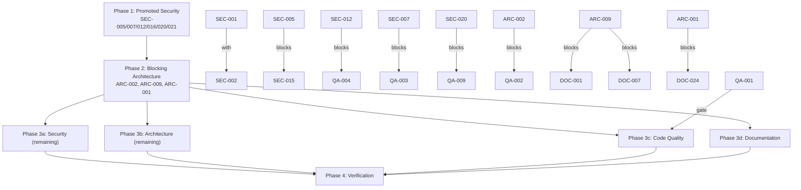

# Project Audit Report

> **Project**: parsidion
> **Date**: 2026-08-23
> **Stack**: Python 3.13 (stdlib-only hooks/CLIs + `uv` extras), TypeScript/Bun (Next.js 16 visualizer), Python MCP server (fastmcp), TypeScript pi/omp extension
> **Audited by**: Claude Code Audit System (Fable 5 subagents)
> **Repo**: `/Users/probello/Repos/parsidion` @ `5d02483` (v0.20.0, par-mem indexed and current)
> **Previous cycle**: 2026-08-01 (Opus 5), remediated 2026-08-02 per `AUDIT-REMEDIATION.md`. Every item that report lists as resolved was re-verified by the agents and is not re-reported. IDs below are renumbered from 001 for this cycle and do **not** correspond to the 2026-08-01 IDs.

---

## Executive Summary

Parsidion remains in good health. Every domain came back with zero Critical findings, all three prior security fixes (allowlist vault resolver, `CLAUDECODE`-stripped env, `O_NOFOLLOW` MCP writes) are intact, the test suite is 1,407 + 62 + 258 green without coverage, and the stdlib-only constraint is still executable. The highest-risk item is a two-step chain in the visualizer dev server: no `Host` check lets a DNS-rebinding page reach `/api/*` (SEC-001), and `POST`/`DELETE /api/note` accept any vault file including `.git/config` and `config.yaml` (SEC-002), which together become local code execution as the user. The largest structural debt is that the 2026-08 `core/` decomposition left its dependency graph inverted (`core/` imports the `vault_common` facade it was meant to replace, ARC-001) and left Claude's session-end path outside the adapter registry so the Codex/Gemini/omp runtimes are silently missing auto-summarize and AI classification (ARC-002). Documentation regressed on the exact item the last audit fixed: README still announces 0.18.0 while the code is 0.20.0 (DOC-001), and the 0.20.0 headline grok-cli backend is undocumented outside CHANGELOG. Remediating all 19 High items is roughly 4 to 5 focused days; the Security Highs are three small edits.

### Issue Count by Severity

| Severity | Architecture | Security | Code Quality | Documentation | Total |
|----------|:-----------:|:--------:|:------------:|:-------------:|:-----:|
| 🔴 Critical | 0 | 0 | 0 | 0 | **0** |
| 🟠 High     | 3 | 3 | 6 | 7 | **19** |
| 🟡 Medium   | 6 | 9 | 9 | 10 | **34** |
| 🔵 Low      | 4 | 21 | 5 | 10 | **40** |
| **Total**   | **13** | **33** | **20** | **27** | **93** |

Cross-domain duplicates folded during synthesis: the `_log_hook_error` copy (Architecture + Code Quality → QA-003), the `note_index` WHERE builder (→ QA-009), the four-way frontmatter serializer (→ ARC-005), the doctor monolith (→ QA-005), the `install.py` facade (→ ARC-008), the Python version floor (→ ARC-009), and the stale `docs/api` (→ DOC-003).

### Known work in flight (not re-reported)

Five open backlog cards predate this audit and were excluded from the findings: `spawn_background_index --no-wait`, skip dead letters whose transcript is gone, `vault-stats _selected_mode` first-mode bug, `vault-stats` IndexError when `note_index` is absent, and `vault_doctor --migrate-subfolders` stale body references.

---

## 🔴 Critical Issues (Resolve Immediately)

None.

---

## 🟠 High Priority Issues

### [ARC-001] `core/` imports back through the deprecated `vault_common` facade
- **Area**: Architecture
- **Location**: `skills/parsidion/scripts/core/vault_health.py:32-33`, `core/vault_links.py:17`, `core/vault_metrics.py:23`
- **Description**: ARC-004 (previous cycle) made `core/` the library layer with flat root shims re-exporting from it. Three `core` modules do `import vault_common` / `import vault_metrics`, so the dependency direction is `core → root shim → core`. It works only because `scripts/` is on `sys.path` and Python tolerates the partial-import cycle. par-mem: `vault_common` is still the second-highest betweenness hub (in-degree 56, out-degree 94, articulation point) with ~60 production importers despite its deprecation docstring.
- **Impact**: The facade can never be removed while the library it fronts depends on it; an import reorder inside `core/` can raise `ImportError` at hook time, and hooks fail open, so the vault silently stops updating.
- **Remedy**: Replace the three facade imports with direct `from .vault_index import …` / `from .vault_path import …`; add an AST test asserting no `core/*.py` imports a root shim name.
- **Effort**: M

### [ARC-002] Two divergent session-end pipelines: Claude native vs adapter registry
- **Area**: Architecture
- **Location**: `skills/parsidion/scripts/session_stop_hook.py:325-611` (`main`, cyclomatic 32, 287 lines); `agent_adapter.py:491-619` (`run_session_end`); `agent_adapter.py:288`
- **Description**: Codex/Gemini/omp go through `run_session_end`; Claude runs `session_stop_hook.main`. Both implement read-tail / parse / categorize / daily-note / `append_to_pending`, but only the Claude path has AI classification (`--ai`), `_launch_summarizer_if_pending`, and the SEC-002-sanitized `git_commit_vault`. CLAUDE.md's "all adapters produce identical vault notes" is true only for the queue entry.
- **Impact**: Feature and security fixes must be applied twice and currently are not. `session_stop_hook.main` is the most complex function in the hook layer.
- **Remedy**: Make `session_stop_hook.py` a thin shim over `run_session_end(get("claude"))`, moving AI classification and summarizer launch into `run_session_end` as config-gated adapter-neutral stages. Retarget `tests/test_session_stop_hook.py` monkeypatches.
- **Effort**: L

### [ARC-003] Wheel manifest omits modules the shipped console scripts import
- **Area**: Architecture
- **Location**: `pyproject.toml:52-100` (`py-modules`/`packages`); importers `vault_merge.py:68`, `vault_conflicts.py:20`, `vault_new.py:23`, `summarizer/prompt.py:30,35`, `summarizer/pipeline.py:36`, `summarizer/transcript.py:27`, `doctor/_state.py:38`, `doctor/frontmatter.py:26`, `cli/stats/health.py:32`; CI smoke `.github/workflows/ci.yml:120-125`
- **Description**: `prompt_templates`, `note_schema`, `vault_health`, `vault_resolve`, `agent_adapter`, and the `session_start` package are not declared, yet `vault-merge`, `vault-conflicts`, `vault-new`, the `summarizer` and `doctor` packages, and `vault-stats --health` import them. The CI wheel smoke imports only five names, so the gap is invisible.
- **Impact**: Any non-editable install ships three broken console scripts and a `summarizer` package that fails on first import.
- **Remedy**: Switch to `[tool.setuptools.packages.find]` plus a generated module list; extend the CI smoke to import every `[project.scripts]` target and every declared package.
- **Effort**: S

### [SEC-001] Visualizer API has no Host-header check, so DNS rebinding bypasses every request guard
- **Area**: Security (CWE-350/352, OWASP A01)
- **Location**: `visualizer/lib/apiAuth.ts:169-183` (`runGuards`)
- **Description**: Guards check only `Sec-Fetch-Site`, `Content-Type`, and the optional `VISUALIZER_TOKEN`. Neither the app nor Next validates `Host` for `/api/*`. With the token unset (the documented default), a page on `attacker.example:3999` whose DNS flips to `127.0.0.1` issues same-origin `fetch('/api/note', {method:'POST'})` calls that pass all three guards.
- **Impact**: A malicious page opened while the dev server runs can create, overwrite, or delete vault files, trigger `/api/summarize`, or read any note.
- **Remedy**: Reject any request whose `Host` is not `127.0.0.1:<port>`, `localhost:<port>`, or `[::1]:<port>` before the other guards; add a route test.
- **Effort**: S

### [SEC-002] `POST`/`DELETE /api/note` accept any existing vault file, not only `.md`
- **Area**: Security (CWE-73)
- **Location**: `visualizer/app/api/note/route.ts:96-107` (POST), `:218-229` (DELETE); the `.md` guard exists only on PUT at `:168-172`
- **Description**: `guardPath` keeps the path inside the vault, but the vault holds executable configuration: `config.yaml` (`codex_cli.command`, `grok_cli.command`, `anthropic_env`), `.git/config` (`core.fsmonitor`, and this server runs `git log`/`git diff` in the vault), `.git/hooks/post-merge`, and `pending_summaries.jsonl` (`transcript_path` makes the summarizer read arbitrary files).
- **Impact**: Chained with SEC-001: POST `path=".git/config"` with an `fsmonitor` command, then GET `/api/note/history`; the command runs as the user.
- **Remedy**: Apply the PUT `.md` check to POST and DELETE; reject any leading-dot segment and the `EXCLUDE_DIRS` set.
- **Effort**: S

### [SEC-003] pi/omp extension executes hook scripts from a cwd-relative sibling directory ahead of the installed copy
- **Area**: Security (CWE-427)
- **Location**: `extensions/pi/parsidion/parsidion.ts:267-278` (`candidateScriptDirs`), `:369-396` (`invokeHook`), `:299`, `:413` (env spread)
- **Description**: Script resolution searches `path.resolve(cwd, "../parsidion/skills/parsidion/scripts")` and `../parsidion/scripts` before `~/.claude/skills/parsidion/scripts`, taking the first directory containing the five hook filenames, and runs them with the full `process.env` on every session start, compaction, turn end, and shutdown.
- **Impact**: Cloning any untrusted repo named `parsidion` beside a workspace makes every pi/omp session in sibling projects run that repo's hooks.
- **Remedy**: Remove the two cwd-relative candidates (keep `PARSIDION_SCRIPTS_DIR`, `PARSIDION_DIR`, installed path); allowlist the spawned env mirroring `visualizer/lib/env.ts`.
- **Effort**: S

### [QA-001] Order/coverage-dependent test failure in the default `make test` configuration
- **Area**: Code Quality
- **Location**: `tests/test_vault_doctor_orchestrator.py:159` (`test_self_ref_removed_on_execute`); `pyproject.toml:113-114` (`addopts = "-v --cov=…"`, `timeout = 10`)
- **Description**: `uv run pytest tests/ -q -x` failed this test (1 failed, 1215 passed); it passes alone, with its file, and the full suite passes with `--no-cov` (1407 passed). The test drives the real `run_scan_and_repair` end to end under a 10 s per-test timeout; coverage instrumentation pushing it past the timeout is the probable cause, unproven because `-x` lost the traceback.
- **Impact**: `make checkall` is nondeterministic.
- **Remedy**: `@pytest.mark.timeout(60)` on the end-to-end orchestrator tests; reproduce once under `--cov` to capture the real traceback before closing.
- **Effort**: S

### [QA-002] `session_stop_hook.main` duplicates its entire commit/queue/event tail across the AI and keyword paths
- **Area**: Code Quality
- **Location**: `skills/parsidion/scripts/session_stop_hook.py:325-611`
- **Description**: Lines ~470-540 (AI path) and ~545-605 (keyword path) each call `append_session_to_daily`, `append_to_pending`, the project sanitizer, `git_commit_vault`, `_launch_summarizer_if_pending`, `write_hook_event`, and `sys.stdout.write("{}")`. Only classification differs.
- **Impact**: Any tail change must be made twice; `queued=` is already computed two different ways.
- **Remedy**: Extract `_classify(...) -> (categories, summary, should_queue, mode)` and one `_persist_and_report(...)`. Blocked by ARC-002: land this inside `run_session_end`, not in the soon-to-be shim.
- **Effort**: M

### [QA-003] `_log_hook_error` copy-pasted into five hooks
- **Area**: Code Quality (also reported by Architecture)
- **Location**: `session_stop_hook.py:259-279`, `session_start_hook.py:540-560`, `pre_compact_hook.py:308-328`, `post_compact_hook.py:24-44`, `subagent_stop_hook.py:70-90`
- **Description**: par-mem near-duplicate lane: cosine 0.997 across the five. They differ only in whether `rotate_log_file` is called via `vault_common.` or bare.
- **Impact**: Hook error-log format and rotation policy is defined in five places; the codex/gemini adapter hooks would need a sixth.
- **Remedy**: Add `log_hook_error(hook_name)` to `core/vault_hooks.py` and import it from each hook.
- **Effort**: S

### [QA-004] Three hand-rolled `vaults.yaml` parsers/writers, one with an unreachable branch
- **Area**: Code Quality
- **Location**: `installer/vault.py:668-760` (`_render_vaults_yaml_for_record`, complexity 31), `installer/paths.py:243-305` (`_resolve_vault_root_for_uninstall`, complexity 24), `skills/parsidion/scripts/core/vault_path.py:149-170`
- **Description**: `_render_vaults_yaml_for_record` sets `vaults[vault_name] = …` then tests `if vault_name not in vaults: continue` inside the loop (never true), re-splits `original` per line, and rebuilds a set comprehension per line. `_resolve_vault_root_for_uninstall` reimplements the `vaults:`/`default:` parser instead of using the core loader.
- **Impact**: Three parsers that can disagree on quoting, comments, and indentation.
- **Remedy**: Single `read_vaults_yaml()`/`write_vaults_yaml()` in `core/vault_path.py`; delete the dead branch; precompute the existing-names set once.
- **Effort**: M

### [QA-005] Doctor pipeline is a monolith with 10-13-parameter functions and an unsplittable `check_note`
- **Area**: Code Quality (also reported by Architecture)
- **Location**: `doctor/orchestrator.py:323` (`run_scan_and_repair`, 13 params, 224 lines, complexity 31), `:77` (`_apply_prefix_clusters`, 10 params), `:263` (`_apply_repairs_parallel`, 10 params), `doctor/worker.py:77` (`_repair_one`, complexity 29), `doctor/check.py:182` (`check_note`, 170 lines, complexity 35), `check.py:47` (`_check_frontmatter_syntax`, 30), `doctor/tags.py:337` (31), `tags.py:165` (26), `doctor/protocol.py`
- **Description**: Every doctor option is threaded by hand through three layers; `_apply_prefix_clusters` returns a 5-tuple the caller destructures back into the same locals; `check_note` is eight independent checks in one body. The memory notes record four separate doctor regressions (prefix splits, tag plural dominance, wikilink false positives, daily-note substitution), the symptom of rules entangled in one control flow.
- **Impact**: Adding one doctor flag touches five signatures; checks cannot be unit-tested individually; `--fix-all` has no per-rule opt-out.
- **Remedy**: Frozen `DoctorOptions` + `ScanContext` dataclasses; a `Rule(name, check, fix)` protocol in `doctor/protocol.py` with `check_note` iterating a registered list. (Per-rule `--only`/`--skip` flags are filed separately as enhancement ENH-015.)
- **Effort**: L

### [QA-006] Visualizer: 21 components and 13 lib modules have no test file, including the five largest
- **Area**: Code Quality
- **Location**: `visualizer/components/HUDPanel.tsx` (644 lines), `GraphCanvas.tsx` (618), `FrontmatterEditor.tsx` (509), `VaultStats.tsx` (480, complexity 22), `ReadingPane.tsx` (397, complexity 28), `visualizer/lib/useSigmaInstance.ts` (510), `useNoteTabs.ts` (392), `vaultStatsServer.ts` (330)
- **Description**: The 34 test files cover routes, pure helpers, and reducer hooks. No component has a render test; the three stateful hooks that own the graph lifecycle are untested.
- **Impact**: Any refactor of the container triad has no regression net.
- **Remedy**: `@testing-library/react` render tests for ReadingPane (edit/save/conflict) and FrontmatterEditor (keyboard handling), unit tests for `useNoteTabs` reducer transitions.
- **Effort**: L

### [DOC-001] README release version regressed to 0.18.0
- **Area**: Documentation
- **Location**: `README.md:11` ("New in 0.18.0"), `README.md:651` ("Latest release: 0.18.0"); `pyproject.toml:3` is 0.20.0
- **Description**: The prior audit's DOC-001, re-opened; the 0.19/0.20 release commits did not touch these lines.
- **Impact**: Stale feature blurb; the hard-coded version drifts every release.
- **Remedy**: Bump to 0.20.0 and rewrite the blurb from CHANGELOG, or replace the hard-coded version with a CHANGELOG pointer.
- **Effort**: S

### [DOC-002] grok-cli backend (0.20.0 headline) undocumented outside CHANGELOG and the CLAUDE.md table
- **Area**: Documentation
- **Location**: `docs/USAGE.md:138,159,184`; `docs/ARCHITECTURE.md:407,439`, `:1038-1129` (config block lacks `ai`, `ai_models`, `claude_cli`, `codex_cli`, `grok_cli`, `adapters`); `docs/PROMPTS.md`; `CLAUDE.md:310,360,364`; `README.md:602-606`; `SECURITY.md:17-28,41`
- **Description**: `ai_backend.py:19,127-141` supports `claude-cli|codex-cli|grok-cli|none`; only a file-tree comment in ARCHITECTURE mentions grok.
- **Remedy**: Add the six config sections to the ARCHITECTURE reference; update every "claude -p or codex exec" sentence.
- **Effort**: M

### [DOC-003] `docs/api/` generated reference is stale and its drift gate cannot stay green
- **Area**: Documentation (also reported by Architecture)
- **Location**: `docs/api/` (last regenerated 2026-08-14, `edec4a9`); `Makefile:66-79`; `.github/workflows/ci.yml` (no `docs-api-check` job); typedoc config
- **Description**: `make docs-api-check` exits 1 with 161 differing files; `docs/api/python/ai_backend.html` has 0 "grok" occurrences vs 50 regenerated. Typedoc embeds the commit SHA in every "Defined in" link, so ~150 diffs are SHA churn and the gate can never be green across commits. Architecture additionally notes 268 committed HTML files plus bundled JS are indexed as source by par-mem (`docs/api/visualizer/assets/main.js` shows up as a bridge symbol).
- **Remedy**: Set typedoc `gitRevision: "main"` (or disable source links), regenerate, commit, add `docs-api-check` to CI, and add `docs/api` to `.parmemignore`.
- **Effort**: S

### [DOC-004] Config table, template, and schema disagree with code on eight keys
- **Area**: Documentation
- **Location**: `CLAUDE.md:232-234,240,248`; `skills/parsidion/templates/config.yaml:93-94,104-107,120-122,215`; `core/vault_schema.py:130,163,173,181,279,293`
- **Description**: Read by code but absent from table and template: `session_stop_hook.transcript_tail_bytes`, `subagent_stop_hook.transcript_tail_bytes`, `pre_compact_hook.transcript_tail_bytes`, `codex_cli.allow_danger_full_access`; `adapters.load_external` in template but no table row; template lacks `claude_cli.system_prompt`/`timeout` and `grok_cli.system_prompt`. `adaptive_context.decay_days` is documented everywhere but read by nothing. `summarizer.persist` is a documented no-op. Template ships `codex_cli.ephemeral/skip_git_repo_check/suppress_notify: false` while code defaults are `True`, so copying the template silently flips three behaviours.
- **Remedy**: Add the missing keys; mark `decay_days` as reserved/not implemented (implementation is enhancement ENH-016); drop `persist`; set the three codex booleans to `true`.
- **Effort**: S

### [DOC-005] Stale "raise hook timeout to 30 s for `--ai`" guidance in four places
- **Area**: Documentation
- **Location**: `README.md:300`; `CLAUDE.md:352`; `docs/ARCHITECTURE.md:287-293,340`; `session_start_hook.py:103` (comment)
- **Description**: `installer/paths.py:71` sets SessionStart to 60000 ms unconditionally since 0.20.0; README lines 139, 182, 593 already say 60 s.
- **Remedy**: Replace all four with "the installer registers a 60 s SessionStart timeout; no manual bump is needed".
- **Effort**: S

### [DOC-006] SKILL.md understates `--fix-all` and documents the legacy daily-note path
- **Area**: Documentation
- **Location**: `skills/parsidion/SKILL.md:462`, `:86,146,416`
- **Description**: `doctor/cli.py:317-324` also enables `--strip-prefixes` (vault-wide bulk rename), `--migrate-daily-notes`, `--fix-permissions`. `core/vault_fs.py:869` writes `Daily/YYYY-MM/DD-{username}.md`; SKILL.md shows the legacy un-namespaced form.
- **Impact**: An agent following SKILL.md runs a bulk rename it was not told about and creates daily notes at the wrong path.
- **Remedy**: List all seven flags; update the three path references.
- **Effort**: S

### [DOC-007] CONTRIBUTING.md PEP 723 table and resolver description are wrong
- **Area**: Documentation
- **Location**: `CONTRIBUTING.md:54-74`, `:124`
- **Description**: "eleven PEP 723 scripts" vs 7 found; `vault_embed_serve.py` missing; four `embed_eval*.py` rows live in `tools/eval/`. Line 124 describes Python and TS resolvers as independent implementations; since ENH-009 the TS side delegates to `vault_resolve.py`.
- **Remedy**: Rebuild the table from the grep; rewrite line 124 to the delegation model.
- **Effort**: S

---

## 🟡 Medium Priority Issues

### Architecture

### [ARC-004] Three independent `rebuild_index` subprocess launchers with different contracts
- **Location**: `installer/skill.py:457-489`, `parsidion-mcp/src/parsidion_mcp/tools/ops.py:37-75`, `skills/parsidion/scripts/summarizer/queue.py:234-304`
- **Description**: Each spawns `update_index.py` via `uv run`, but the installer omits `--no-project` (the previous cycle's fix landed only in the summarizer and MCP copies), timeouts are 30/30/300 s, only the summarizer strips `CLAUDECODE`, and the summarizer hardcodes a `~/.claude/skills/parsidion/scripts` fallback.
- **Remedy**: `core/vault_index.run_index_rebuild(vault, *, rebuild_graph, include_daily, timeout)` owning argv/env/timeout and script discovery; all three call it.
- **Effort**: S

### [ARC-005] Frontmatter serialization has four writers and no shared schema-aware emitter
- **Location**: `vault_new.py:54-97`, `vault_merge.py:298-331`, `tools/migrate_memory.py:215-236`, `tools/migrate_research.py:238-272,275-311`; parsers `core/vault_index.py:122`, `prompt_templates.py:101`; TS `visualizer/lib/frontmatter.ts:29,97` (also reported by Code Quality)
- **Description**: `note_schema.py` is the note contract, yet each writer hand-builds YAML (`_build_frontmatter` ×4, 0.93-0.96 similarity). The TS side has its own parser/serializer, with no parity fixture, so Python and TS emitters can diverge on `related` quoting and list formatting.
- **Remedy**: `serialize_frontmatter(fm) -> str` next to `parse_frontmatter` in `core/vault_index.py` (or `note_schema`); route the four writers through it; add `tests/fixtures/parity/frontmatter.json` consumed by both test suites (ENH-005 pattern).
- **Effort**: M

### [ARC-006] Test monkeypatch contracts dictate production module layout
- **Location**: `vault_search.py:20-30,113-120,174-181` (`LAST_BACKEND` global, `_search_embeddings` shim); CLAUDE.md note keeping `ai_backend.py`/`parmem_backend.py` at root for tests; five test files reaching `vault_common._private` names
- **Description**: `SearchResultEnvelope` already supersedes `LAST_BACKEND`, but the mutable module global is retained for tests. parsidion-mcp serves `vault_search` in one process, so the global is a latent concurrency bug.
- **Remedy**: Retarget tests to patch `cli.search.embeddings._search_embeddings`; delete `LAST_BACKEND` and the re-export; move the two backends into `core/` under the stdlib gate.
- **Effort**: M

### [ARC-007] Typed config schema exists but access remains stringly-typed
- **Location**: `core/vault_schema.py:302` (`VaultAppConfig`), `core/vault_config.py:394` (`get_config`); 47 `get_config("section","key",default)` sites, 16 in `session_start_hook.py`; `agent_adapter.py:70`
- **Description**: ENH-014's dataclasses are consumed only by warn-only `validate_config`. Readers re-declare defaults inline (`transcript_tail_lines=200` in two files); the schema declares types but not defaults.
- **Remedy**: Real defaults on the dataclass fields, `load_typed_config(vault) -> VaultAppConfig`, migrate hot readers; keep `get_config` as a thin adapter.
- **Effort**: M

### [ARC-008] `install.py` remains a 1,342-line entrypoint and re-export facade
- **Location**: `install.py:56-170` (ten `# noqa: F401` blocks re-exporting private names), `:288` (`_print_install_plan`, 20 params), `:363-665` (`_build_install_steps`, 16 params), `:977-1210` (`parse_args`), `:1210-1338` (`main`, complexity 27); `installer/skill.py:54` (27); `installer/vault.py:668` (31); duplicate `sys.path` inserts `installer/__init__.py:26`, `installer/paths.py:130` (also reported by Code Quality)
- **Remedy**: Move `_build_install_steps` to `installer/plan.py` with an `InstallPlan` dataclass, `parse_args` to `installer/cli.py` with subparsers, leaving `install.py` a ~20-line shim; drop the duplicate `sys.path` insert and the private-name re-exports.
- **Effort**: L

### [ARC-009] Python version floor is inconsistent across manifests, CI, and docs
- **Location**: `pyproject.toml:10-11` (`>=3.11`, ruff `py311` at `:119`), `parsidion-mcp/pyproject.toml:3-4` (`>=3.13`), `.github/workflows/ci.yml` (3.13 only); docs claiming 3.13+: `README.md:5,43`, `CONTRIBUTING.md:16`, `docs/ARCHITECTURE.md:63` (also reported by Documentation)
- **Description**: Two floors in force at once; nothing exercises 3.11.
- **Remedy**: Repo-level decision. Recommended: raise root `requires-python` to `>=3.13` and ruff target to `py313` (matches CI, MCP, and docs). Alternative: add a 3.11 CI job and document 3.11.
- **Effort**: S

### Security

### [SEC-004] Predictable shared-tmp scratch cwd for `claude -p` / `grok` lets a co-tenant plant project settings
- **Location**: `ai_backend.py:594-596` (`_minimal_context_cwd`), used at `:316`, `:652-653`
- **Description**: `Path(tempfile.gettempdir()) / "parsidion-grok-clean"` with `mkdir(exist_ok=True)`, no uid/mode check. `claude -p` loads `<cwd>/.claude/settings.json` from there. High on multi-user Linux.
- **Remedy**: Create under `secure_log_dir()` (0700) or `tempfile.mkdtemp()` per call; refuse if `st_uid != os.getuid()` or group/other bits set.
- **Effort**: S

### [SEC-005] `atomic_write_text` uses a predictable `.tmp` sibling and follows symlinks
- **Location**: `core/vault_fs.py:306-311`; same pattern `build_graph.py:762-781`; `installer/vault.py:125-146` (gitignore list lacks `*.tmp`)
- **Description**: `tmp.write_text(...)` follows an existing symlink. Used for `CLAUDE.md`, `TAGS.md`, every `MANIFEST.md`, and all note writes. A committed symlink `Patterns/MANIFEST.md.tmp -> ~/.claude/settings.json` in a synced vault is overwritten by the nightly index.
- **Remedy**: `os.open(tmp, O_CREAT|O_EXCL|O_WRONLY|O_NOFOLLOW, mode)`; add `*.tmp` to the vault gitignore.
- **Effort**: S

### [SEC-006] `event_log.path` config override redirects hook-log append and rotation to any file
- **Location**: `core/vault_fs.py:411-460`
- **Remedy**: Require the resolved path under the vault or `~/.claude/logs`; open with `O_NOFOLLOW`.
- **Effort**: S

### [SEC-007] Config-sourced binaries and API endpoints trusted without ownership or tracking checks
- **Location**: `parmem_backend.py:104-108,172,523` (`par_mem.binary`); `ai_backend.py:393-423` (`codex_cli.command`, `grok_cli.command`); `core/vault_hooks.py:112-125,145-163,191-194` (`anthropic_env` sets `ANTHROPIC_BASE_URL`/`AUTH_TOKEN`/`CUSTOM_HEADERS`/`HTTPS_PROXY` via `setdefault`)
- **Description**: `agent_adapter.py:231-239` already refuses writable adapter files; the same rule is absent here. A synced `config.yaml` can redirect the API base URL or point `codex_cli.command` at a script in the vault.
- **Remedy**: Reject configured binaries not owned by the current uid or group/other-writable; honor `anthropic_env` network keys only from `config.local.yaml`, or refuse when `config.yaml` is git-tracked (`_git_path_ignored` at `vault_fs.py:698`).
- **Effort**: S

### [SEC-008] MCP `vault_read` reads any vault file with no suffix, dot-dir, or size restriction
- **Location**: `parsidion-mcp/src/parsidion_mcp/tools/notes.py:57-58`
- **Description**: `config.local.yaml` (documented home for `ANTHROPIC_API_KEY`), `.git/config`, `hook_events.log`, `pending_summaries.jsonl` are readable; binary files raise an uncaught `UnicodeDecodeError`.
- **Remedy**: Mirror the write rules: `.md` only, skip `EXCLUDE_DIRS` and dotfiles, 10 MB cap, catch `UnicodeDecodeError` into `VaultToolError`.
- **Effort**: S

### [SEC-009] HTML export renders `javascript:`/`data:` hrefs
- **Location**: `vault_export.py:147`
- **Remedy**: Allow only `http`, `https`, `mailto`, and relative hrefs.
- **Effort**: S

### [SEC-010] Daily-note migration builds a rename target from an unsanitized username
- **Location**: `doctor/daily.py:57-60,94`; `core/vault_fs.py:863-866` (`get_vault_username`)
- **Remedy**: Validate `^[A-Za-z0-9._-]+$` in `get_vault_username()` and the CLI; assert `new.parent == old.parent`.
- **Effort**: S

### [SEC-011] `vault-merge` accepts absolute or `..` note paths and mutates them
- **Location**: `cli/merge/lookup.py:30-38`; `vault_merge.py:645-652`, `:667`
- **Remedy**: `is_path_inside_vault` after resolution for both notes and `--output`.
- **Effort**: S

### [SEC-012] Vault `post-merge` hook is generated with a double-quoted `~` and fails on every `git pull`
- **Location**: `installer/vault.py:221-230` (template), `:275`, `:233-245` (`_is_current_post_merge_hook` treats the broken hook as current); live hook confirmed identical
- **Description**: `uv run --no-project "~/.claude/skills/parsidion/scripts/update_index.py"` does not tilde-expand; with `set -e` every pull exits non-zero after the merge, and reinstall never repairs it.
- **Remedy**: Emit `"$HOME/..."` or `shlex.quote(absolute)`; bump the staleness marker. Add the `*.tmp` (SEC-005) and `.merge_previews/` (SEC-013) gitignore entries in the same edit.
- **Effort**: S

### Code Quality

### [QA-007] Confirmed dead code
- **Location**: `session_start_hook.py:531` (`_kill_process_group`, unreferenced copy of `core/subproc_util.py:126`), `note_schema.py:101` (`folder_for`), `installer/steps.py:131` (`StepList.undo_all`), `cli/stats/_common.py:50` (`_fetch_all`)
- **Description**: Verified by grep; the remaining par-mem candidates (MCP tools, `_backup_note` wrappers, `_enrich_with_graph`, `run_no_db_summary`, `tools/eval/*`) are false positives.
- **Remedy**: Delete the four; keep `undo_all` only if a rollback plan will wire it.
- **Effort**: S

### [QA-008] Shims still re-export stdlib names, contradicting the previous QA-005 remediation claim
- **Location**: `subproc_util.py:12-23`, `vault_constants.py`; `AUDIT-REMEDIATION.md` QA-005 entry
- **Remedy**: Apply the `from core.X import *` + `__all__` pattern; correct the remediation note.
- **Effort**: S

### [QA-009] `metadata.query` and `query_note_index` are two copies of the same SQL WHERE builder
- **Location**: `cli/search/metadata.py:22-171`, `core/vault_index.py:437-535` (also reported by Architecture, which adds `core/vault_metrics.py:52-88,235-263` vs `cli/stats/_common.py:50-80`)
- **Description**: par-mem similarity 0.908; the SEC-005 path re-validation exists only in the core copy.
- **Remedy**: Extract `_build_note_index_where(filters) -> (sql, params)` into `core/vault_index.py`; have `cli/stats/_common` import `open_db`/`fetch_all`/`collect_tags` from `core.vault_metrics`.
- **Effort**: S

### [QA-010] `run_weekly`/`run_monthly` duplicate ~120 lines and import `re` inside the per-line loop
- **Location**: `cli/stats/rollups.py:18-150`, `:150-280`; nested `import re` at `:89`, `:212`; unused `conn` param
- **Remedy**: `_collect_daily_rollup(paths) -> RollupData` + `_render_rollup(...)`; drop `conn`; hoist the import.
- **Effort**: S

### [QA-011] Edge-build loop with `catch { /* skip */ }` copied three times
- **Location**: `visualizer/components/GraphCanvas.tsx:240-258`, `:485-512`, `visualizer/lib/useSigmaInstance.ts:283-310`
- **Remedy**: One `addEdgesForSource(graph, data, opts)` in `lib/`.
- **Effort**: S

### [QA-012] 30 `eslint-disable` comments, 14 `exhaustive-deps` in one file
- **Location**: `GraphCanvas.tsx:218-525` (14), `VaultStats.tsx:161-183`, `app/page.tsx:44,146,199`, `ReadingPane.tsx:73,121`; `set-state-in-effect` at `FrontmatterEditor.tsx:204,342`, `UnifiedSearch.tsx:74,108`, `HistoryView.tsx:41,70`, `useVaultFiles.ts:161`
- **Remedy**: Single `useLatest(props)` ref instead of per-prop mirroring effects; derive `selectedIdx` with `useMemo`/key reset.
- **Effort**: M

### [QA-013] Silent `except OSError: pass` on adaptive-context and AI-selector state writes
- **Location**: `core/vault_adaptive.py:122,197,232`, `session_start_hook.py:331`, `session_start/ai_selector.py:71`
- **Remedy**: One-line stderr diagnostic at each site (previous cycle's ARC-009 convention).
- **Effort**: S

### [QA-014] `_normalize_underscores_in_frontmatter` reads and regex-parses every note twice
- **Location**: `doctor/tags.py:337-465`
- **Remedy**: Collect `(note, content, fm_match)` in pass one; split the tag-block rewrite into its own helper.
- **Effort**: S

### [QA-015] Python modules with no test file referencing them
- **Location**: `html-to-md.py` (548 lines, complexity 28), `check_graph_coverage.py`, `session_start/ai_selector.py`, `session_start/graph_retrieval.py`, `cli/stats/operations.py`, `cli/stats/rollups.py`
- **Remedy**: Direct tests for `run_weekly`/`run_monthly` against a fixture vault; decide whether `html-to-md.py` is supported and test or retire it.
- **Effort**: M

### Documentation

### [DOC-008] ARCHITECTURE config reference documents removed `sonnet_model` and omits nine keys
- **Location**: `docs/ARCHITECTURE.md:415,1085,1130`; block `:1038-1129`
- **Description**: Missing: `session_start_hook.ai_candidates_max`, `summarizer.graph_incremental`, `summarizer.ai_timeout`, `embeddings.service_enabled/service_idle_exit`, `search.use_note_index`, `event_log.max_lines`, `subagent_stop_hook.transcript_tail_bytes`, `pre_compact_hook.transcript_tail_bytes`.
- **Remedy**: Remove `sonnet_model`; regenerate the block from `vault_schema.py` (generator filed as ENH-017).
- **Effort**: M

### [DOC-009] omp runtime (0.19.0) missing from ARCHITECTURE and PI_EXTENSION
- **Location**: `docs/ARCHITECTURE.md:60`; `docs/PI_EXTENSION.md`; `SECURITY.md:17-28`
- **Effort**: S

### [DOC-010] USAGE.md misdescribes two flags
- **Location**: `docs/USAGE.md:61` (`--as-of` claims semantic search; `vault_search.py:464-480` applies it only to metadata), `:152` (`vault-conflicts --scan-only` "no AI, no writes"; it writes `conflicts/report.json` and calls the AI unless `--no-ai`)
- **Effort**: S

### [DOC-011] `docs/MCPL.md` presents a tool that is not installed and is discouraged as a live integration
- **Location**: `docs/MCPL.md`; `docs/README.md:31`; `docs/ARCHITECTURE.md:1567`; `agents/research-agent.md:303`
- **Remedy**: Move to `docs/archive/`; gate or drop the research-agent step.
- **Effort**: S

### [DOC-012] `docs/opus` ENH plan status lines stale
- **Location**: `docs/opus/ENH-002,004,005,007,008-*.md:3` ("not started"; all shipped in 0.15.0); ENH-009..014 no status line; `ENH-009-…md:129` links a deleted file; `ENH-008-…md:153` wrong path for `prompt_eval_run.py`
- **Remedy**: Status line on all 14 plans; fix two paths. Record ENH-013 as obsolete (investigation `fa06be8` found every candidate a false positive).
- **Effort**: S

### [DOC-013] No consolidated environment-variable reference; nine variables undocumented
- **Location**: missing section; variables read at `core/vault_path.py:157,598`, `core/vault_hooks.py:235`, `ai_backend.py:140`, `core/vault_fs.py:865`, `tools/eval/prompt_eval_run.py:71`, `installer/paths.py:196-199`
- **Remedy**: "Environment variables" section in `docs/USAGE.md`.
- **Effort**: M

### [DOC-014] SECURITY.md scope lags code
- **Location**: `SECURITY.md:37,41,50,55-57`
- **Remedy**: Sync module and poison lists (12 poisoned modules per `tests/test_stdlib_only.py:42-55`); reword transport; add a supported-versions line.
- **Effort**: S

### [DOC-015] CLAUDE.md Makefile table and session-stop log path wrong
- **Location**: `CLAUDE.md:289` (`/tmp/session_stop_hook.log`; real `$HOME/.claude/logs/session_stop_hook.log`), `:307` (extras omit `docs`), `:337` (`visualizer-check` omits `&& bun run build`), `:341` (`graph-with-daily` is `--include-daily`, not an alias); missing `docs-api`/`docs-api-check` rows
- **Effort**: S

### [DOC-016] Release 0.20.0 is untagged
- **Location**: git tags (last `v0.19.0`)
- **Remedy**: Tag `v0.20.0` at `a5036cc`; pushing the tag is outward-facing and needs user confirmation.
- **Effort**: S

### [DOC-017] Research agent has an unrendered placeholder
- **Location**: `agents/research-agent.md:10` (`<vault root>/` twice; should be `~/ClaudeVault/`)
- **Effort**: S

---

## 🔵 Low Priority / Improvements

### Architecture
- **[ARC-010]** `run_ai_prompt` vs `run_ai_prompt_with_cause` — `ai_backend.py:697-783`, 0.919 similarity; make `run_ai_prompt` a one-line wrapper discarding the cause. S.
- **[ARC-011]** `build_graph.py` excluded from pyright — `pyproject.toml:132`; the only unchecked Python module (1,011 lines); use `# pyright: basic` or a numpy stub extra instead of a blanket exclude. S.
- **[ARC-012]** Stray `skills/parsidion-cc/` directory — untracked egg-info plus `.claude/.cc2cc-session-id`; confuses `skills/` discovery and par-mem indexing. Remove locally. S.
- **[ARC-013]** Interactive TUI loop triplicated — `vault_tui.py:132-233` (complexity 30), `vault_review.py:500-601`, `vault_conflicts.py:352-400`; extract a curses list-view base with row-renderer and key-handler callbacks. M.

### Security
- **[SEC-013]** `vault-merge --from-preview` bypasses `_is_valid_merge_body`; `.merge_previews/` not gitignored and `git add -A -- .` stages it. `vault_merge.py:376-395,259-263`. S.
- **[SEC-014]** `vault-review` rewrites the queue from an unlocked read and creates the temp at umask over the 0600 queue. `vault_review.py:88-101,295,512`. S.
- **[SEC-015]** `append_session_to_daily` flocks the inode that `atomic_write_text` then replaces; a third writer bypasses the lock. `core/vault_fs.py:969-1000`; reuse the inode-retry loop from `append_to_pending` (`:531-539`). S.
- **[SEC-016]** Doctor singleton is an unlocked PID-JSON read-check-write; `is_process_running` returns True on `PermissionError`, so a stale `pid: 1` permanently disables doctor runs. `doctor/cli.py:292-305`, `doctor/_state.py:201-250`, `core/vault_hooks.py:418-424`; use `vault_fs.try_singleton_lock`. S.
- **[SEC-017]** Stale `.git/index.lock` self-heal: when `lsof` is absent, the 300 s mtime test alone decides. `core/vault_fs.py:716-752`. Log when `lsof` is unavailable. S.
- **[SEC-018]** Embed service: `_read_line` has no request-size cap and the client may choose the model. `vault_embed_serve.py:134-144,156-158`. 64 KiB cap, drop client model override. S.
- **[SEC-019]** Subfolder migration can rename a variant over the base note. `doctor/subfolder.py:340-346,367,551`. Reject existing targets. S.
- **[SEC-020]** Paths from `embeddings.db` / `note_index` / par-mem JSON read without containment. `vault_conflicts.py:234-252`, `cli/search/metadata.py:305-317`, `parmem_backend.py:490-499`. Add `is_path_inside_vault`. S.
- **[SEC-021]** `--grep` regex and negative `-l`/`-n` limits unbounded (self-DoS). `cli/search/metadata.py:292-317`. Clamp. S.
- **[SEC-022]** Codex/Gemini adapter path reads transcripts without the byte bound (`readlines()` on the whole subagent transcript). `agent_adapter.py:546-549,663`. Pass `transcript_tail_bytes`. S.
- **[SEC-023]** `config.local.yaml` excluded from `git add -A` only by the installer's `.gitignore`; `vault_fs.py:803-807` guards `config.yaml` only. S.
- **[SEC-024]** Config timeouts accept `nan`/negative/`inf` and become `timeout=None`. `core/vault_config.py:142-152`, `ai_backend.py:210,382-390`. Clamp. S.
- **[SEC-025]** `settings.json.bak` written at umask instead of the source mode. `installer/hooks.py:830-832`. S.
- **[SEC-026]** Cron line wraps paths in double quotes only. `installer/schedule.py:210-213`. `shlex.quote`. S.
- **[SEC-027]** Root `.env` not gitignored. `.gitignore`. Add `.env`, `.env.*`. S.
- **[SEC-028]** GitHub Actions pinned to mutable tags; pages job holds `id-token: write`. `ci.yml`, `pages.yml`. Pin to SHAs. S.
- **[SEC-029]** Absolute vault path leaked in a 404 body. `visualizer/app/api/graph/delta/route.ts:118-121`. S.
- **[SEC-030]** No concurrency cap on `/api/health` (60 s subprocess) and `/api/graph/rebuild` (5 min, concurrent runs race on `graph.json`); synchronous ~47 MB `readFileSync` in `graph/delta`; unbounded JSON bodies on note writes. `vaultStatsServer.ts:230`, `graph/rebuild/route.ts:55-58`, `graph/delta/route.ts:56-62`. S.
- **[SEC-031]** `bun audit` transitive advisories pinned by `overrides`: `brace-expansion@5.0.6` (→5.0.9), `nanoid@3.3.15` (→3.3.18), `postcss@8.5.15` (→8.5.23), `sharp@0.34.5`. `visualizer/package.json`. S.
- **[SEC-032]** MCP `vault_context` swaps the module-global `VAULT_ROOT` during the call; concurrent multi-vault calls can read the wrong vault. `parsidion-mcp/src/parsidion_mcp/tools/context.py:44-76`. Thread `vault_root` explicitly. S.
- **[SEC-033]** Minor integrity items: `core/vault_links.py:1011-1014` resets mode on write; `vault_conflicts.py:301-305` locks the tmp not the destination; `vault_merge.py:323` unescaped `"` in YAML lists; `doctor/frontmatter.py:245-258` AI-repaired body written wholesale; `core/vault_fs.py:789` `git add <paths>` lacks `--`; `scripts/show-context:25-27` unquoted `$FOLDER` in a JSON heredoc. S each.

### Code Quality
- **[QA-016]** `sys.exit` inside library helpers — `cli/merge/scan.py:41-130` (four `sys.exit(1)`); return a result or raise a domain error. S.
- **[QA-017]** Three `open_db` implementations — `build_embeddings.py:55`, `core/vault_metrics.py:52`, `cli/search/embeddings.py:36`. S.
- **[QA-018]** `tools/migrate_memory.py` and `tools/migrate_research.py` are near-clones — five function pairs at 0.9+ similarity, 1,371 lines for two one-off migrations. M.
- **[QA-019]** Lint-suppression volume — 527 Python markers (118 `E402` and 127 `F401` from shims and the `tools/eval` `sys.path` bootstrap; 71 `BLE001` documented never-fail hook contract); a proper package for `tools/eval` removes most `E402`. M.
- **[QA-020]** Weak test assertions — 60 terminal `assert x is not None` (e.g. `tests/test_vault_doctor.py:870-965`) and 5 assert-less tests. S.

### Documentation
- **[DOC-018]** README omits installer flags `--omp-home` (`install.py:1017`), `--purge-config` (`:1085`); `README.md:620` "not automatically" contradicts `:102-110`; `:99` says only `vault-search` is installed (seven CLIs). S.
- **[DOC-019]** CLAUDE.md prose lag: `:376` "via Claude haiku"; `:354` pre-compact tool list omits `find`/`ls`; `:14` omits `installer/steps.py`, `installer/uninstall.py`; `:307` stdlib list omits eight modules and four subpackages; `:37,311` place `embed_eval_run.py` under scripts; `:362` credits `write_hook_event` to `vault_hooks.py` (impl `core/vault_fs.py:380`); `:315` pre-commit omits lint + pyright; undocumented flags `summarize_sessions.py --retry-dead-letters/--reason/--min-age-days/--max-count`, `vault_doctor.py --fix-permissions`, `update_index.py --graph-incremental`, `vault-stats --fast/--dry-run`. S.
- **[DOC-020]** `docs/README.md:37` says opus covers ENH-001..008 (14 exist); index omits `parsidion-architecture.png` and five slideshow HTML files. S.
- **[DOC-021]** `docs/archive/CHANGELOG-0.11-and-older.md:6` links `../CHANGELOG.md` (should be `../../CHANGELOG.md`). S.
- **[DOC-022]** `docs/PI_EXTENSION.md:3` links pi to `github.com/anthropics/pi`; verify against mariozechner's pi-mono. S.
- **[DOC-023]** Minor: `docs/USAGE.md:225-229` uses `Path` without import; `docs/ARCHITECTURE.md:1558-1571` Related list omits USAGE/MULTI_VAULT/PI_EXTENSION; `docs/AGENT-ADAPTERS.md`, `docs/PAR-MEM.md` exceed 500 words with no TOC. S.
- **[DOC-024]** Root artifacts: `AUDIT.md`, `AUDIT-REMEDIATION.md`, `AUDIT-REMEDIATION-PLAN.md` from 2026-08-01 are fully consumed (this run overwrites the first and third); `AUDIT-REMEDIATION.md:85` and `:139` are internally inconsistent; code comments `vault_common.py:46`, `tools/migrate_research.py:7`, `tools/migrate_memory.py:7` cite AUDIT.md. `ENHANCEMENTS.md` is tracked but the pipeline says the board is the source of truth and its line 31 points at nonexistent `~/Repos/PAR-MEM-FEEDBACK.md`. `MEMORY_REPORT.md` (gitignored) uses the old names. Archive/delete and repoint. S.
- **[DOC-025]** Eleven undocumented public symbols (all trivial): `cli/search/_common.py:65,69,73`; `main` in `codex_*_hook.py:14`, `gemini_*_hook.py:11`, `vault_embed_serve.py:186`, `vault_resolve.py:46`; `doctor/_state.py:100` `Issue`. S.
- **[DOC-026]** `CONTRIBUTING.md:97-100` and CLAUDE.md "Making Changes" quick-sync `cp` is a self-copy on macOS/Linux (symlink install); only meaningful on Windows. S.
- **[DOC-027]** Historical relative links broken in `docs/superpowers/plans/2026-07-12-par-mem-integration.md:3262-3351`, `plans/2026-07-12-visualizer-parmem-benefits.md:1232,1250`, `specs/2026-03-16-parsidion-mcp-design.md:300-301`, `specs/2026-03-21-visualizer-redesign.md:432`; only 8 of 32 plans/specs carry a status header. S.

---

## Detailed Findings

### Architecture & Design
Grounded via par-mem (`get_repository_stats`: 738 files, 6,535 symbols, 27 communities; `find_central_symbols`, `find_bridge_symbols`, `list_communities`, `find_duplicate_code`, `find_most_complex_functions`; `find_god_objects` exceeded its budget while a reindex job was queued). Verdict: the core contracts hold (stdlib-only hooks, single-sourced vault resolution via `resolve_vault_server` + `vault_resolve.py` with a parity fixture, `withApi` enforced on all 14 routes by `apiRoutes.test.ts`, `AgentAdapter` registry with 18-21-line Codex/Gemini shims, undoable `StepList` installer). The 2026-08 decomposition succeeded at the file level but left the dependency graph inverted (ARC-001) and left Claude's session-end path outside the registry (ARC-002). Findings ARC-001..013 above; the agent's ARC-105/110/111/115 were folded into QA-009, QA-005, QA-003, and DOC-003.

### Security Assessment
Method: four parallel read-only reviewers (hook/subprocess layer, locking/summarizer/CLIs, visualizer server, MCP/installer/CI) plus spot-verification of every Medium-or-higher finding. Verified intact: SEC-P001 allowlist resolver (`core/vault_path.py:321-379`), SEC-P002 `envWithoutClaudecode` (`visualizer/lib/env.ts:72-83`), SEC-P003 `vault_write` re-resolve + `O_NOFOLLOW` (`notes.py:99-116`). No `shell=True`/`os.system`/`execSync`; every subprocess is an argv list with timeout, `start_new_session`, and SIGTERM→SIGKILL; env forwarding allowlisted everywhere; transcript reads allowlisted to `~/.claude`, `~/.pi`, `$CODEX_HOME/sessions`, `$GEMINI_HOME`; SQL parameterised with `mode=ro`; visualizer uses `react-markdown` without `rehype-raw`, `timingSafeEqual` on the bearer, `X-Frame-Options`/`nosniff`/`Referrer-Policy`; all locked deps current and OSV-clean; no key-shaped strings in tracked files or history; gitleaks + detect-private-key at pre-commit; both workflows declare top-level `permissions:`. Findings SEC-001..033 above.

### Code Quality
Sources: par-mem `find_most_complex_functions`, `find_duplicate_code`, `find_dead_code`, `wc -l` plus AST scans, direct reads of every Critical-band function, two full `pytest tests/` runs (1407 passed / 3 skipped with `--no-cov`; 1 failure with default addopts, QA-001). Zero TODO/FIXME markers, zero mutable defaults, zero `console.log`, zero `as any` in production TS. 527 Python lint markers concentrated in shims and `tools/eval`; 30 `eslint-disable`. 23 non-test files over 500 lines, largest `install.py` (1342), `core/vault_fs.py` (1068), `core/vault_index.py` (1060), `build_graph.py` (1011). Test files: 82 (`tests/`), 10 (MCP), 34 (visualizer), 1 (pi). Findings QA-001..020 above; the agent's QA-010/017/018 were folded into ARC-005 and ARC-008.

### Documentation Review
Docstring coverage: 374 public symbols, 97.1% documented, 0 missing module docstrings, 0 missing return annotations. Every CLI flag shown in README, CLAUDE.md, SKILL.md and docs/ exists in argparse (no phantom flags). CHANGELOG complete through 0.20.0. Style-guide conformance high. `docs/AGENT-ADAPTERS.md` and the CLAUDE.md config table were kept current through 0.19/0.20. `make docs-api-check` run by the agent: exit 1, 161 files differ. par-mem `find_broken_doc_links` returned 168 rows; all but DOC-021/027 are shorthand paths, not defects. Inventory: README good (facts stale), API docs stale, ARCHITECTURE partial (config reference lags 0.15+), CHANGELOG good, CONTRIBUTING two factual errors, ops guides partial (no env-var reference). Findings DOC-001..027 above; the agent's DOC-008 was folded into ARC-009.

---

## Remediation Roadmap

### Immediate Actions (Before Next Deployment)
1. SEC-001 + SEC-002 together (Host allowlist + `.md`/dot-dir guard on `/api/note`) — closes the rebinding-to-RCE chain.
2. SEC-003 (drop cwd-relative script resolution in the pi/omp extension).
3. QA-001 (deterministic gate) so every subsequent fix is verified against a stable `make checkall`.
4. DOC-001, DOC-005, DOC-006 (README version, timeout guidance, SKILL.md `--fix-all` and daily path) — the three docs an agent or user acts on directly.

### Short-term (Next 1–2 Sprints)
1. ARC-001 (fix `core/` → facade inversion), ARC-003 (wheel manifest + CI smoke), ARC-009 (Python floor decision).
2. SEC-004..012 (nine small hardening edits, one file each).
3. QA-003, QA-004, QA-007..010, QA-013, QA-014 (small DRY/cleanup items).
4. DOC-002, DOC-003, DOC-004, DOC-007..017.

### Long-term (Backlog)
1. ARC-002 + QA-002 (unify session-end pipelines under `run_session_end`).
2. QA-005 (doctor rule registry), ARC-005 (single frontmatter emitter + parity fixture), ARC-006, ARC-007, ARC-008.
3. QA-006, QA-011, QA-012, QA-015 (visualizer test net, hook hygiene).
4. All Low items.

---

## Positive Highlights

1. All three prior-cycle security fixes are present and sound, and no new Critical or injection-class finding surfaced across four independent security review lanes.
2. `tests/test_stdlib_only.py` keeps the stdlib-only hook constraint executable by poisoning 12 third-party modules in `sys.modules`; `dependencies = []` has held through 0.20.0.
3. Vault resolution is single-sourced in Python with the TS visualizer delegating through `vault_resolve.py`, pinned by a shared parity fixture in CI — the template ARC-005 should follow.
4. `withApi` plus the route-enumeration test make it structurally impossible to add an unguarded visualizer API route.
5. Docstring coverage is 97% with full return annotations, and every CLI flag mentioned in any doc actually exists.
6. Security-motivated code is annotated at the site with the audit ID and reason (SEC-002 sanitizer, SEC-004 guard, SEC-005 re-validation, `O_NOFOLLOW` writes).
7. Zero TODO/FIXME markers, zero mutable default arguments, zero `as any` in production TypeScript.
8. CHANGELOG is disciplined: every tag has an entry citing commits and measured numbers, with older history archived and linked.

---

## Audit Confidence

| Area | Files Reviewed | Confidence |
|------|---------------|-----------|
| Architecture | ~45 (manifests, CI, `core/`, `installer/`, adapters, visualizer lib) + par-mem graph | High |
| Security | ~70 (all hooks, `core/`, CLIs, MCP tools, 14 visualizer routes, installer, workflows, lockfiles) | High |
| Code Quality | ~60 (every Critical-band function, hook entrypoints, doctor, visualizer components) + two full test runs | High |
| Documentation | all 90 markdown files, templates, `docs/api` drift check, argparse cross-check | High |

*`find_hotspots` returned no data (no git episodes in par-mem); a `replay_history` backfill was started during this audit and hotspot ranking should be re-checked next cycle.*

---

## Remediation Plan

> This section is generated by the audit and consumed directly by `/fix-audit`.
> It pre-computes phase assignments and file conflicts so the fix orchestrator
> can proceed without re-analyzing the codebase. Per-issue execution detail is in
> `AUDIT-REMEDIATION-PLAN.md`.

### Phase Assignments

#### Phase 1 — Critical Security (Sequential, Blocking)
<!-- No Critical Security issues this cycle. Rows below are Security issues promoted here because they modify a conflict file also targeted by Code Quality. -->
| ID | Title | File(s) | Severity |
|----|-------|---------|----------|
| SEC-005 | `atomic_write_text` predictable `.tmp` + symlink follow (base for SEC-006/007/015) | `core/vault_fs.py`, `build_graph.py`, `installer/vault.py` | Medium |
| SEC-007 | Config-sourced binaries/endpoints trusted without checks | `core/vault_hooks.py`, `ai_backend.py`, `parmem_backend.py` | Medium |
| SEC-012 | Vault `post-merge` hook double-quoted `~` (+ gitignore entries for SEC-005/013) | `installer/vault.py` | Medium |
| SEC-016 | Doctor singleton unlocked PID check | `core/vault_hooks.py`, `doctor/cli.py`, `doctor/_state.py` | Low |
| SEC-020 | DB/par-mem-sourced paths without containment | `cli/search/metadata.py`, `vault_conflicts.py`, `parmem_backend.py` | Low |
| SEC-021 | `--grep` regex / negative limits unbounded | `cli/search/metadata.py` | Low |

#### Phase 2 — Critical Architecture (Sequential, Blocking)
<!-- No Critical Architecture issues. Rows below are Architecture issues promoted because they explicitly block Code Quality or Documentation work. -->
| ID | Title | File(s) | Severity | Blocks |
|----|-------|---------|----------|--------|
| ARC-002 | Unify session-end pipelines under `run_session_end` | `session_stop_hook.py`, `agent_adapter.py`, `tests/test_session_stop_hook.py` | High | QA-002, SEC-022 |
| ARC-009 | Python version floor decision | `pyproject.toml`, `.github/workflows/ci.yml` | Medium | DOC-001, DOC-007, DOC-014 |
| ARC-001 | `core/` imports the facade | `core/vault_health.py`, `core/vault_links.py`, `core/vault_metrics.py`, `tests/` | High | DOC-024 |

#### Phase 3 — Parallel Execution

**3a — Security (remaining)**
| ID | Title | File(s) | Severity |
|----|-------|---------|----------|
| SEC-001 | Host-header allowlist in `runGuards` | `visualizer/lib/apiAuth.ts` | High |
| SEC-002 | `.md`/dot-dir guard on POST/DELETE `/api/note` | `visualizer/app/api/note/route.ts` | High |
| SEC-003 | Drop cwd-relative script resolution in pi/omp extension | `extensions/pi/parsidion/parsidion.ts` | High |
| SEC-004 | Secure scratch cwd for `claude -p`/`grok` | `ai_backend.py` | Medium |
| SEC-006 | Contain `event_log.path` | `core/vault_fs.py` | Medium |
| SEC-008 | MCP `vault_read` restrictions | `parsidion-mcp/src/parsidion_mcp/tools/notes.py` | Medium |
| SEC-009 | HTML export href scheme filter | `vault_export.py` | Medium |
| SEC-010 | Validate daily-note username | `doctor/daily.py`, `core/vault_fs.py` | Medium |
| SEC-011 | `vault-merge` path containment | `cli/merge/lookup.py`, `vault_merge.py` | Medium |
| SEC-013..015, SEC-017..019, SEC-022..033 | Low hardening items | see each | Low |

**3b — Architecture (remaining)**
| ID | Title | File(s) | Severity |
|----|-------|---------|----------|
| ARC-003 | Wheel manifest + CI import smoke | `pyproject.toml`, `.github/workflows/ci.yml` | High |
| ARC-004 | Single `run_index_rebuild` | `core/vault_index.py`, `installer/skill.py`, `parsidion-mcp/.../ops.py`, `summarizer/queue.py` | Medium |
| ARC-005 | Single frontmatter emitter + parity fixture | `core/vault_index.py`, `vault_new.py`, `vault_merge.py`, `tools/migrate_*.py`, `visualizer/lib/frontmatter.ts` | Medium |
| ARC-006 | Retarget monkeypatches, delete `LAST_BACKEND` | `vault_search.py`, `cli/search/embeddings.py`, tests | Medium |
| ARC-007 | Typed config access | `core/vault_schema.py`, `core/vault_config.py`, hot readers | Medium |
| ARC-008 | `install.py` → `installer/plan.py` + `installer/cli.py` | `install.py`, `installer/` | Medium |
| ARC-010..013 | Low items | see each | Low |

**3c — Code Quality (all)**
| ID | Title | File(s) | Severity |
|----|-------|---------|----------|
| QA-001 | Deterministic test gate (do first) | `tests/test_vault_doctor_orchestrator.py`, `pyproject.toml` | High |
| QA-002 | Single classify + persist tail (after ARC-002) | `agent_adapter.py` | High |
| QA-003 | Shared `log_hook_error` | `core/vault_hooks.py`, five hooks | High |
| QA-004 | Single `vaults.yaml` reader/writer | `core/vault_path.py`, `installer/vault.py`, `installer/paths.py` | High |
| QA-005 | Doctor `DoctorOptions` + rule registry | `doctor/*.py` | High |
| QA-006 | Visualizer render tests | `visualizer/components/*.test.tsx`, `visualizer/lib/*.test.ts` | High |
| QA-007..015 | Medium items | see each | Medium |
| QA-016..020 | Low items | see each | Low |

**3d — Documentation (all)**
| ID | Title | File(s) | Severity |
|----|-------|---------|----------|
| DOC-001 | README version 0.20.0 | `README.md` | High |
| DOC-002 | grok-cli backend documented | `docs/USAGE.md`, `docs/ARCHITECTURE.md`, `docs/PROMPTS.md`, `CLAUDE.md`, `README.md`, `SECURITY.md` | High |
| DOC-003 | Regenerate `docs/api`, `gitRevision`, CI gate, parmemignore | `docs/api/`, `visualizer/typedoc.json`, `Makefile`, `ci.yml`, `.parmemignore` | High |
| DOC-004 | Config table/template/schema sync | `CLAUDE.md`, `templates/config.yaml`, `core/vault_schema.py` | High |
| DOC-005 | 60 s timeout guidance | `README.md`, `CLAUDE.md`, `docs/ARCHITECTURE.md`, `session_start_hook.py:103` | High |
| DOC-006 | SKILL.md `--fix-all` + daily path | `skills/parsidion/SKILL.md` | High |
| DOC-007 | CONTRIBUTING table + resolver | `CONTRIBUTING.md` | High |
| DOC-008..017 | Medium items | see each | Medium |
| DOC-018..027 | Low items | see each | Low |

### File Conflict Map
<!-- Files touched by issues in multiple domains. Fix agents must read current file state before editing. -->

| File | Domains | Issues | Risk |
|------|---------|--------|------|
| `skills/parsidion/scripts/core/vault_hooks.py` | Security + Code Quality | SEC-007, SEC-016, QA-003 | ⚠️ Read before edit |
| `skills/parsidion/scripts/core/vault_fs.py` | Security (multiple) + Code Quality | SEC-005, SEC-006, SEC-010, SEC-015, SEC-017, SEC-023, SEC-033, QA-013 (adjacent) | ⚠️ Read before edit |
| `skills/parsidion/scripts/cli/search/metadata.py` | Security + Code Quality | SEC-020, SEC-021, QA-009 | ⚠️ Read before edit |
| `installer/vault.py` | Security + Code Quality | SEC-005 (gitignore), SEC-012, SEC-013 (gitignore), QA-004 | ⚠️ Read before edit |
| `skills/parsidion/scripts/session_stop_hook.py` | Architecture + Code Quality | ARC-002, ARC-007, QA-002, QA-003 | ⚠️ ARC-002 first |
| `skills/parsidion/scripts/agent_adapter.py` | Architecture + Security + Code Quality | ARC-002, ARC-003, SEC-022, QA-002 | ⚠️ ARC-002 first |
| `skills/parsidion/scripts/session_start_hook.py` | Architecture + Code Quality + Documentation | ARC-007, QA-003, QA-007, QA-013, DOC-005 | ⚠️ Read before edit |
| `skills/parsidion/scripts/ai_backend.py` | Architecture + Security | ARC-006, ARC-010, SEC-004, SEC-007, SEC-024 | ⚠️ Read before edit |
| `skills/parsidion/scripts/parmem_backend.py` | Architecture + Security | ARC-006, SEC-007, SEC-020 | ⚠️ Read before edit |
| `skills/parsidion/scripts/vault_merge.py` | Architecture + Security | ARC-005, SEC-011, SEC-013, SEC-033 | ⚠️ Read before edit |
| `skills/parsidion/scripts/vault_conflicts.py` | Architecture + Security | ARC-013, SEC-020, SEC-033 | ⚠️ Read before edit |
| `skills/parsidion/scripts/core/vault_index.py` | Architecture + Code Quality | ARC-004, ARC-005, QA-009 | ⚠️ Read before edit |
| `skills/parsidion/scripts/core/vault_metrics.py` | Architecture + Code Quality | ARC-001, QA-009, QA-017 | ⚠️ ARC-001 first |
| `skills/parsidion/scripts/core/vault_config.py` | Architecture + Security | ARC-007, SEC-024 | ⚠️ Read before edit |
| `skills/parsidion/scripts/core/vault_schema.py` | Architecture + Documentation | ARC-007, DOC-004 | ⚠️ Read before edit |
| `skills/parsidion/scripts/core/vault_path.py` | Code Quality + (ENH-009 fixture) | QA-004 | ⚠️ Run parity tests |
| `skills/parsidion/scripts/doctor/cli.py`, `doctor/_state.py` | Security + Code Quality | SEC-016, QA-005 (adjacent) | ⚠️ Read before edit |
| `skills/parsidion/scripts/build_graph.py` | Architecture + Security | ARC-011, SEC-005 | ⚠️ Read before edit |
| `pyproject.toml` | Architecture + Code Quality + Documentation | ARC-003, ARC-009, ARC-011, QA-001 | ⚠️ Sequence ARC-009 → QA-001 → ARC-003 |
| `.github/workflows/ci.yml` | Architecture + Security + Documentation | ARC-003, ARC-009, SEC-028, DOC-003 | ⚠️ Read before edit |
| `install.py`, `installer/paths.py`, `installer/skill.py` | Architecture + Code Quality | ARC-004, ARC-008, QA-004 | ⚠️ Read before edit |
| `visualizer/components/GraphCanvas.tsx`, `visualizer/lib/useSigmaInstance.ts` | Code Quality (multiple) | QA-006, QA-011, QA-012 | ⚠️ Same construction-order cycle |
| `README.md`, `CONTRIBUTING.md`, `docs/ARCHITECTURE.md` | Architecture + Documentation | ARC-009, DOC-001, DOC-002, DOC-005, DOC-007, DOC-008 | ⚠️ ARC-009 first |
| `CLAUDE.md` | Documentation (multiple) | DOC-002, DOC-004, DOC-005, DOC-015, DOC-019, DOC-026 | ⚠️ One agent, sequential edits |
| `skills/parsidion/scripts/vault_common.py`, `tools/migrate_*.py` | Architecture + Documentation | ARC-001, ARC-005, QA-018, DOC-024 | ⚠️ Read before edit |
| `AUDIT-REMEDIATION.md` | Code Quality + Documentation | QA-008, DOC-024 | ⚠️ Archive after correcting |

### Blocking Relationships
<!-- Format: [blocker issue] → [blocked issue] — reason -->
- SEC-001 → SEC-002: land together; both change the guard chain `apiRoutes.test.ts` enforces.
- SEC-005 → SEC-006, SEC-007, SEC-015: all edit `core/vault_fs.py`/`vault_hooks.py`; the new `O_NOFOLLOW` open is the base.
- SEC-007 → SEC-024: config-trust changes precede the timeout clamp in `vault_config.py`.
- SEC-012 → QA-004: both rewrite `installer/vault.py`; the hook template fix lands first.
- SEC-007, SEC-016 → QA-003: `core/vault_hooks.py` gains `log_hook_error` after the security edits.
- SEC-020, SEC-021 → QA-009: the shared WHERE builder must inherit the containment guard and clamps.
- SEC-008, SEC-032 → DOC-002 (MCP paragraphs): document tool behaviour after signatures change.
- ARC-002 → QA-002: the classify/persist extraction lands in `run_session_end`, not the shim.
- ARC-002 → SEC-022: byte-bounded transcript reads land once in the unified path.
- ARC-009 → DOC-001, DOC-007, DOC-014: Python floor decided before README/CONTRIBUTING/SECURITY edits.
- ARC-001 → DOC-024: `vault_common.py:46` AUDIT.md comment is repointed when the facade is touched.
- ARC-005 → QA-018: frontmatter emitter first; the migrate-clone consolidation uses it.
- QA-001 → all of Phase 3: gate must be deterministic before refactors are verified against it.
- DOC-003 typedoc `gitRevision` change → `docs/api` regeneration (same issue, ordered steps).
- DOC-016 tag push and any `git push` are outward-facing: user confirmation required.

### Dependency Diagram

```mermaid
graph TD
    P1["Phase 1: Promoted Security<br/>SEC-005/007/012/016/020/021"]
    P2["Phase 2: Blocking Architecture<br/>ARC-002, ARC-009, ARC-001"]
    P3a["Phase 3a: Security (remaining)"]
    P3b["Phase 3b: Architecture (remaining)"]
    P3c["Phase 3c: Code Quality"]
    P3d["Phase 3d: Documentation"]
    P4["Phase 4: Verification"]

    P1 --> P2
    P2 --> P3a & P3b & P3c & P3d
    P3a & P3b & P3c & P3d --> P4

    SEC001["SEC-001"] -->|with| SEC002["SEC-002"]
    SEC005["SEC-005"] -->|blocks| SEC015["SEC-015"]
    SEC012["SEC-012"] -->|blocks| QA004["QA-004"]
    SEC007["SEC-007"] -->|blocks| QA003["QA-003"]
    SEC020["SEC-020"] -->|blocks| QA009["QA-009"]
    ARC002["ARC-002"] -->|blocks| QA002["QA-002"]
    ARC009["ARC-009"] -->|blocks| DOC001["DOC-001"]
    ARC009 -->|blocks| DOC007["DOC-007"]
    ARC001["ARC-001"] -->|blocks| DOC024["DOC-024"]
    QA001["QA-001"] -->|gate| P3c
```
