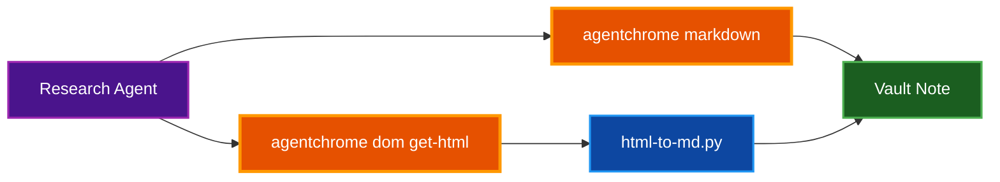

# AgentChrome

A fast native Rust CLI that lets AI coding agents control a Chrome or Chromium browser via the Chrome DevTools Protocol, enabling real-time web interaction, page inspection, form automation, and screenshot capture without any Node.js or Python runtime.

## Table of Contents
- [Overview](#overview)
- [Why AgentChrome](#why-agentchrome)
- [Installation](#installation)
- [Key Capabilities](#key-capabilities)
- [Usage in Parsidion](#usage-in-parsidion)
- [Common Commands](#common-commands)
- [Troubleshooting](#troubleshooting)
- [Related Documentation](#related-documentation)

## Overview

**Purpose:** Bridge the gap between AI agents and the live web — AgentChrome exposes structured, machine-readable browser state so agents can navigate pages, extract content, fill forms, and capture screenshots without fragile HTML scraping.

**Key characteristics:**
- Single Rust binary — no Node.js, no Python, no runtime dependencies
- Communicates with Chrome via the Chrome DevTools Protocol (CDP)
- Outputs structured JSON responses suitable for programmatic parsing
- Fast startup time; small binary size
- Dual-licensed MIT / Apache 2.0

**Repository:** [https://github.com/Nunley-Media-Group/AgentChrome](https://github.com/Nunley-Media-Group/AgentChrome)

## Why AgentChrome

The research agent and other web-fetching workflows in Parsidion use agentchrome to fetch and convert web pages into clean, noise-free markdown for LLM consumption. The built-in `agentchrome markdown` command handles conversion natively; the `dom get-html | html-to-md.py` pipeline remains available for custom post-processing.



Without AgentChrome, the research agent falls back to `curl` or the built-in Claude Code Web Fetch tool, piping the raw HTML through `html-to-md.py` — which works but skips JavaScript rendering. AgentChrome returns the fully rendered DOM after JavaScript execution, which is essential for single-page applications and documentation sites that rely on client-side rendering.

## Installation

### Via Cargo (build from source)

Requires Rust:

```bash
cargo install agentchrome
```

### Pre-built Binaries

Download the latest release binary for your platform from the [GitHub Releases page](https://github.com/Nunley-Media-Group/AgentChrome/releases):

| Platform | Architecture |
|----------|-------------|
| macOS | Apple Silicon (ARM64), Intel (x86_64) |
| Linux | x86_64, ARM64 |
| Windows | x86_64 |

Place the binary somewhere on your `PATH` (e.g., `/usr/local/bin/agentchrome` on macOS/Linux).

### Runtime Requirement

AgentChrome requires **Chrome or Chromium** to be installed and accessible. On macOS, a standard Google Chrome installation is sufficient.

### Verify Installation

```bash
agentchrome --version
agentchrome --help
```

### Install the Claude Code Skill

AgentChrome can install a minimal skill file that tells Claude Code what it is and how to discover its capabilities:

```bash
agentchrome skill install
```

This auto-detects the active agentic environment. Use `agentchrome skill list` to see all supported tools and their installation status.

## Key Capabilities

| Feature | Description |
|---------|-------------|
| **Page text extraction** | Extracts visible text from the rendered page (`page text`) |
| **DOM HTML extraction** | Retrieves outer HTML of any element after JavaScript execution (`dom get-html`) |
| **HTML to Markdown conversion** | Convert browser pages, files, stdin, or URLs to clean Markdown with optional link stripping and image handling (`markdown`) |
| **Accessibility tree snapshots** | Returns stable UIDs for reliable element targeting (`page snapshot`) |
| **Element queries** | Find elements by text, CSS selector, or accessibility role (`page find`) |
| **Element state inspection** | Query a single element's role, name, bounding box, and visibility by UID or CSS selector (`page element`) |
| **Page wait conditions** | Wait for URL match, text appearance, selector match, network idle, or JS expression (`page wait`) |
| **Frame inspection** | List all frames including iframes with index, URL, origin, and nesting depth (`page frames`) |
| **Worker listing** | List service, shared, and dedicated workers associated with the page (`page workers`) |
| **Hit testing** | Hit test at viewport coordinates to identify click targets and overlays (`page hittest`) |
| **Page structure analysis** | Analyze page structure: iframes, frameworks, overlays, media, shadow DOM (`page analyze`) |
| **Coordinate resolution** | Resolve a selector to frame-local and page-global coordinates (`page coords`) |
| **Screenshot capture** | Full-page, viewport, or element PNG/JPEG/WebP screenshots (`page screenshot`) |
| **Form automation** | Fill, clear, upload files, and submit form fields by UID or CSS selector (`form fill/fill-many/clear/upload/submit`) |
| **User interaction** | Click, hover, type, press keys, scroll, and drag-and-drop by UID or CSS selector (`interact click/click-at/hover/type/key/scroll/drag/drag-at`) |
| **JavaScript execution** | Run arbitrary JS in the page context (`js exec`) |
| **Console monitoring** | Read or stream browser console messages (`console read/follow`) |
| **Network monitoring** | Inspect and stream requests and responses (`network list/get/follow`) |
| **Cookie management** | List, set, delete, and clear browser cookies (`cookie list/set/delete/clear`) |
| **Tab management** | List, create, close, and activate tabs (`tabs list/create/close/activate`) |
| **Device emulation** | Simulate mobile viewports and network conditions (`emulate set/reset/status`) |
| **Performance tracing** | Capture Core Web Vitals, record traces, and analyze insights (`perf vitals/record/analyze`) |
| **Lighthouse audits** | Run Google Lighthouse performance, accessibility, SEO, and best-practices audits (`audit lighthouse`) |
| **Dialog handling** | Inspect and dismiss alerts, confirms, prompts (`dialog info/accept/dismiss`) |
| **Media control** | List, play, pause, and seek HTML5 audio and video elements (`media list/play/pause/seek/seek-end`) |
| **Pre-automation diagnostics** | Scan pages for iframes, overlays, shadow DOM, media gates, and framework quirks (`diagnose`) |
| **Batch scripting** | Execute JSON batch scripts with conditionals and loops (`script run`) |
| **Navigation history** | Navigate, go back, forward, and reload (`navigate/back/forward/reload`) |
| **Skill management** | Install agentchrome skill files for AI coding tools (`skill install/list`) |
| **Configuration** | Manage connection config via TOML config file (`config show/init/path`) |
| **Capabilities manifest** | Output a machine-readable manifest of all CLI commands and flags (`capabilities`) |
| **Man pages** | Display man pages for agentchrome commands (`man`) |
| **Shell completions** | Generate shell completion scripts (`completions`) |

## Usage in Parsidion

### Research Agent Page Fetching

The primary use case is fetching pages for the research agent. Connect once per session, then navigate and extract content:

```bash
# Connect once per research session (launch headless Chrome)
agentchrome connect --launch --headless

# Navigate to a URL
agentchrome navigate "https://example.com/docs" --wait-until networkidle

# Option A: Built-in markdown conversion (no external script needed)
agentchrome markdown --plain

# Option B: Raw HTML piped through html-to-md.py for more control
agentchrome dom get-html "css:html" | uv run --script ~/.claude/skills/parsidion/scripts/html-to-md.py - --url "https://example.com/docs" > /tmp/page-content.md
```

The built-in `agentchrome markdown` command handles HTML-to-Markdown conversion natively. For cases requiring custom post-processing (link stripping, image handling), the `dom get-html | html-to-md.py` pipeline remains available.

The research agent (`~/.claude/agents/research-agent.md`) uses this pipeline automatically when agentchrome is available, falling back to `curl` otherwise.

### Manual Page Inspection

```bash
# Get visible text of the current active tab
agentchrome page text

# Get raw HTML of the entire page
agentchrome dom get-html "css:html"

# Convert the current page to clean Markdown
agentchrome markdown --plain

# Save a screenshot (full page)
agentchrome page screenshot --full-page --file screenshot.png

# Get accessibility tree (structured element list with UIDs)
agentchrome page snapshot

# Diagnose a page for automation challenges (iframes, overlays, frameworks)
agentchrome diagnose --current
```

### Built-in Markdown Conversion vs html-to-md.py

AgentChrome v1.62+ includes a built-in `agentchrome markdown` command that handles HTML-to-Markdown conversion natively:

```bash
# Built-in: convert the current browser page to Markdown
agentchrome markdown --plain

# Built-in: fetch and convert a URL without a browser session
agentchrome markdown --url https://docs.example.com/api --plain

# Built-in: convert HTML from stdin
cat page.html | agentchrome markdown --stdin --base-url https://docs.example.com/api --plain
```

The `html-to-md.py` script remains available for cases requiring custom post-processing:

```bash
# Navigate then fetch and convert to markdown
agentchrome navigate https://docs.example.com/api
agentchrome dom get-html "css:html" | uv run --script ~/.claude/skills/parsidion/scripts/html-to-md.py - --url https://docs.example.com/api
```

The `--url` flag is optional but improves link resolution in the markdown output.

## Common Commands

```bash
# Connect to (or launch) Chrome
agentchrome connect
agentchrome connect --launch --headless

# Check current connection status
agentchrome connect --status

# Disconnect and remove session file
agentchrome connect --disconnect

# Navigate to a URL (wait-until options: load, domcontentloaded, networkidle, none)
agentchrome navigate https://example.com
agentchrome navigate https://example.com --wait-until networkidle

# Navigation history
agentchrome navigate back
agentchrome navigate forward
agentchrome navigate reload

# Convert the current page to clean Markdown
agentchrome markdown --plain

# Convert a URL to Markdown (no browser needed)
agentchrome markdown --url https://example.com --plain

# Convert HTML from stdin to Markdown
cat page.html | agentchrome markdown --stdin --base-url https://example.com --plain

# Extract visible text from the page
agentchrome page text

# Extract raw HTML of the full page
agentchrome dom get-html "css:html"

# Take a full-page screenshot
agentchrome page screenshot --full-page --file screenshot.png

# Take a screenshot of a specific element by UID
agentchrome page screenshot --uid s3 --file element.png

# Take a screenshot in JPEG format
agentchrome page screenshot --format jpeg --quality 80 --file shot.jpg

# Get accessibility tree (assigns UIDs to elements, e.g. s1, s2, s3)
agentchrome page snapshot

# Find elements by text or selector
agentchrome page find "Sign in"
agentchrome page find --selector "button.submit"

# Resize the viewport
agentchrome page resize 1280x720

# Query a single element's state by UID or CSS selector
agentchrome page element s3
agentchrome page element "css:#submit-btn"

# Wait for a condition on the page
agentchrome page wait --url "*/login*"
agentchrome page wait --text "Welcome"
agentchrome page wait --selector ".loaded"

# List all frames (including iframes)
agentchrome page frames

# List workers (service, shared, dedicated)
agentchrome page workers

# Interact with an element (requires UID from page snapshot)
agentchrome interact click s5
agentchrome interact type "hello world"
agentchrome interact key Enter
agentchrome interact hover s5
agentchrome interact scroll --amount 500

# Drag and drop elements by UID or CSS selector
agentchrome interact drag s5 s10

# Click at specific viewport coordinates
agentchrome interact click-at 100,200

# Fill a form field
agentchrome form fill s5 "hello@example.com"

# Fill multiple form fields at once from JSON
agentchrome form fill-many '{"s5": "hello@example.com", "s6": "John"}'

# Upload a file to a file input element
agentchrome form upload s7 /path/to/file.pdf

# Submit a form programmatically
agentchrome form submit s5

# Execute JavaScript
agentchrome js exec "document.title"

# List all open tabs
agentchrome tabs list

# Create a new tab
agentchrome tabs create https://example.com

# Read browser console output
agentchrome console read

# Stream console messages in real time
agentchrome console follow --timeout 5000

# List recent network requests
agentchrome network list

# Get details of a specific network request
agentchrome network get <request-id>

# Stream network requests in real time
agentchrome network follow --timeout 5000

# List cookies for current page
agentchrome cookie list

# Set a cookie
agentchrome cookie set session_id abc123 --domain example.com

# Capture Core Web Vitals
agentchrome perf vitals

# Record a performance trace
agentchrome perf record --duration 5000

# Emulate a mobile device
agentchrome emulate set --viewport 375x812 --user-agent "Mozilla/5.0 (iPhone)"

# List media elements on the page
agentchrome media list

# Run a Lighthouse audit
agentchrome audit lighthouse

# Diagnose a page for automation challenges
agentchrome diagnose https://example.com
agentchrome diagnose --current

# Run a batch script
agentchrome script run script.json

# Show built-in usage examples for all commands
agentchrome examples

# Install the agentchrome skill for the current AI coding tool
agentchrome skill install

# List supported AI tools and installation status
agentchrome skill list

# Output machine-readable manifest of all commands and flags
agentchrome capabilities

# Display man page for a command
agentchrome man navigate

# Generate shell completions (e.g., for bash)
agentchrome completions bash
```

## Troubleshooting

### `agentchrome: command not found`

The binary is not on your `PATH`. Either install via `cargo install agentchrome` or download a pre-built binary and move it to a directory on your `PATH`.

### Chrome not found

AgentChrome looks for Chrome or Chromium in standard installation paths. If you use a non-standard location, pass `--chrome-path /path/to/chrome` to `agentchrome connect --launch`, or use `--channel` to target a specific release channel (`stable`, `beta`, `dev`, `canary`). You can also set `chrome_path` in the TOML config file (`agentchrome config init` to create one, `agentchrome config show` to inspect).

### Falls back to curl in the research agent

If you see curl or the Web Fetch tool being used instead of agentchrome, it means `agentchrome` is not found on the `PATH` that Claude Code uses. Verify:

```bash
# Check if agentchrome is accessible
which agentchrome

# Test directly
agentchrome --version
```

If `which agentchrome` returns a path but Claude Code still falls back to curl, your shell `PATH` may differ from Claude Code's environment. Add the binary's parent directory to the `PATH` in your shell profile (`.zshrc`, `.bashrc`, etc.).

### CDP connection errors

If agentchrome cannot connect to Chrome, ensure:
- Chrome or Chromium is installed
- No firewall rule blocks localhost CDP connections
- You are not running in a sandboxed environment that restricts browser access
- Use `agentchrome connect --status` to check the current connection state
- Use `agentchrome connect --disconnect` to clean up stale session files, then reconnect

## Related Documentation

- [docs/ARCHITECTURE.md](ARCHITECTURE.md) — System architecture, including the research agent that uses agentchrome
- [docs/MCPL.md](MCPL.md) — MCP Launchpad CLI: alternative search tools used alongside agentchrome
- [docs/MCP.md](MCP.md) — MCP server configuration and available tools
- [README.md](../README.md) — Project overview and prerequisites
