# parsidion-mcp

A FastMCP-based MCP server that exposes the Parsidion vault knowledge management system to Claude Desktop and any MCP-capable client, enabling vault read, write, search, and maintenance operations from within AI assistant conversations.

## Table of Contents

- [Overview](#overview)
- [Architecture](#architecture)
- [Installation](#installation)
  - [Prerequisites](#prerequisites)
  - [Install from Repository](#install-from-repository)
  - [Verify Installation](#verify-installation)
- [Configuration](#configuration)
- [Tools Reference](#tools-reference)
  - [vault\_search](#vault_search)
  - [vault\_read](#vault_read)
  - [vault\_write](#vault_write)
  - [vault\_context](#vault_context)
  - [rebuild\_index](#rebuild_index)
  - [vault\_doctor](#vault_doctor)
  - [vault\_health](#vault_health)
  - [code\_search](#code_search)
- [Security](#security)
- [Development](#development)
  - [Running Tests](#running-tests)
  - [Checkall](#checkall)
  - [Package Structure](#package-structure)
- [Related Documentation](#related-documentation)

## Overview

`parsidion-mcp` solves the problem of Claude Desktop agents being unable to directly access the Parsidion vault. The Parsidion vault accumulates project knowledge, debugging solutions, architectural decisions, and reusable patterns across sessions — but Claude Desktop has no native mechanism to read or write those notes.

`parsidion-mcp` bridges this gap by running as a local stdio MCP server. It wraps `vault_common` (the vault's shared library), `vault_search` (the semantic and metadata search engine), and the optional `parsight_backend` (the parsight code-memory bridge) behind eight MCP tools, giving Claude Desktop the same vault access that Claude Code hook scripts enjoy.

Key capabilities:

- Semantic vector search and structured metadata filtering across all vault notes
- Direct note read and write with path-containment safety enforcement
- Session-start-style context injection — project notes and recent activity surfaced as a compact index or full summaries
- Index rebuild triggering from within a conversation
- Vault health scanning and automated repair via `vault_doctor`
- Composite vault health scoring across eight dimensions via `vault_health`
- Natural-language code search over any parsight-indexed repository via `code_search`

The server runs locally only. It makes no external network calls and requires no API keys beyond the Claude API key already used by Claude Desktop. The `code_search` tool additionally requires parsight to be installed and its local daemon running (see [docs/PARSIGHT.md](PARSIGHT.md)); without parsight the other seven tools continue to work and `code_search` raises a clear `ValueError`. **Note:** parsight itself is not yet publicly available (coming soon) — the other seven tools work fully today; `code_search` activates automatically once parsight ships.

## Architecture

The diagram below shows the full component topology: Claude Desktop communicates with `parsidion-mcp` over stdio; the server delegates to `vault_common`, `vault_search`, and subprocess-invoked scripts to fulfil each tool call.

```mermaid
graph TD
    Desktop["Claude Desktop"]
    MCP["parsidion-mcp<br/>(FastMCP / stdio)"]
    VaultSearch["vault_search<br/>(semantic + metadata)"]
    VaultCommon["vault_common<br/>(shared library)"]
    ParsightBackend["parsight_backend<br/>(parsight bridge, optional)"]
    ParsightDaemon["parsight daemon<br/>(local HTTP)"]
    ScriptsDir["parsidion scripts/<br/>(resolved from vault_path.__file__)"]
    UpdateIndex["update_index.py<br/>(subprocess)"]
    VaultDoctor["vault_doctor.py<br/>(subprocess)"]
    VaultStats["vault_stats.py<br/>(subprocess)"]
    EmbeddingsDB["embeddings.db<br/>(SQLite + sqlite-vec)"]
    VaultRoot["~/ParsidionVault/<br/>(or ~/ClaudeVault/ for legacy installs)"]

    Desktop -->|"stdio (MCP protocol)"| MCP

    MCP -->|"vault_search tool"| VaultSearch
    MCP -->|"vault_read / vault_write / vault_context"| VaultCommon
    MCP -->|"code_search tool"| ParsightBackend
    MCP -->|"rebuild_index (uv run)"| UpdateIndex
    MCP -->|"vault_doctor (uv run)"| VaultDoctor
    MCP -->|"vault_health (uv run)"| VaultStats

    VaultSearch --> EmbeddingsDB
    VaultSearch --> VaultCommon
    VaultSearch --> ParsightBackend
    ParsightBackend --> ParsightDaemon
    VaultCommon --> VaultRoot
    UpdateIndex --> ScriptsDir
    VaultDoctor --> ScriptsDir
    VaultStats --> ScriptsDir
    UpdateIndex --> EmbeddingsDB
    UpdateIndex --> VaultRoot
    VaultStats --> VaultRoot

    subgraph "8 Exposed Tools"
        T1["vault_search"]
        T2["vault_read"]
        T3["vault_write"]
        T4["vault_context"]
        T5["rebuild_index"]
        T6["vault_doctor"]
        T7["vault_health"]
        T8["code_search"]
    end

    MCP --- T1
    MCP --- T2
    MCP --- T3
    MCP --- T4
    MCP --- T5
    MCP --- T6
    MCP --- T7
    MCP --- T8

    class Desktop external
    class MCP primary
    class VaultSearch,VaultCommon,ParsightBackend data
    class ScriptsDir,T1,T2,T3,T4,T5,T6,T7,T8 neutral
    class UpdateIndex,VaultDoctor,VaultStats active
    class ParsightDaemon,EmbeddingsDB,VaultRoot database

    classDef primary fill:#e65100,stroke:#ff9800,stroke-width:3px,color:#ffffff
    classDef active fill:#1b5e20,stroke:#4caf50,stroke-width:2px,color:#ffffff
    classDef database fill:#1a237e,stroke:#3f51b5,stroke-width:2px,color:#ffffff
    classDef external fill:#4a148c,stroke:#9c27b0,stroke-width:2px,color:#ffffff
    classDef data fill:#0d47a1,stroke:#2196f3,stroke-width:2px,color:#ffffff
    classDef neutral fill:#37474f,stroke:#78909c,stroke-width:1px,color:#ffffff
```



The server entry point in `server.py` creates a `FastMCP` application, registers each tool function, and calls `mcp.run()` which handles the stdio transport required by Claude Desktop.

Script paths for `rebuild_index`, `vault_doctor`, and `vault_health` resolve from `vault_path.__file__` rather than the module-level `SCRIPTS_DIR` constant. `ops.py` derives its `SCRIPTS_DIR` as `Path(vault_path.__file__).resolve().parent`, so each subprocess runs the same code the MCP server imported via the editable install — not a possibly-drifted `~/.claude/skills/parsidion/scripts/` copy. On Unix this resolves to the same path because the installer symlinks `~/.claude/skills/parsidion` at the repo; on Windows (where the installer copies) the distinction matters.

Every tool except `code_search` also accepts an optional `vault` parameter (ARC-021) — a vault name from `~/.config/parsidion/vaults.yaml` or an absolute path — so multi-vault callers can target a specific vault instead of always hitting the resolver's default. The parameter threads through to `vault_common.resolve_vault(explicit=vault)` for the in-process tools and to a `--vault <path>` argv flag for the subprocess tools.

## Installation

### Prerequisites

- Python 3.13 or later
- `uv` (the package manager — install from [docs.astral.sh/uv](https://docs.astral.sh/uv))
- `parsidion` installed as an editable package with the `[search]` extra. The editable install exposes the `vault_common`, `vault_search`, and `parsight_backend` py-modules; the `[search]` extra pulls in `fastembed`, `sqlite-vec`, and `pillow`

> **📝 Note:** Both `parsidion` and `parsidion-mcp` must be editable installs. Non-editable installs are not supported due to the `py-modules` layout of `parsidion`.

### Install from Repository

```bash
# Step 1 — Install parsidion[tools] editably (skip if already done)
cd parsidion/
uv tool install --editable ".[tools]"

# Step 2 — Install the MCP server
cd parsidion-mcp/
uv tool install --editable .
```

`uv tool install` places the `parsidion-mcp` binary in `~/.local/bin/` (or the equivalent `uv` tool bin directory on your platform).

> **📝 Note:** On the first `vault_search` call with a query, `fastembed` downloads the configured ONNX embedding model and caches it. This initial download can take 30–60 seconds. Subsequent calls are fast. If the embeddings database does not yet exist and parsight is unavailable, the tool raises a clear error message prompting you to run `rebuild_index` first.

### Verify Installation

```bash
which parsidion-mcp
# Expected: /Users/<username>/.local/bin/parsidion-mcp
```

> **Note:** `parsidion-mcp --help` does **not** work — `server.py:main()` calls `mcp.run()` directly with no `argv` handling, so any flag is ignored and the server blocks on stdin waiting for MCP traffic. To verify the server is callable, use `which parsidion-mcp` (above) and then add it to your MCP client config; the client's tool-discovery handshake is the real smoke test.

## Configuration

Add the server to Claude Desktop's configuration file at `~/Library/Application Support/Claude/claude_desktop_config.json`:

```json
{
  "mcpServers": {
    "parsidion": {
      "command": "/Users/<username>/.local/bin/parsidion-mcp"
    }
  }
}
```

Replace `<username>` with your actual username. Use the full absolute path rather than a bare command name — Claude Desktop launches processes with a minimal `PATH` that may not include `~/.local/bin/`, so the bare `parsidion-mcp` command may not resolve. Run `which parsidion-mcp` to confirm the exact path.

After saving the file, restart Claude Desktop for the change to take effect.

## Tools Reference

All tools return plain strings on success. On failure, tools raise typed exceptions that FastMCP converts to `ToolError` responses visible to the MCP client. The exception messages describe the specific failure.

| Error condition | Exception type | Message |
|---|---|---|
| Path escapes vault root | `VaultToolError` | `path escapes vault root` |
| Vault root directory missing | `VaultToolError` | `vault root not found at <path>` |
| Note not found | `VaultToolError` | `note not found at <path>` |
| Read exceeds 10 MB (`vault_read`) | `VaultToolError` | `Note exceeds 10 MB limit` |
| Content exceeds 10 MB (`vault_write`) | `VaultToolError` | `Content exceeds 10 MB limit` |
| Non-.md path (`vault_read`) | `VaultToolError` | `Only .md files are readable` |
| Non-.md extension (`vault_write`) | `VaultToolError` | `Only .md files are allowed` |
| Hidden path segment (`vault_read` / `vault_write`) | `VaultToolError` | `Hidden paths are not readable` / `Hidden paths are not writable` |
| Excluded top-level directory (`vault_read` / `vault_write`) | `VaultToolError` | `Excluded directory: <dir>` |
| Embeddings DB missing and parsight unavailable (semantic search) | `ValueError` | `embeddings DB not found and parsight unavailable -- run rebuild_index first, or install/start parsight` |
| parsight unavailable (`code_search`) | `ValueError` | `parsight unavailable -- install parsight and start its daemon (see docs/PARSIGHT.md)` |
| `code_search` repo_path missing | `ValueError` | `repo_path does not exist: <path>` |
| `code_search` query failure | `ValueError` | `parsight query failed -- check \`parsight repos --json\` and the daemon log` |
| Subprocess timeout | `OpsToolError` | `command timed out after <N>s` |
| Subprocess non-zero exit | `OpsToolError` | `<combined stdout+stderr from subprocess>` |

### vault_search

Searches vault notes using semantic vector similarity or structured metadata filtering.

**Semantic mode** activates when `query` is provided. It is served by the parsight backend when parsight is available and has indexed the vault, silently falling back to the local fastembed cosine similarity search against `embeddings.db` otherwise (configurable via the `search.backend` config key; default `auto`). **Metadata mode** activates when `query` is omitted; it runs a SQL query against the `note_index` table filtered by whichever metadata parameters are supplied.

#### Parameters

| Parameter | Type | Default | Description |
|---|---|---|---|
| `query` | `str \| None` | `None` | Natural language query (enables semantic mode) |
| `tag` | `str \| None` | `None` | Filter by exact tag token |
| `folder` | `str \| None` | `None` | Filter by folder name |
| `note_type` | `str \| None` | `None` | Filter by note type (e.g. `pattern`, `debugging`) |
| `project` | `str \| None` | `None` | Filter by project name |
| `recent_days` | `int \| None` | `None` | Only notes modified within N days |
| `top_k` | `int` | `10` | Maximum number of results |
| `min_score` | `float` | `0.45` | Minimum cosine similarity threshold (semantic mode only) |
| `vault` | `str \| None` | `None` | Vault reference (name from `vaults.yaml` or absolute path). When `None`, the resolver's default precedence applies |

#### Return Value

JSON array of note objects. Each object contains: `score` (float or null), `stem`, `title`, `folder`, `tags`, `path`, `summary`, `note_type`, `project`, `confidence`, `mtime`, `related`, `is_stale`, `incoming_links`.

#### Examples

```python
# Semantic search
vault_search(query="fastembed cosine similarity python")

# Metadata search — all debugging notes modified in last 7 days
vault_search(tag="python", folder="Debugging", recent_days=7)

# Semantic search with tighter relevance threshold
vault_search(query="vault hook session stop", min_score=0.5, top_k=5)
```

---

### vault_read

Reads a vault note by path and returns its full content including YAML frontmatter and body.

#### Parameters

| Parameter | Type | Description |
|---|---|---|
| `path` | `str` | Path relative to vault root (e.g. `Patterns/my-note.md`) or absolute path |
| `vault` | `str \| None` | Vault reference (name from `vaults.yaml` or absolute path). When `None`, the resolver's default precedence applies |

#### Return Value

Full note content as a string. Raises `VaultToolError` if the path escapes the vault root, the note does not exist, or an OS error occurs.

Reads are restricted to markdown notes (SEC-008). Reads and writes share one segment gate (SEC-201): the path must end in `.md`, must not contain any dot-segment (`.git/config`, `.trash/...`), and must not live under an excluded top-level directory (`Templates`, `TagsRoutes`). Files over 10 MB are refused, and non-UTF-8 (binary) content raises `VaultToolError("not a text note")` — so configuration files such as `config.yaml`, `config.local.yaml`, and `pending_summaries.jsonl` are not readable through this tool.

#### Example

```python
vault_read("Patterns/fastmcp-mcp-server.md")
vault_read("Debugging/sqlite-vec-install.md")
```

---

### vault_write

Creates or overwrites a vault note. Parent directories are created automatically.

#### Parameters

| Parameter | Type | Description |
|---|---|---|
| `path` | `str` | Path relative to vault root |
| `content` | `str` | Full note content including YAML frontmatter |
| `vault` | `str \| None` | Vault reference (name from `vaults.yaml` or absolute path). When `None`, the resolver's default precedence applies |

The tool does not validate frontmatter. The caller is responsible for supplying valid frontmatter per vault conventions. Any structural issues are detectable via `vault_doctor` on the next scan.

**Constraints:**

- Content must not exceed 10 MB (enforced before any file system write)
- Only `.md` file extensions are allowed
- Hidden path segments (dot-prefixed files or directories such as `.git/`, `.trash/`) and excluded top-level directories (`Templates`, `TagsRoutes`) are rejected — the same segment gate `vault_read` enforces (SEC-201), so writes cannot land in `.trash/backup/` pre-mutation backups or `.obsidian/`

#### Return Value

`Written: <absolute_path>` on success. Raises `VaultToolError` on failure (path escape, oversized content, non-.md extension, or OS error).

#### Example

```python
vault_write(
    path="Patterns/fastmcp-tool-registration.md",
    content="""---
date: 2026-03-16
type: pattern
tags: [fastmcp, mcp, python]
project: parsidion-mcp
confidence: high
sources: []
related: ["[[parsidion-mcp-design]]"]
---

# FastMCP Tool Registration Pattern

Register tools by calling `mcp.tool()(fn)` after defining the FastMCP instance.
""",
)
```

---

### vault_context

Returns vault context in the same format as the session start hook. This tool is intended for injection into a system prompt at the start of a Claude Desktop conversation.

By default it produces a compact one-line-per-note index (title, folder, tags) that minimises token consumption. When `verbose=True` it returns full note summaries.

**Note selection algorithm:**

1. If `project` is set, collect notes tagged or associated with that project via `vault_common.find_notes_by_project()`
2. Collect recently modified notes via `vault_common.find_recent_notes(recent_days)`
3. Merge both sets, deduplicating by path (project notes appear first)
4. Format as compact index (default) or full summaries (verbose)

The compact index is truncated at 2000 characters with a "N more notes" indicator.

The resolved vault root is threaded explicitly through every helper call (SEC-032), so concurrent `vault_context` calls against different `vault` references cannot read the wrong vault — no module-global vault state is mutated during the call.

#### Parameters

| Parameter | Type | Default | Description |
|---|---|---|---|
| `project` | `str \| None` | `None` | Project name to prioritise context for |
| `recent_days` | `int` | `3` | Include notes modified within this many days |
| `verbose` | `bool` | `False` | Return full summaries instead of compact index |
| `vault` | `str \| None` | `None` | Vault reference (name from `vaults.yaml` or absolute path). When `None`, the resolver's default precedence applies |

#### Return Value

A formatted context string ready for system prompt injection.

#### Example

```python
# Compact context for a specific project
vault_context(project="parsidion-mcp", recent_days=7)

# Full summaries for recent notes
vault_context(recent_days=5, verbose=True)
```

---

### rebuild_index

Rebuilds the vault index by running `update_index.py` as a subprocess. This regenerates:

- `~/ParsidionVault/CLAUDE.md` — the lean root index (stats, conventions, recent activity, folder pointers)
- `~/ParsidionVault/TAGS.md` — full tag cloud and tag list (for summarizer tag reuse)
- Per-folder `MANIFEST.md` files
- The `note_index` table in `embeddings.db`

Run this after creating, renaming, or deleting notes to ensure search results and context generation reflect the current vault state.

#### Parameters

| Parameter | Type | Default | Description |
|---|---|---|---|
| `vault` | `str \| None` | `None` | Vault reference (name from `vaults.yaml` or absolute path). When `None`, the resolver's default precedence applies |

#### Return Value

Combined stdout and stderr from `update_index.py` on success. Raises `OpsToolError` on failure or timeout (30 seconds).

#### Example

```python
rebuild_index()
# Returns something like: "Updated CLAUDE.md: 142 notes indexed, 53 tags; TAGS.md written; 9 MANIFEST.md file(s) generated"
```

---

### vault_doctor

Scans all vault notes for structural issues — missing frontmatter fields, invalid note types, broken wikilinks, orphan notes, and similar problems. Optionally repairs repairable issues using the configured prompt AI backend (`claude -p` by default; `codex exec` or `grok` per the `ai.backend` config key).

> **Note:** When `fix=True`, `vault_doctor.py` itself invokes the configured prompt AI backend for repairs (`claude` by default, using the system's existing credentials) — the same behaviour as running `vault_doctor.py` manually from the terminal. The MCP server passes through `--fix`, `--errors-only`, and `--limit`; all other flags use the script's defaults.

#### Parameters

| Parameter | Type | Default | Description |
|---|---|---|---|
| `fix` | `bool` | `False` | When `True`, attempt repairs via the configured prompt AI backend; when `False`, scan and report only |
| `errors_only` | `bool` | `False` | When `True`, suppress warnings and report errors only |
| `limit` | `int \| None` | `None` | Maximum notes to repair (only relevant when `fix=True`) |
| `vault` | `str \| None` | `None` | Vault reference (name from `vaults.yaml` or absolute path). When `None`, the resolver's default precedence applies |

The following `vault_doctor.py` flags are not exposed: `--dry-run`, `--model`, `--no-state`, `--jobs`, `--timeout`, `--migrate-subfolders`, `--execute`, `--fix-all`, `--fix-tags`, `--fix-sessions`, `--fix-frontmatter`, `--fix-headings`, `--no-fix-headings`, `--migrate-daily-notes`, `--daily-username`, `--strip-prefixes`, `--fix-permissions`, `--only`, `--skip`, `--list-rules`. The server uses the defaults (3 parallel workers, 120-second per-repair timeout).

#### Return Value

Combined stdout and stderr from `vault_doctor.py` on success. Raises `OpsToolError` on failure or timeout (120 seconds).

#### Examples

```python
# Scan only — report all issues
vault_doctor()

# Scan, errors only
vault_doctor(errors_only=True)

# Repair up to 10 notes
vault_doctor(fix=True, limit=10)

# Repair all, errors only
vault_doctor(fix=True, errors_only=True)
```

---

### vault_health

Returns the composite vault health report as JSON (ENH-007). Eight scored dimensions — index freshness, queue health, graph connectivity, metadata quality, embedding coverage, tag hygiene, file hygiene, and hook latency (ENH-019) — are combined into a weighted overall grade. Each dimension carries a concrete `action` command when unhealthy, or `null` when healthy.

Read-only: the tool never mutates the vault. It subprocesses `vault_stats.py --health --json` via `uv run --no-project` so the import and subprocess layers see the same code (the same pattern used by `rebuild_index` and `vault_doctor`).

#### Parameters

| Parameter | Type | Default | Description |
|---|---|---|---|
| `vault` | `str \| None` | `None` | Vault reference (name from `vaults.yaml` or absolute path). When `None`, the resolver's default precedence applies |
| `fast` | `bool` | `False` | Skip the metadata-quality scan so the report returns in well under a second on large vaults. The metadata dimension reports `detail='skipped (--fast)'` with a neutral score |

#### Return Value

The health report as a JSON string (compact, sorted keys). Raises `OpsToolError` on failure or timeout (60 seconds).

#### Examples

```python
# Full health report for the default vault
vault_health()

# Fast report (skips metadata-quality scan)
vault_health(fast=True)

# Health report for a named vault
vault_health(vault="work-vault")
```

---

### code_search

Natural-language search over a parsight-indexed repository's code graph (symbols, calls, imports, types). This is the MCP analogue of parsight's `find_code` tool, exposed so Claude Desktop can answer "where is this defined?" or "find me the implementation of X" without leaving the conversation.

Unlike the hook and CLI surfaces, this tool **raises** instead of degrading silently — MCP callers can choose another tool when parsight is unavailable.

#### Parameters

| Parameter | Type | Default | Description |
|---|---|---|---|
| `query` | `str` | _(required)_ | Natural-language query (error strings work well) |
| `repo_path` | `str \| None` | `None` | Absolute path to a repository parsight has indexed. When omitted, the resolved vault is searched and results are parsidion note objects (identical to `vault_search`'s semantic results) |
| `top_k` | `int` | `10` | Maximum number of results |

#### Behaviour

- With `repo_path`: returns raw parsight code hits verbatim — repo-relative `file_path` plus RRF `score` (rank-fusion value, **not** a cosine, so `min_score` does not apply).
- Without `repo_path`: searches the resolved vault via `parsight_backend.parsight_search()` and returns parsidion note objects in the same shape as `vault_search`.

#### Return Value

JSON array of result objects (shape depends on `repo_path` as described above).

#### Examples

```python
# Search an indexed repo for a symbol
code_search(query="resolve_worktree", repo_path="/Users/me/Repos/parsight")

# Search the vault's indexed notes (no repo_path)
code_search(query="hook patterns", top_k=5)
```

#### Availability Check

The tool first calls `parsight_backend.resolve_parsight_backend()`. If parsight is not installed, its daemon is not running, or it is disabled via config, the tool raises `ValueError("parsight unavailable -- install parsight and start its daemon (see docs/PARSIGHT.md)")` immediately. Nonexistent `repo_path` values and failed queries also raise `ValueError`.

## Security

`parsidion-mcp` enforces two security boundaries.

**Path containment.** Both `vault_read` and `vault_write` resolve the caller-supplied path against the vault root (obtained via `vault_common.resolve_vault()`) using `Path.resolve()` and `Path.is_relative_to()`. Any path that resolves outside the vault root — including traversal sequences such as `../../etc/passwd` — raises `VaultToolError("path escapes vault root")` immediately. No file system access occurs for rejected paths. On `vault_write`, containment and the segment gate are re-run against the fully resolved path after parent-directory creation, and the leaf file is opened with `O_NOFOLLOW`, so a vault-internal symlink swap between validation and the write cannot redirect the bytes (SEC-P003).

**No external network calls.** The server and all eight tools operate entirely on the local file system and local SQLite database. The subprocess calls to `update_index.py`, `vault_doctor.py`, and `vault_stats.py` are also local-only (except when `vault_doctor` is run with `fix=True`, in which case `vault_doctor.py` itself invokes the configured prompt AI backend — `claude` by default, or `codex`/`grok` per the `ai.backend` config key — using the system's existing credentials; this is the same behaviour as running `vault_doctor.py` manually from the terminal). The `code_search` tool talks only to the local parsight daemon over HTTP on `127.0.0.1`; it makes no outbound network calls.

The server has no authentication layer of its own because it is transport-bound to stdio. Only Claude Desktop (or another local process with stdio access) can communicate with it.

## Development

### Running Tests

```bash
cd parsidion-mcp/
uv run pytest
```

The test suite covers:

- **Unit tests** — each tool module tested with mocked `vault_common`, `vault_search`, and `subprocess.run`
- **Subprocess tests** — `rebuild_index`, `vault_doctor`, and `vault_health` verified for correct flag construction across all parameter combinations
- **Path safety tests** — traversal attempts in `vault_read` and `vault_write` confirmed to raise the expected `VaultToolError`
- **Integration smoke test** — reads one real note; automatically skipped when the vault is absent

### Checkall

```bash
cd parsidion-mcp/
make checkall
```

This runs format checking (`ruff format --check`), linting (`ruff check`), type checking (`pyright`), and the full test suite in sequence.

### Package Structure

```text
parsidion-mcp/
├── pyproject.toml
├── Makefile
├── tests/
└── src/
    └── parsidion_mcp/
        ├── __init__.py
        ├── server.py         # FastMCP app and entry point
        └── tools/
            ├── __init__.py
            ├── search.py     # vault_search tool
            ├── notes.py      # vault_read, vault_write
            ├── context.py    # vault_context
            ├── ops.py        # rebuild_index, vault_doctor, vault_health
            └── code_search.py # code_search tool (parsight bridge)
```

The `parsidion[search]` editable path dependency (declared in `pyproject.toml` under `[tool.uv.sources]`) makes `vault_common`, `vault_search`, and `parsight_backend` directly importable — no `sys.path` manipulation is required in the server code.

## Related Documentation

- [CLAUDE.md](../CLAUDE.md) — project instructions, vault conventions, hook architecture, and script paths
- [PARSIGHT.md](PARSIGHT.md) — the optional parsight code-memory backend that serves `code_search` and vault semantic search when available
- [MULTI_VAULT.md](MULTI_VAULT.md) — named vaults, `vaults.yaml`, and the per-call `vault` parameter every tool except `code_search` accepts
